### Q1. Którego polecenia nalezy użyć, aby wyraz TEKST został wyświetleny w kolorze czarnym w oknie przeglądarki internetowej?
- **A.** <body color="black"> TEKST 
- **B.**  TEKST 
- **C.**  TEKST  ✅
- **D.** <body bgcolor="black"> TEKST </body>

### Q2. W poleceniach, których celem jest odtwarzanie na stronie internetowej dźwięku jako podkładu muzycznego NIE wykorzystuje się atrybutu
- **A.** loop="10"
- **B.** balance="-10"
- **C.** volume="-100"
- **D.** href="C:/100.wav" ✅

### Q3. Jakiego znacznika należy użyć, aby przejść do kolejnej linii tekstu, nie tworząc akapitu na stronie internetowej?
- **A.** 

- **B.** </b>
- **C.**   ✅
- **D.**  

### Q4. Kaskadowe arkusze stylów tworzy się w celu
- **A.** ułatwienia formatowania strony ✅
- **B.** nadpisywania wartości znaczników już ustawionych na stronie
- **C.** połączenia struktury dokumentu strony z właściwą formą jego prezentacji
- **D.** blokowania jakichkolwiek zmian w wartościach znaczników już przypisanych w pliku CSS

### Q5. W podanej regule CSS: h1 {color: blue} h1 oznacza
- **A.** klasę
- **B.** wartość
- **C.** selektor ✅
- **D.** deklarację

### Q6. Edytor spełniający założenia WYSIWYG musi umożliwiać
- **A.** tworzenie podstawowej grafiki wektorowej
- **B.** publikację strony na serwerze poprzez wbudowanego klienta FTP
- **C.** obróbkę plików dźwiękowych przed umieszczeniem ich na stronie internetowej
- **D.** uzyskanie zbliżonego wyniku tworzenej strony do jej obrazu w przegladarce interenetowej ✅

### Q7. Do graficznego tworzenia stron internetowych należy wykorzystać.
- **A.** edytor CSS
- **B.** przeglądarkę internetową
- **C.** program typu WYSIWYG ✅
- **D.** program MS Office Picture Manager

### Q8. W procesie walidacji stron internetowych nie bada się
- **A.** działania linków
- **B.** błędów składni kodu
- **C.** zgodności z przeglądarkami
- **D.** źródła pochodzenia narzędzi edytorskich ✅

### Q9. Model opisu przestrzeni barw o parametrach: odcień, nasycenie i jasność, to
- **A.** HSV ✅
- **B.** RGB
- **C.** CMY
- **D.** CMYK

### Q10. Wskaż model barw, który stosuje się do wyświetlania kolorów na ekranie monitora komputerowego
- **A.** HLS
- **B.** RGB ✅
- **C.** CMY
- **D.** CMYK

### Q11. Który parametr obiektu graficznego ulegnie zmianie po modyfikacji wartości kanału alfa?
- **A.** Nasycenie barw
- **B.** Przezroczystość ✅
- **C.** Ostrość krawędzi
- **D.** Kolejność wyświetlenia pikseli

### Q12. Jakiego formatu należy użyć do zapisu obrazu z kompresją stratną?
- **A.** GIF
- **B.** PNG
- **C.** PCX
- **D.** JPEG ✅

### Q13. Najprostszy sposób zamiany obiektu oznaczonego cyfrą 1 na obiekt oznaczony cyfrą 2 polega na

- **A.** animowaniu obiektu
- **B.** zmianie warstwy obiektu
- **C.** narysowaniu docelowego obiektu
- **D.** geometrycznym transformowaniu obiektu ✅

### Q14. Jak nazywa się proces przedstawienia, we właściwej dla danego środowiska formie, informacji zawartej w dokumencie elektronicznym?
- **A.** Mapowanie
- **B.** Rasteryzacja
- **C.** Renderowanie ✅
- **D.** Teksturowanie

### Q15. Proces filtracji sygnału wejściowego w dziedzinie czasu, obejmujący zasadę superpozycji, związany jest filtrem
- **A.** liniowym ✅
- **B.** przyczynowym
- **C.** niezmiennym w czasie
- **D.** o skończonej odpowiedzi impulsowej

### Q16. Jak nazywa się podzbiór strukturalnego języka zapytań, związany z formułowaniem zapytań do bazy danych za pomocą polecenia SELECT?
- **A.** SQL DML (ang. Data Manipulation Language)
- **B.** SQL DDL (ang. Data Definition Language)
- **C.** SQL DCL (ang. Data Control Language)
- **D.** SQL DQL (ang. Data Query Language) ✅

### Q17. Jakie sa nazwy typowych poleceń języka zapytań SQL, związane z wykonywaniem operacji na danych SQL DML (np.: umieszczanie danych w bazie, kasowanie dokonywanie zmian w danych)?
- **A.** SELECT, SELECT INTO
- **B.** ALTER, CREATE, DROP
- **C.** DENY, GRANT, REVOKE
- **D.** DELETE, INSERT, UPDATE ✅

### Q18. Jak posortowana będzie lista, utworzona ze wszystkich kolumn tabeli uczniowie i zawierająca uczniów ze średnią większą od 5, która zostanie zwrócona jako wynik przedstawionego zapytania?

- **A.** Rosnąca według parametru klasa
- **B.** Malejąco według parametru klasa ✅
- **C.** Rosnaco według parametru srednia
- **D.** Malejąco według parametru srednia

### Q19. Według którego parametru oraz dla ilu tabel zostaną zwrócone wiersze na liście w wyniku przedstawionego zapytania?

- **A.** Według parametru wyrob_id wyłącznie dla trzech tabel
- **B.** Według parametru wyrob_id dla wyłącznie dla trzech tabel
- **C.** Według parametru nr_id wyłącznie dla trzech tabel
- **D.** Według parametru nr_id dla wszystkich tabel ✅

### Q20. Który z obiektów relacyjnej bazy danych, będący kodem języka SQL, może być wywoływany w zapytaniach modyfikujących kolumny danych widoczne jako tabela, bez względu na to czy jest tworzony programowo, czy dynamicznie?
- **A.** Reguła
- **B.** Wyzwalacz
- **C.** Procedura składowa
- **D.** Funkcja zdefiniowana ✅

### Q21. Jak nazywa się element bazy danych, za pomocą którego można jedynie odczytać dane z bazy, prezentując je w postaci tekstu lub wykresu?
- **A.** Tabela
- **B.** Raport ✅
- **C.** Zapytanie
- **D.** Formularz

### Q22. Jakiego typu specjalizowane oprogramowanie narzędziowe należy zainstalować, aby umożliwić wykonywanie jego użytkownikowi operacji na zgromadzonych danych?
- **A.** Klucz obcy
- **B.** System Zarządzania Bazą Danych (SZBD) ✅
- **C.** Obiektowy System Zarządzania Bazą Danych
- **D.** Otwarty mechanizm komunikacji bazy danych

### Q23. Co należy zastosować w organizacji danych, aby zapytania w bazie danych były wykonywane szybciej?
- **A.** Reguły
- **B.** Indeksy ✅
- **C.** Wartości domyślne
- **D.** Klucze podstawowe

### Q24. W programie Microsoft Access formą zabezpieczeń dostępu do danych związaną z tabelą i kwerendą jest
- **A.** stosowanie makr
- **B.** przypisanie uprawnień ✅
- **C.** określanie przestrzeni tabel
- **D.** wprowadzenie limitów przestrzeni dyskowej

### Q25. Które z wymienionych osób odpowiadają za przygotowanie systemu bazy danych do pracy produkcyjnej w sposób ciągły, zarządzanie użytkownikami i instalowanie nowych wersji systemu bazodanowego?
- **A.** Projektanci narzędzi deweloperskich
- **B.** Administratorzy systemu bazy danych ✅
- **C.** Administratorzy serwerów i sieci komputerowych
- **D.** Projektanci i programiści Systemu Zarządzania Bazą Danych.

### Q26. Z jakimi mechanizmami nadawania zabezpieczeń, dającymi możliwości wykonywania operacji na bazie danych, związane są zagadnienia zarządzania kontami, użytkownikami i uprawnieniami?
- **A.** Z regułami
- **B.** Z atrybutami
- **C.** Z przywilejami obiektowymi
- **D.** Z przywilejami systemowymi ✅

### Q27. Metoda udostępniania bazy danych w programie Microsoft Access, dotycząca wszystkich obiektów bazy umieszczonych na dysku sieciowym i używanych jednocześnie przez różne osoby nosi nazwę
- **A.** folderu sieciowego ✅
- **B.** serwera bazy danych
- **C.** dzielonej bazy danych
- **D.** witryny programu SharePoint

### Q28. Jakie należy posiadać uprawnienia, aby wykonać i odtworzyć kopię zapasową bazy danych Microsoft SQL Server 2005 Express?
- **A.** Users
- **B.** Security users
- **C.** Użytkownik lokalny
- **D.** Administrator systemu ✅

### Q29. Typ zmiennej w języku JavaScript
- **A.** nie występuje
- **B.** jest tylko jeden
- **C.** następuje poprzez przypisanie wartości ✅
- **D.** musi być zadeklarowany na początku skryptu

### Q30. Zmienne typu int odnoszą się do liczb
- **A.** naturalnych
- **B.** całkowitych ✅
- **C.** w notacji stałoprzecinkowej
- **D.** w notacji zmiennoprzecinkowej

### Q31. Co definiuje w języku C++ przedstawiony fragment kodu?

- **A.** Hierarchię zmiennych
- **B.** Trzy zmienne niepowiązane ze sobą
- **C.** Typ strukturalny składający się z trzech pól ✅
- **D.** Kontakt pomiędzy zmiennymi globalnymi i lokalnymi

### Q32. Sposób programowania, w którym ciąg poleceń (sekwencji instrukcji) przekazywanych komputerowi jest postrzegany jako program, nosi nazwę programowania
- **A.** stanowego
- **B.** logicznego
- **C.** funkcyjnego
- **D.** imperatywnego ✅

### Q33. Które wartości będą kolejno wypisane w wyniku działania przedstawionego skryptu

- **A.** 2 2 1 ✅
- **B.** 2 1 1
- **C.** 1 2 1
- **D.** 1 2 2

### Q34. Fragment kodu prezentuje składnię języka
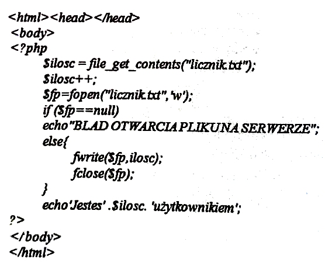
- **A.** C
- **B.** C#
- **C.** PHP ✅
- **D.** JavaScript

### Q35. Jaki program komputerowy przekształca kod źródłowy, napisany w konkretnym języku programowania, na język komputera?
- **A.** Debugger
- **B.** Kompilator ✅
- **C.** Edytor kodu źródłowego
- **D.** Środowisko programistyczne

### Q36. Jak nazywa się program, który wykonuje instrukcje zawarte w kodzie źródłowym tworzonego programu bez uprzedniego generowania programu wynikowego?
- **A.** Interpreter ✅
- **B.** Kompilator
- **C.** Konwerter kodu
- **D.** Konwerter języka

### Q37. Który język skryptowy ogólnego przeznaczenia należy wykorzystać do tworzenia aplikacji WWW, zagnieżdżanych w języku HTML i uruchamianych po stronie serwera?
- **A.** C#
- **B.** Perl
- **C.** PHP ✅
- **D.** JavaScript

### Q38. Jak nazywa się technika umożliwiająca otwarcie połączenia klienta z serwerem i komunikację bez przeładowywania całej strony WWW w sposób asynchroniczny ?
- **A.** PHP
- **B.** XML
- **C.** AJAX ✅
- **D.** VBScript

### Q39. Jak nazywa się element oznaczony znakiem zapytania w strukturze platformy .NET, który umożliwia tworzenie własnych aplikacji z użyciem frameworków i zamianę kompilowanego kodu pośredniego na kod maszynowy procesora zainstalowanego w komputerze?

- **A.** Infrastruktura językowa (CLI)
- **B.** Biblioteka klas bazowych (BCL)
- **C.** Wspólne środowisko programistyczne (CLP)
- **D.** Wspólne środowisko uruchomieniowe (CLR) ✅

### Q40. Jakiego rodzaju mechanizm kontroli bezpieczeństwa wykonywania aplikacji zawiera środowisko uruchomieniowe platformy .NET Framework?
- **A.** Mechanizm wykonywania aplikacji dla bibliotek klas
- **B.** Mechanizm wykonywania aplikacji realizowany przez frameworki aplikacji internetowych (ASP.NET)
- **C.** Mechanizm wykonywania aplikacji realizowany przez funkcję Windows API (Application Programming Interface)
- **D.** Mechanizm wykonywania aplikacji oparty na uprawnieniach kodu (CAS - Code Access Security) i na rolach (RBS - Role-Based Security) ✅

### Q41. Co to jest DBMS?
- **A.** Strukturalny język zapytań kierowanych do bazy danych
- **B.** System zarządzania bazą danych ✅
- **C.** Obiektowy język programowania do generowania stron www
- **D.** Kaskadowy arkusz stylów do opisu wyglądu strony www

### Q42. Który z odsyłaczy posiada poprawną konstrukcję?
- **A.** <a href='mailto:adres'> tekst </a>
- **B.** <a href='http://adres'> tekst </a>
- **C.** <a href="http://adres"> tekst <a>
- **D.** <a href="mailto:adres"> tekst </a> ✅

### Q43. Fragment kodu napisany w języku HTML zamieszczony w ramce przedstawia listę

- **A.** wypunktowaną
- **B.** numerowaną ✅
- **C.** odnośników
- **D.** skrótów

### Q44. Polecenie colspan służy do łączenia komórek tabeli w poziomie, natomiast rowspan w pionie. Którą z tabel wyświetli fragment kodu napisany w języku HTML?

- **A.** A
- **B.** B ✅
- **C.** C
- **D.** D

### Q45. W znaczniku <head> (w części <meta>) strony www NIE umieszcza się informacji dotyczącej
- **A.** autora
- **B.** kodowania
- **C.** typu dokumentu ✅
- **D.** automatycznego odświeżania

### Q46. Wskaż sposób, w jaki należy odwołać się do pliku default.css, jeśli index.html znajduje się bezpośrednio w katalogu Strona?
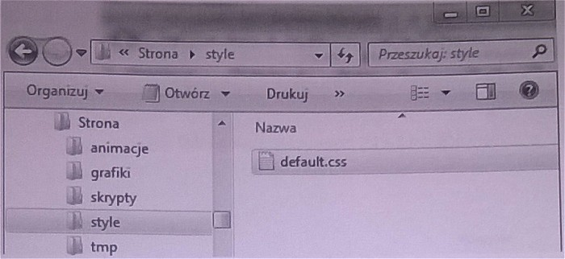
- **A.** <link rel="stylesheet" type="text/css" href="./style/default.css" /> ✅
- **B.** <link rel="stylesheet" type="text/css" href="C:/style/default.css" />
- **C.** <link rel="stylesheet" type="text/css" href="...styledefault.css" />
- **D.** <link rel="stylesheet" type="text/css" href="c:style/default.css" />

### Q47. Wskaż stwierdzenie, które jest prawdziwe dla następującej definicji stylu:

- **A.** Jest to styl lokalny
- **B.** Zdefiniowano dwie klasy ✅
- **C.** Akapit będzie transponowany na małe litery
- **D.** Odnośnik będzie pisany czcionką 14 punktów

### Q48. W palecie kolorów RGB kolor żółty jest połączeniem dwóch kolorów: zielonego i czerwonego. Który z kodów szesnastkowych oznacza kolor żółty?
- **A.** #FF00FF
- **B.** #00FFFF
- **C.** #FFFF00 ✅
- **D.** #F0F0F0

### Q49. Który z formatów NIE pozwala na zapis plików animowanych?
- **A.** GIF
- **B.** ACE ✅
- **C.** SWF
- **D.** SVG

### Q50. Który z formatów graficznych pozwala na zapis przejrzystego tła?
- **A.** GIF ✅
- **B.** RAW
- **C.** BMP
- **D.** JPEG

### Q51. Proces walidacji strony internetowej to
- **A.** zespół działań mających na celu zwiększenie oglądalności
- **B.** sprawdzenie jej w celu wyeliminowania błędów ✅
- **C.** publikowanie w sieci
- **D.** promocja strony

### Q52. Które oprogramowanie NIE JEST systemem zarządzania treścią (CMS)?
- **A.** Joomla
- **B.** Apache ✅
- **C.** Mambo
- **D.** WordPress

### Q53. Który z formatów zapewnia największa redukcję rozmiaru pliku dźwiękowego?
- **A.** WAV
- **B.** PCM
- **C.** MP3 ✅
- **D.** CD-Audio

### Q54. Wskaż prawidłową kolejność tworzenia bazy danych
- **A.** Określenie celu, utworzenie relacji, stworzenie tabel, normalizacja
- **B.** Określenie celu, normalizacja, utworzenie relacji, stworzenie tabel
- **C.** Określenie celu, stworzenie tabel, utworzenie relacji, normalizacja ✅
- **D.** Określenie celu, normalizacja, stworzenie tabel, utworzenie relacji

### Q55. Wskaż typ relacji pomiędzy tabelami: Tabela1 i Tabela3

- **A.** Jeden do jednego
- **B.** Wiele do jednego
- **C.** Jeden do wielu
- **D.** Wiele do wielu ✅

### Q56. Które z pól są umieszczone w formularzu?

- **A.** Textarea, Option, Input(Chechbox), Input(Checkbox), Input(Submit) Input(Reset)
- **B.** Input(Text), Select, Input(Radio), Input(Radio), Input(Submit), Input(Reset) ✅
- **C.** Textarea, Select, Input(Radio), Input(Radio), Input(Reset), Input(Submit)
- **D.** Input(Text), Input(Chechbox), Select, Select, Input(Submit), Input(Reset)

### Q57. Którą z właściwości pola tabeli należy zdefiniować, aby pole przyjmowało dane składające się wyłącznie z cyfr?

- **A.** Tagi inteligentne
- **B.** Wartość domyślną
- **C.** Maskę wprowadzania ✅
- **D.** Regułę sprawdzania poprawności

### Q58. Którego ze słów kluczowych języka SQL należy użyć, aby wyeliminować duplikaty?
- **A.** LIKE
- **B.** DISTINCT ✅
- **C.** ORDER BY
- **D.** GROUP BY

### Q59. Które ze stwierdzeń prawidłowo charakteryzuje zdefiniowaną tabelę: CREATE TABLE dane (kolumna INTEGER(3));
- **A.** Tabela o nazwie posiada trzy kolumny liczb całkowitych
- **B.** Tabela o nazwie posiada jedną kolumnę liczb całkowitych ✅
- **C.** Tabela posiada jedną kolumnę zawierającą trzy elementowe tablice
- **D.** Kolumny tabeli nazywają się: , ,

### Q60. Polecenie REVOKE SELECT ON nazwa1 FROM nazwa2 w języku SQL umożliwia
- **A.** nadanie uprawnień z użyciem zdefiniowanego schematu
- **B.** odbieranie uprawnień użytkownikowi ✅
- **C.** usuwanie użytkownika z bazy
- **D.** nadawanie praw do tabeli

### Q61. Które polecenie wydane z konsoli systemu operacyjnego, zawierające w swojej składni opcję --repair, umożliwia naprawę bazy danych?
- **A.** mysqlcheck ✅
- **B.** mysqldump
- **C.** truncate
- **D.** create

### Q62. Które polecenie wydane z konsoli systemowej dokona przywrócenia bazy danych?
- **A.** mysqldump -u root -p baza > kopia.sql
- **B.** mysqldump -u root -p baza < kopia.sql
- **C.** mysql -u root -p baza < kopia.sql ✅
- **D.** mysql -u root -p baza > kopia.sql

### Q63. Polecenie w języku SQL GRANT ALL PRIVILEGES ON klienci TO pracownik
- **A.** nadaje uprawnienie grupie do tabeli
- **B.** odbiera wszystkie uprawnienia do tabeli
- **C.** skopiuje uprawnienia z grupy na użytkownika
- **D.** nadaje wszystkie uprawnienia do tabeli użytkownikowi ✅

### Q64. Która z wymienionych funkcji sortowania wykorzystywana w języku PHP sortuje tablicę asocjacyjną według indeksów
- **A.** sort()
- **B.** rsort()
- **C.** asort()
- **D.** ksort() ✅

### Q65. W skrypcie PHP należy utworzyć cookie o nazwie owoce które przyjmie wartość jabłko. Cookie ma być dostępne przez jedną godzinę od jego utworzenia. W tym celu należy w skrypcie PHP użyć funkcji:
- **A.** cookie("owoce","jabłko",3600);
- **B.** cookie("jabłko","owoce",3600);
- **C.** setcookie("owoce","jabłko",time()+3600); ✅
- **D.** setcookie("jabłko","owoce",time()+3600);

### Q66. Wskaż słowo kluczowe w języku C++ dodawane przed wbudowanym typem danych, które przesuwa zakres liczby wyłącznie nieujemne
- **A.** long
- **B.** const
- **C.** short
- **D.** unsigned ✅

### Q67. W językach programowania tylko zmienna jednego typu wbudowanego może przyjmować wyłącznie dwie wartości. Jest to typ
- **A.** logiczny ✅
- **B.** znakowy
- **C.** tablicowy
- **D.** łańcuchowy

### Q68. Instrukcja języka PHP tworząca obiekt pkt dla zdefiniowanej w ramce klasy ma postać

- **A.** pkt Punkt;
- **B.** pkt = new Punkt(); ✅
- **C.** pkt Punkt();
- **D.** Punkt() pkt;

### Q69. Wskaż wynik wykonania skryptu napisanego w języku PHP

- **A.** A ✅
- **B.** B
- **C.** C
- **D.** D

### Q70. Które ze stwierdzeń dotyczących języków programowania NIE jest prawdziwe
- **A.** C++ jest językiem obiektowym
- **B.** JavaScript jest językiem skryptowym
- **C.** SQL jest językiem programowania strukturalnego ✅
- **D.** PHP jest językiem do tworzenia stron w czasie rzeczywistym

### Q71. Jaka wartość zostanie wypisana na standardowym wyjściu dla zamieszczonego w ramce fragmentu programu napisanego w języku C++
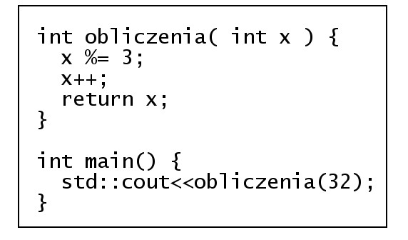
- **A.** 0
- **B.** 2
- **C.** 3 ✅
- **D.** 32

### Q72. Wskaż stwierdzenie, które nie jest prawdziwe dla następującej definicji funkcji w języku C++?

- **A.** Funkcja zwraca wartość ✅
- **B.** Funkcja nie zwraca wartości
- **C.** Funkcja posiada dwa parametry
- **D.** Funkcja odwołuje się do parametrów przez referencję

### Q73. Element zadeklarowany w języku C++ double *x; to
- **A.** Parametr formalny typu rzeczywistego
- **B.** Zmienna rzeczywista
- **C.** Zmienna całkowita
- **D.** Wskaźnik ✅

### Q74. Wskaż prawidłową kolejność tworzenia aplikacji
- **A.** Specyfikacja wymagań, analiza wymagań klienta, tworzenie, wdrażanie,testy
- **B.** Analiza wymagań klienta, specyfikacja wymagań tworzenie, testy, wdrażanie ✅
- **C.** Tworzenie, analiza wymagań klienta, specyfikacja wymagań, wdrażanie, testy
- **D.** Analiza wymagań klienta, specyfikacja wymagań, tworzenie, wdrażanie, testy

### Q75. Jaką wartość zwróci funkcja zao zdefiniowana w języku C++, wywołana z aktualnym parametrem 3.55

- **A.** 3
- **B.** 4 ✅
- **C.** 3.5
- **D.** 4.05

### Q76. Proces tłumaczenia kodu źródłowego pisanego przez programistę na zrozumiały dla komputera kod maszynowy to
- **A.** debugowanie
- **B.** uruchamianie
- **C.** kompilowanie ✅
- **D.** implementowanie

### Q77. Które ze stwierdzeń, w odniesieniu do zamieszczonej w ramce definicji funkcji, jest poprawne?

- **A.** Pętla wykona się tylko raz
- **B.** Funkcja posiada pętlę powtarzającą się 3 razy
- **C.** Tekst będzie wczytywany do momentu podania liczby większej niż 3
- **D.** Wczytanie tekstu zakończy się, gdy tekst będzie się składał przynajmniej z 3 znaków ✅

### Q78. Po wykonaniu zamieszczonego w ramce skryptu napisanego w języku JavaScript w przeglądarce zostanie wypisana wartość

- **A.** 12,4
- **B.** 12,5 ✅
- **C.** 15,4
- **D.** 15,5

### Q79. Poprzez deklarację var x="true"; w języku JavieScript tworzy się zmienną typu
- **A.** Logicznego
- **B.** Liczbowego
- **C.** String (ciąg znaków) ✅
- **D.** Nieokreślonego (undefined)

### Q80. Platforma wspierająca programowanie w technologii .NET to
- **A.** db2
- **B.** eclipse
- **C.** framework ✅
- **D.** middleware

### Q81. Proces, w którym wykrywa się i usuwa błędy w kodzie źródłowym programów, to
- **A.** Kompilowanie
- **B.** Debugowanie ✅
- **C.** standaryzacja
- **D.** Normalizacja

### Q82. Aby ustawić tło na stronie www należy użyć polecenia
- **A.** <background=""> </background>
- **B.** <body bgcolor=""> </body> ✅
- **C.** <bgcolor=""> </bgcolor>
- **D.** <body background=""> </body>

### Q83. Parametr face znacznika  służy do określenia
- **A.** barwy czcionki
- **B.** nazwy czcionki ✅
- **C.** efektów czcionki
- **D.** wielkości czcionki

### Q84. Kodowanie w standardzie ISO-8859-2 stosowane jest w celu poprawnego wyświetlenia
- **A.** symboli matematycznych
- **B.** polskich liter, takich jak: ś, ć, ń, ó, ą ✅
- **C.** znaków specjalnych dla języka kodu strony
- **D.** znaków zarezerwowanych dla języka opisu strony

### Q85. Zamieszczony w ramce kod wyświetla tabelę składajacą się z

- **A.** dwóch wierszy i dwóch kolumn
- **B.** dwóch wierszy i jednej kolumny
- **C.** jednego wiersza i dwóch kolumn ✅
- **D.** jednego wiersza i jednej kolumny

### Q86. W języku JavaScript, aby wydzielić fragment napisu znajdujący się pomiędzy wskazanymi przez parametr indeksami należy użyć metody
- **A.** slice() ✅
- **B.** replace()
- **C.** trim()
- **D.** concat()

### Q87. Które polecenie w CSS służy do załączenia zewnętrznego arkusza stylów?
- **A.** open
- **B.** import ✅
- **C.** require
- **D.** include

### Q88. Selektor CSS a:link {color:red} zawarty w kaskadowych arkuszach stylów definiuje
- **A.** klasę
- **B.** pseudoklasę ✅
- **C.** identyfikator
- **D.** pseudoelement

### Q89. Jak nazywa się edytor wspomagający tworzenie stron internetowych, którego sposób działania można w polskim tłumaczeniu określić jako: otrzymujesz to, co widzisz?
- **A.** IDE
- **B.** WYSIWYG ✅
- **C.** WEB STUDIO
- **D.** VISUAL EDITOR

### Q90. Kolor 255 12 12 w modelu RGB na stronie www powinien być zapisany w postaci
- **A.** #2551212
- **B.** #EE0C0C
- **C.** #AB1A1D
- **D.** #FF0C0C ✅

### Q91. CMYK to zestaw czterech podstawowych kolorów farb drukarskich:
- **A.** turkusowego, błękitnego, białego, różowego
- **B.** turkusowego, purpurowego, białego, czarnego
- **C.** czerwonego, purpurowego, żółtego, szarego
- **D.** turkusowego, purpurowego, żółtego, czarnego ✅

### Q92. Cechą formatu PNG jest
- **A.** obsługa animacji
- **B.** bezstratna kompresja ✅
- **C.** brak obsługi kanału alfa
- **D.** reprezentacja grafiki wektorowej

### Q93. Saturacja koloru nazywana jest inaczej
- **A.** jasnością koloru
- **B.** nasyceniem koloru ✅
- **C.** dopełnieniem koloru
- **D.** przezroczystością koloru

### Q94. Kanał alfa służy do zdefiniowania
- **A.** jasności i kontrastu kolorów
- **B.** przezroczystość obiektu graficznego ✅
- **C.** zaznaczonego fragmentu obiektu graficznego
- **D.** podstawowych parametrów obiektu graficznego

### Q95. Częstotliwość próbkowania ma wpływ na
- **A.** jakość cyfrowego dzwięku ✅
- **B.** jakość analogowego dzwięku
- **C.** amplitudę fali dźwiękowej utworu
- **D.** skalę głośności zapisanego utworu

### Q96. Wysokość dźwięku zależy od
- **A.** siły wzbudzenia drgania
- **B.** sposobu pobudzania drgania
- **C.** czasu drgania źródła dzwięku
- **D.** częstotliwości drgania fali akustycznej ✅

### Q97. Typ stało-znakowy w języku SQL to
- **A.** char ✅
- **B.** text
- **C.** time
- **D.** bool

### Q98. Operator arytmetyczny modulo w języku SQL to
- **A.** /
- **B.** ||
- **C.** &
- **D.** % ✅

### Q99. Polecenie w języku SQL ALTER TABLE USA... ma za zadanie
- **A.** usunięcie tabeli USA
- **B.** modyfikację tabeli USA ✅
- **C.** nadpisanie starej tabeli USA
- **D.** utworzenie nowej tabeli USA

### Q100. Kod: SELECT imie, pesel, wiek FROM dane WHERE wiek IN (18,30) spowoduje wybranie:
- **A.** imion, nazwisk i numerów PESEL osób w wieku poniżej 18 lat
- **B.** imion, numerów PESEL i wieku osób z przedziału od 18 do 30 lat
- **C.** imion, numerów PESEL i wieku osób posiadających powyżej 30 lat
- **D.** imion, numerów PESEL i wieku osób w wieku równym 18 lub 30 lat ✅

### Q101. Aby policzyć wszystkie wiersze tabeli Koty należy użyć polecenia:
- **A.** SELECT COUNT(*) FROM Koty ✅
- **B.** SELECT ROWNUM() FROM Koty
- **C.** SELECT COUNT(Koty) AS ROWNUM
- **D.** SELECT COUNT(ROWNUM) FROM Koty

### Q102. Aby podczas tworzenia tabeli utworzyć klucz obcy na wielu kolumnach, należy użyć polecenia
- **A.** CONSTRAINT(nazwisko,imie) FOREIGN KEY REFERENCES osoby (nazwisko, imie)
- **B.** CONSTRAINT(nazwisko,imie) FOREIGN REFERENCES KEY osoby (nazwisko, imie)
- **C.** CONSTRAINT fk_osoba_uczen FOREIGN KEY (nazwisko, imie) REFERENCES osoby (nazwisko,imie) ✅
- **D.** CONSTRAINT fk_osoba_uczen FOREIGN KEY ON (nazwisko, imie) REFERENCES osoby (nazwisko,imie)

### Q103. W algebrze relacji operacja selekcji polega na
- **A.** wyelminowaniu pustych wierszy
- **B.** wybraniu krotek spełniających określone warunki ✅
- **C.** wybraniu krotek niezawierających wartości NULL
- **D.** wyelminowaniu krotek z powtarzającymi się polami

### Q104. Relacja w bazach danych jest
- **A.** logicznym połączeniem tabel ✅
- **B.** kluczem głównym w relacji tabel
- **C.** algebraicznym połączeniem tabel
- **D.** połączeniem dwóch pól jednej tabeli

### Q105. Wskaż poprawną kolejność etapów projektowania relacyjnej bazy danych
- **A.** Selekcja, Określenie relacji, Określenie kluczy podstawowych tabel, Określenie zbioru danych
- **B.** Określenie relacji, Określenie kluczy podstawowych tabel, Selekcja, Określenie zbioru danych
- **C.** Określenie kluczy podstawowych tabel, Określenie zbioru danych, Selekcja, Określenie relacji
- **D.** Określenie zbioru danych, Selekcja, Określenie kluczy podstawowych tabel, Określenie relacji ✅

### Q106. Formularze do obsługi baz danych tworzy się w celu
- **A.** raportowania danych
- **B.** wyszukiwania wierszy spełniających dane kryteria
- **C.** wprowadzenia powiązań w relacyjnych bazach danych
- **D.** wygodniejszego wprowadzania, edytowania i usuwania danych ✅

### Q107. Integralność referencyjna w modelu relacyjnych baz danych oznacza, że
- **A.** wartość klucza głównego oraz klucza obcego nie jest pusta
- **B.** klucz główny lub klucz obcy nie zawierają wartości NULL
- **C.** każdemu kluczowi głównemu odpowiada dokładnie jeden klucz obcy w tabeli lub tabelach powiązanych
- **D.** wartość klucza obcego w danej tabeli musi być albo równa wartości klucza głównego w tabeli z nia powiązanej albo równa wartości NULL ✅

### Q108. Deklaracja w języku JavaScript: var x=true; powoduje, że zmienna x jest typu
- **A.** logicznego ✅
- **B.** liczbowego
- **C.** ciąg znaków
- **D.** wyliczeniowego

### Q109. Obiekt typu array w języku Javascript służy do przechowywania
- **A.** wielu wartości lub funkcji
- **B.** wielu wartości dowolnego typu ✅
- **C.** wielu wartości wyłącznie liczbowych
- **D.** wielu wartości wyłącznie tekstowych

### Q110. Ukrywanie pewnych pól lub metod obiektów danej klasy tak, aby były one dostępne tylko metodom wewnętrznym tej klasy lub funkcjom zaprzyjaźnionym, to
- **A.** polimorfizm
- **B.** hermetyzacja ✅
- **C.** konkatenacja
- **D.** dziedziczenie

### Q111. Odwoływanie funkcji do samej siebie to
- **A.** iteracja
- **B.** rekurencja ✅
- **C.** hermetyzacja
- **D.** dziedziczenie

### Q112. W języku PHP zmienna $_GET jest zmienną
- **A.** predefiniowaną, używaną do przekazywania danych do skryptów PHP poprzez adres strony ✅
- **B.** predefiniowaną, używaną do gromadzenia wartości formularza po nagłówkach zlecenia HTTP (danych z formularza nie można zobaczyć w adresie)
- **C.** zdefiniowaną przez twórcę strony, służącą do przekazywania danych z formularza przez adres strony
- **D.** zwykłą, zdefiniowaną przez twórcę strony

### Q113. W języku PHP w instrukcji switch musi występować
- **A.** instrukcja default
- **B.** konstrukcja switch(wyrażenie) ✅
- **C.** przynajmniej dwie instrukcje case
- **D.** instrukcja break po każdej instrukcji case

### Q114. Konstruktor w języku PHP jest metodą o nazwie
- **A.** _new
- **B.** _open
- **C.** _create
- **D.** _construct ✅

### Q115. Debugger to program służący do
- **A.** badania właściwości programu
- **B.** sprawdzania szybkości programu
- **C.** wyszukiwania błędów w kodzie programu ✅
- **D.** zoptymalizowanie pamięci używanej przez aplikację

### Q116. Kod zamieszczony w ramce spowoduje wypisanie liczb

- **A.** 2 4 6 8
- **B.** 1 3 5 7 9
- **C.** 2 4 6 8 10 ✅
- **D.** 1 2 3 4 5 6 7 8 9 10

### Q117. Który kod jest alternatywny do kodu zamieszczonego w ramce?

- **A.** A ✅
- **B.** B
- **C.** C
- **D.** D

### Q118. Zamieszczony w ramce fragment skryptu w języku JavaScript
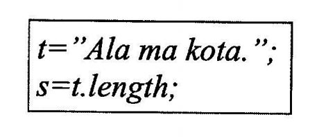
- **A.** przypisze zmienniej s zmienną t
- **B.** wyświetli długość napisu ze zmiennej t
- **C.** przypisze zmiennej s długość napisu ze zmiennej t ✅
- **D.** przypisze zmiennej s fragment napisu ze zmiennej t, o określonej przez zmienną length długości

### Q119. Zamieszczony w ramce fragment kodu w JavaScript wypisze

- **A.** "ze" ✅
- **B.** "wo"
- **C.** "owodzeni"
- **D.** "wodzenia"

### Q120. Który fragment kodu JavaScript zwróci wartość true?
- **A.** "a" > "b"
- **B.** "ab" > "c"
- **C.** "abc" > "def"
- **D.** "def" > "abc" ✅

### Q121. W kodzie PHP znak "//" oznacza
- **A.** początek skryptu
- **B.** operator alernatywy
- **C.** operator dzielenia całkowitego
- **D.** początek komentarza jednoliniowego ✅

### Q122. Zapisując hasło użytkownika serwisu WWW (np. bankowości internetowej), w celu jego zabezpieczenia przed odtajnieniem, zwykle używa się funkcji
- **A.** klucza ✅
- **B.** cyklometrycznych
- **C.** abstrakcyjnych
- **D.** mieszających

### Q123. W celu określenia wysokości obrazka wyświetlonego na stronie WWW należy wykorzystać właściwość CSS o nazwie
- **A.** width
- **B.** padding
- **C.** height ✅
- **D.** margin

### Q124. Aby ustawić czcionkę Verdana w kodzie CSS, należy wykorzystać właściwość
- **A.** font-family: Verdana; ✅
- **B.** font-style: Verdana;
- **C.** font-name: Verdana;
- **D.** font-weight: Verdana;

### Q125. Funkcja zapisana językiem PHP służy do

- **A.** połączenia z bazą danych
- **B.** ustawienia hasła do bazy danych
- **C.** zabezpieczenia bazy danych
- **D.** pobrania danych z bazy danych ✅

### Q126. Kwerenda pozwalająca na wprowadzenie zmian w wielu rekordach lub przeniesienie wielu rekordów przy użyciu pojedynczej operacji, nosi nazwę kwerendy
- **A.** krzyżowej
- **B.** funkcjonalnej ✅
- **C.** wybierającej
- **D.** parametrycznej

### Q127. Wskaż rezultat działania fragmentu kodu JavaScript

- **A.** Usunięcie akapitu ze strony
- **B.** Dodanie akapitu na koniec strony ✅
- **C.** Wyświetlenie okna dialogowego z napisem akapit
- **D.** Dodanie akapitu na początku strony

### Q128. Fizyczny model replikacji bazy danych przedstawiony na rysunku jest modelem

- **A.** rozproszonym
- **B.** centralnego subskrybenta
- **C.** równorzędnym
- **D.** centralnego wydawcy ✅

### Q129. Za pomocą którego protokołu należy wysłać pliki na serwer WWW?
- **A.** DHCP
- **B.** FTP ✅
- **C.** POP3
- **D.** DNS

### Q130. Wynikiem działania zamieszczonej pętli zapisanej językiem PHP jest wypisanie kolejnych liczb

- **A.** od 10 do 1 ✅
- **B.** od 1 do 10
- **C.** od 10 do 2
- **D.** od 2 do 10

### Q131. Które z poleceń naprawi uszkodzoną tabelę w języku SQL?
- **A.** REGENERATE TABLE tbl_name
- **B.** REPAIR TABLE tblname ✅
- **C.** OPTIMIZE TABLE tbl_name
- **D.** ANALYZE TABLE tbl_name

### Q132. Który z wymienionych formatów plików graficznych obsługuje przezroczystość?
- **A.** JPG
- **B.** PNG ✅
- **C.** NEF
- **D.** BMP

### Q133. Który zapis stylu CSS ustawi tło bloku na kolor niebieski?
- **A.** div {shadow: blue;}
- **B.** div {border-color: blue;}
- **C.** div {color: blue;}
- **D.** div {background-color: blue;} ✅

### Q134. Domyślna nazwa pliku konfiguracyjnego serwera Apache to
- **A.** .configuration
- **B.** configuration.php
- **C.** htaccess.cnf
- **D.** .htaccess ✅

### Q135. Organizacja zajmująca się ustalaniem standardu dla języka HTML nosi nazwę
- **A.** W3C ✅
- **B.** ISO
- **C.** NASK
- **D.** WYSIWYG

### Q136. Który z wymienionych systemów nie jest systemem CMS?
- **A.** Joomla
- **B.** Adobe Flash ✅
- **C.** WordPress
- **D.** Drupal

### Q137. Która ze zdefiniowanych funkcji w języku PHP jako wynik zwraca połowę kwadratu wartości przekazanej?
- **A.** function licz($a) { echo $a*$a/2; }
- **B.** function licz($a) { return $a/2; }
- **C.** function licz($a) { return $a*$a/2; } ✅
- **D.** function licz($a) { echo $a/2; }

### Q138. W strukturalnych językach programowania w celu przechowania informacji o 50 uczniach (ich imionach, nazwiskach, średniej ocen) należy użyć
- **A.** tablicy 50 elementów o składowych strukturalnych ✅
- **B.** struktury 50 elementów o składowych typu tablicowego
- **C.** tablicy 50 elementów o składowych łańcuchowych
- **D.** klasy 50 elementów typu tablicowego

### Q139. Aby zobaczyć wyniki działania skryptu napisanego w języku PHP, będącego elementem strony WWW, musi być on
- **A.** zinterpretowany po stronie serwera ✅
- **B.** skompilowany po stronie klienta
- **C.** skompilowany po stronie serwera
- **D.** zinterpretowany po stronie klienta

### Q140. Projektowanie logicznego układu witryny polega na
- **A.** rozmieszczeniu elementów w konkretnych miejscach witryny ✅
- **B.** opracowaniu zestawu grafik dla witryny
- **C.** zdefiniowaniu treści witryny
- **D.** ustaleniu adresów URL dla podstron witryny

### Q141. Prosta animacja może być zapisana w formacie
- **A.** PSD
- **B.** BMP
- **C.** GIF ✅
- **D.** TIFF

### Q142. Która z instrukcji umożliwia wysłanie tekstu do przeglądarki?
- **A.** echo ✅
- **B.** exit
- **C.** break
- **D.** type

### Q143. Aby stworzyć tabelę w bazie danych, należy zastosować polecenie SQL
- **A.** ADD TABLE
- **B.** NEW TABLE
- **C.** PLUS TABLE
- **D.** CREATE TABLE ✅

### Q144. Zdarzenie JavaScript, będące reakcją na pojedynczo kliknięty dowolny element strony, nosi nazwę
- **A.** onClick ✅
- **B.** onDblClick
- **C.** onLoad
- **D.** onKeyDown

### Q145. W skład typowego frameworka wchodzą
- **A.** zarządzanie komunikacją z bazą danych, mechanizm uruchamiania i przetwarzania akcji ✅
- **B.** domena i obsługa błędów
- **C.** obsługa formularzy i wbudowany serwer
- **D.** mechanizm uruchamiania i przetwarzania akcji, oraz certyfikat http

### Q146. W celu stworzenia relacji wiele do wielu łączącej tabele A i B wystarczy, że
- **A.** tabela A będzie zawierała te same pola co tabela B
- **B.** wiele rekordów z tabeli A zduplikuje się w tabeli B
- **C.** zdefiniuje się trzecią tabelę z kluczami obcymi do tabel A i B ✅
- **D.** tabelę A połączy się z tabelą B poprzez zdefiniowanie kluczy obcych

### Q147. W celu zapewnienia spójności danych w bazie programu Microsoft Access należy skorzystać
- **A.** z więzów integralności ✅
- **B.** z kwerendy aktualizującej
- **C.** z defragmentacji bazy
- **D.** z archiwizacji bazy

### Q148. W załączonym fragmencie kodu CSS kolor jest zapisany w postaci

- **A.** HSL
- **B.** dziesiętnej
- **C.** CMYK
- **D.** szesnastkowej ✅

### Q149. W języku skryptowym JavaScript zmienne mogą być deklarowane
- **A.** w momencie pierwszego użycia zmiennej ✅
- **B.** tylko na początku skryptu
- **C.** tylko jeśli podamy typ zmiennej i jej nazwę
- **D.** zawsze z poprzedzającym nazwę znakiem $

### Q150. W językach programowania zmienna typu integer służy do przechowywania
- **A.** znaku
- **B.** liczby całkowitej ✅
- **C.** liczby rzeczywistej
- **D.** wartości logicznej

### Q151. Jeśli rozmiar pliku graficznego jest zbyt duży do publikacji w Internecie, należy
- **A.** dodać kanał alfa
- **B.** zmniejszyć jego rozdzielczość ✅
- **C.** zwiększyć jego głębię kolorów
- **D.** zapisać w formacie BMP

### Q152. Które z poleceń umożliwia dodanie kolumny zadaniekompletne do tabeli zadania?
- **A.** ALTER TABLE zadania ADD COLUMN zadaniekompletne int ✅
- **B.** ADD COLUMN zadaniekompletne WITH zadania
- **C.** CREATEINDEX zadania ADD COLUMN zadaniekompletne int
- **D.** INSERT INTO zadania VALUES zadaniakompletne

### Q153. W bazie danych, w celu uporządkowania listy uczniów według roku urodzenia, należy użyć polecenia
- **A.** SELECT imie,nazwisko,klasa from uczniowie group by rok_urodzenia
- **B.** SELECT imie,nazwisko,klasa from uczniowie order by rok_urodzenia ✅
- **C.** SELECT imie,nazwisko,klasa from uczniowie order by nazwisko
- **D.** SELECT imie,nazwisko,klasa from uczniowie where rok_urodzenia = 1994

### Q154. Wskaż dwa sposoby zabezpieczenia bazy danych Microsoft Access
- **A.** Ustalanie hasła do otwarcia bazy danych oraz zabezpieczeń na poziomie użytkownika ✅
- **B.** Zaszyfrowanie pliku bazy danych oraz SMSy z kodem autoryzującym
- **C.** Funkcje anonimowe oraz ustalenie hasła otwarcia bazy danych
- **D.** Ustalenie zabezpieczeń na poziomie użytkownika oraz sesji

### Q155. W zamieszczonym przykładzie pseudoklasa hover sprawi, że styl pogrubiony będzie przypisany

- **A.** odnośnikowi, w momencie kiedy najechał na niego kursor myszy ✅
- **B.** wszystkim odnośnikom nieodwiedzonym
- **C.** każdemu odnośnikowi niezależnie od aktualnego stanu
- **D.** wszystkim odnośnikom odwiedzonym

### Q156. Certyfikat SSL jest stosowany do
- **A.** zapisania danych o sesjach tworzonych w witrynie
- **B.** zidentyfikowania właściciela domeny ✅
- **C.** deszyfracji transmitowanych danych
- **D.** blokowania szkodliwego oprogramowania w witrynie

### Q157. W języku SQL przywilej SELECT polecenia GRANT pozwala użytkownikowi baz danych na
- **A.** odczyt danych z tabeli ✅
- **B.** tworzenie tabeli
- **C.** usunięcie danych z tabeli
- **D.** modyfikowanie danych w tabeli

### Q158. W języku HTML atrybut alt znacznika img jest wykorzystywany w celu zdefiniowania
- **A.** ścieżki i nazwy pliku źródłowego grafiki
- **B.** tekstu, który będzie wyświetlony, jeśli nie może być wyświetlona grafika ✅
- **C.** podpisu, który zostanie wyświetlony pod grafiką
- **D.** atrybutów grafiki, takich jak rozmiar, obramowanie, wyrównanie

### Q159. Warunek zapisany językiem PHP wypisze liczbę, gdy

- **A.** jest ona parzysta ✅
- **B.** jest ona liczbą pierwszą
- **C.** wynik dzielenia liczby przez 2 jest równy 0
- **D.** jest ona dodatnia

### Q160. Analizując przedstawiony kod zapisany w języku HTML, można stwierdzić, że w przeglądarce

- **A.** zostanie ustawiony dolny margines dla bloku B
- **B.** blok B będzie oddalony od bloku A o 20 px ✅
- **C.** blok A będzie przesunięty w lewo o 20 px
- **D.** bloki A i B będą nachodzić na siebie.

### Q161. Baza danych zawiera tabelę o nazwie pracownicy o polach: nazwisko, imie, pensja, wiek. Jak wygląda składnia polecenia wyznaczającego średnią pensję pracowników?
- **A.** select AVG (nazwisko) into pensja
- **B.** select VAR (pracownicy) into pensja
- **C.** select AVG (pensja) from pracownicy ✅
- **D.** select VAR (pensja) from nazwisko

### Q162. Do reprezentacji liczb zmiennoprzecinkowych w języku C stosowany jest typ
- **A.** int
- **B.** bool
- **C.** char
- **D.** double ✅

### Q163. Polecenie SQL o treści: UPDATE artykuly SET cena = cena * 0.7 WHERE kod = 2; oznacza
- **A.** w tabeli artykuly obniża wartość każdego pola cena o 30% dla wszystkich artykułów
- **B.** w tabeli artykuly obniża wartość każdego pola cena dla którego pole kod jest równe 2 ✅
- **C.** wprowadzenie w tabeli artykuly nowych pól cena i kod
- **D.** wprowadzenie w tabeli artykuly pola o nazwie cena ze znacznikiem kod

### Q164. Do edycji grafiki wektorowej stosuje się program
- **A.** Paint
- **B.** Audacity
- **C.** Wordpad
- **D.** Corel Draw ✅

### Q165. W programowaniu obiektowym mechanizm współdzielenia pól i metod klasy w taki sposób, że klasa pochodna zawiera metody zdefiniowane w klasie bazowej nazywa się
- **A.** hermetyzacją
- **B.** wirtualizacją
- **C.** polimorfizmem
- **D.** dziedziczeniem ✅

### Q166. Który z wymienionych znaczników języka HTML nie jest stosowany w celu formatowania tekstu?
- **A.** <em>
- **B.** 
- **C.** 
 ✅
- **D.** <strong>

### Q167. Aby zdefiniować w języku HTML listę nienumerowaną, należy użyć znacznika
- **A.** <dd>
- **B.** <dt>
- **C.** <ol>
- **D.** <ul> ✅

### Q168. W języku CSS właściwość font-size przyjmuje, według słów kluczowych, wartości
- **A.** tylko big i small
- **B.** wyłączenie small, medium, large
- **C.** jedynie small, smaller,large, larger
- **D.** ze zbioru xx-small, x-small, medium, large, x-large, xx-large ✅

### Q169. W języku CSS, w celu zdefiniowania wewnętrznego górnego marginesu, czyli odstepu między elementem a otaczającym go obramowaniem, należy użyć polecenia
- **A.** padding-top ✅
- **B.** outline-top
- **C.** border-top
- **D.** local-top

### Q170. Funkcja edytor WYSIWYG Adobe Dreamweaver służy do
- **A.** wyświetlania interaktywnego drzewa struktury HTML dla zawartości statycznej i dynamicznej ✅
- **B.** definiowania kaskadowych arkuszy stylów dołączonych do witryny
- **C.** formatowanie tekstu przy pomocy dostępnych znaczników
- **D.** tworzenia szablonu strony internetowej

### Q171. Aby witryna internetowa prawidłowo skalowała się w urządzeniach mobilnych, należy wielkość czcionki zdefiniować
- **A.** w pikselach
- **B.** w procentach ✅
- **C.** w milimetrach
- **D.** tylko znacznikami big i small

### Q172. Znacznik meta języka HTML należy umieścić
- **A.** pomiędzy znacznikami body
- **B.** w części nagłówkowej witryny internetowej ✅
- **C.** pomiędzy znacznikami paragrafu
- **D.** w stopce witryny internetowej

### Q173. Prawidłowy, zgodny ze standardem języka XHTML, zapis samozamykającego się znacznika odpowiadającego za łamanie linii ma postać
- **A.** </ br>
- **B.**   ✅
- **C.**  
- **D.**    

### Q174. Najprostszą i najmniej pracochłonną metodą przetestowania działania witryny internetowej w wielu przeglądarkach i ich różnych wersjach jest
- **A.** skorzystanie z walidatora języka HTML
- **B.** skorzystanie z emulatora przeglądarek internetowych np. Browser Sandbox ✅
- **C.** zainstalowanie na kilku komputerach różnych przeglądarek i testowanie witryny
- **D.** testowanie witryny w programie Internet Explorer, zakładając kompatybilność innych przeglądarek

### Q175. Aby przenieść witrynę na serwer, można skorzystać z oprogramowania
- **A.** Bugzilla
- **B.** Go!Zilla
- **C.** FileZilla ✅
- **D.** CloneZilla

### Q176. Kolor zapisany kodem RGB, o wartości rgb(255, 128, 16) w kodzie szesnastkowym będzie miał wartość:
- **A.** #008010
- **B.** #ff0f10
- **C.** #ff8010 ✅
- **D.** #ff8011

### Q177. Plik graficzny należy zapisać w formacie GIF, jeżeli
- **A.** jest to grafika wektorowa
- **B.** jest to obraz stereoskopowy
- **C.** jest potrzeba zapisu obrazu bez kompresji
- **D.** jest potrzeba zapisu obrazu lub animacji ✅

### Q178. Aby dopasować dźwięk do danego poziomu głośności, należy użyć efektu
- **A.** wyciszenia
- **B.** normalizacji ✅
- **C.** podbicia basów
- **D.** usuwania szumów

### Q179. Instrukcja DROP języka SQL ma za zadanie
- **A.** usunąć istniejący obiekt ✅
- **B.** zmienić parametry obiektu
- **C.** zaktualizować dane obiektu
- **D.** dodać nowy obiekt

### Q180. Baza danych zawiera tabelę uczniowie z polami: imie, nazwisko, klasa. Aby odnaleźć imiona i nazwiska tych uczniów, których nazwiska rozpoczynają się literą M, należy zastosować polecenie SQL
- **A.** SELECT nazwisko, imie FROM uczniowie WHERE nazwisko IN "M%";
- **B.** SELECT nazwisko, imie FROM uczniowie WHERE nazwisko LIKE "M%"; ✅
- **C.** SELECT nazwisko, imie FROM uczniowie ORDER BY nazwisko = "M%";
- **D.** SELECT nazwisko, imie FROM uczniowie ORDER BY nazwisko IN "M%";

### Q181. Baza danych zawiera tabele z polami: . Aby wyświetlić wszystkie nazwy artykułów wyłącznie typu pralka, dla których cena jest z przedziału 1000 PLN i 1500 PLN, należy zastosować polecenie
- **A.** SELECT nazwa FROM artykuly WHERE typ="pralka" AND cena FROM 1000 TO 1500;
- **B.** SELECT nazwa FROM artykuly WHERE typ="pralka" OR cena BETWEEN 1000 OR 1500;
- **C.** SELECT nazwa FROM artykuly WHERE typ="pralka" OR cena BETWEEN 1000 AND 1500;
- **D.** SELECT nazwa FROM artykuly WHERE typ="pralka" AND cena BETWEEN 1000 AND 1500; ✅

### Q182. Wartość pola tabeli pełniącego rolę klucza podstawowego
- **A.** musi być unikalna ✅
- **B.** jest zawsze typu numerycznego
- **C.** służy do szyfrowania zawartości tabeli
- **D.** może przyjmować wartość pustą (NULL)

### Q183. Aby utworzyć relację jeden do wielu, w tabeli po stronie , należy zdefiniować
- **A.** klucz obcy wskazujący na klucz obcy tabeli po stronie
- **B.** klucz sztuczny odnoszący się do kluczy podstawowych obu tabel
- **C.** klucz obcy wskazujący na klucz podstawowy tabeli po stronie ✅
- **D.** klucz podstawowy wskazujący na klucz podstawowy tabeli po stronie

### Q184. Narzędziem służącym do grupowania i prezentowania informacji z wielu rekordów w celu ich drukowania lub rozpowszechniania jest
- **A.** raport ✅
- **B.** kwerenda
- **C.** formularz
- **D.** makropolecenie

### Q185. Aby uprościć wprowadzenie i edytowanie danych w tabeli, należy zdefiniować
- **A.** kwerendę SELECT
- **B.** formularz ✅
- **C.** raport
- **D.** filtr

### Q186. Baza danych 6-letniej szkoły podstawowej zawiera tabelę z polami: . Wszyscy uczniowie klas 1-5 zdali do następnej klasy. Aby zwiększyć wartość w polu klasa o 1 należy użyć polecenia
- **A.** SELECT szkola FROM klasa=klasa+1 WHERE klasa >=1 AND klasa <=5;
- **B.** SELECT nazwisko, imie FROM klasa=klasa+1 WHERE klasa>1 OR klasa <5;
- **C.** UPDATE szkola SET klasa=klasa+1 WHERE klasa>=1 AND klasa <=5; ✅
- **D.** UPDATE nazwisko, imie SET klasa=klasa+1 WHERE klasa>1 OR klasa<5;

### Q187. Uprawnienia obiektowe, nadawane użytkownikom serwera bazy danych, mogą pozwalać lub zabraniać
- **A.** dziedziczyć uprawnienia
- **B.** modyfikować role i konta użytkowników
- **C.** wykonywać instrukcje, takie jak tworzenie kopii zapasowej
- **D.** wykonywać operacje na bazie, takie jak wstawanie lub modyfikowanie danych ✅

### Q188. Przed wykonaniem kopii bezpieczeństwa bazy danych, tak aby kopia ta była poprawna i możliwa do późniejszego odtworzenia, należy sprawdzić
- **A.** możliwość udostępnienia bazy danych
- **B.** prawa dostępu do serwera bazy danych
- **C.** poprawność składni zapytań
- **D.** spójność bazy danych ✅

### Q189. W MS SQL Server polecenie RESTORE DATABASE służy do
- **A.** odtworzenia bazy danych z kopii bezpieczeństwa ✅
- **B.** odświeżenia bazy danych z kontrolą więzów integralności
- **C.** przebudowania bazy danych w oparciu o buforowane dane
- **D.** usunięcia bazy danych z serwera centralnego subskrybenta

### Q190. W języku PHP zmienna typu float przyjmuje wartości
- **A.** logiczne
- **B.** nieliczbowe
- **C.** tylko całkowite
- **D.** zmiennoprzecinkowe ✅

### Q191. Dany jest fragment kodu PHP z zdeklarowaną zmienną typu tablicowego. W wyniku wykonania kodu zostanie wpisane imię

- **A.** Anna
- **B.** Tomasz
- **C.** Krzysztof ✅
- **D.** Aleksandra

### Q192. Przedstawiony kod języka PHP

- **A.** jest błędny, nieznany operator =>
- **B.** definiuje tablicę z trzema wartościami ✅
- **C.** definiuje tablicę z sześcioma wartościami
- **D.** jest błędny, indeksami tablicy mogą być tylko liczby całkowite

### Q193. W języku JavaScript poprawnie nazwana zmienna to
- **A.** #imie
- **B.** imie2 ✅
- **C.** imię2
- **D.** imię%

### Q194. Zakładając, że zmienne: a, b, c przechowują wartości numeryczne, wynikiem działania warunku będzie wypisanie liczby

- **A.** najmniejszej
- **B.** największej ✅
- **C.** nieparzystej
- **D.** parzystej

### Q195. Fragment kodu języku PHP ma następującą postać. Wynikiem działania pętli będzie wypisanie liczb:

- **A.** 0,1,2,3,4,5,6,7,8,9,10,11,12,13,14,15,16,17,18,19,20
- **B.** 0,1,2,3,4,5,6,7,8,9,10,11,12,13,14,15,16,17,18,19
- **C.** 0,4,8,12,16,20 ✅
- **D.** 0,4,8,12,16

### Q196. Zadaniem funkcji zapisanej w języku PHP jest

- **A.** Wypisanie liczby parzystej
- **B.** Wypisanie liczby nieparzystej
- **C.** Zwrócenie wartości 1, gdy liczba jest parzysta ✅
- **D.** Zwrócenie wartości 0, gdy liczba jest parzysta

### Q197. Wykonanie kodu JavaScript w przeglądarce wymaga
- **A.** debugowania
- **B.** kompilowania
- **C.** interpretowania ✅
- **D.** zamiany na kod maszynowy

### Q198. Kod strony WWW napisanej w języku PHP
- **A.** jest wykonywany po stronie klienta
- **B.** jest wykonywany po stronie serwera ✅
- **C.** może być uruchomiony bez obsługi serwera WWW
- **D.** jest przetwarzany na tych samych zasadach co JavaScript

### Q199. Zakładając, że zmienna tablicowa $tab jest wypełniona liczbami naturalnymi, wynikiem programu będzie wypisanie

- **A.** największego elementu tablicy ✅
- **B.** najmniejszego elementu tablicy
- **C.** elementu tablicy, który jest równy wartości $tab[0]
- **D.** tych elementów, które są większe od zmiennej $liczba

### Q200. Fragment kodu w języku JavaScript realizujący dodawanie dwóch liczb ma następującą postać. Aby dodawanie wykonane było po kliknięciu przycisku o nazwie , należy w wykropkowane miejsce wstawić

- **A.** <button onselect="return dodaj()">dodaj</button>
- **B.** <button onselect="return dodaj()">oblicz</button>
- **C.** <button onclick="return oblicz()">dodaj</button>
- **D.** <button onclick="return dodaj()">dodaj</button> ✅

### Q201. Komentarz w języku JavaScript rozpoczyna się od znaku lub znaków
- **A.** <!--
- **B.** <?
- **C.** // ✅
- **D.** #

### Q202. Polecenie pg_connect języka PHP służy do połączenia z bazą
- **A.** mySQL
- **B.** MS SQL
- **C.** PostgreSQL ✅
- **D.** MS ACCESS

### Q203. Aby zamieścić aplikację PHP w internecie, należy jej pliki źródłowe skopiować na serwer za pomocą protokołu
- **A.** FTP ✅
- **B.** HTTP
- **C.** SMTP
- **D.** NNTP

### Q204. Personalizowanie wyglądu strony dla danego użytkownika i jego identyfikacja w serwisie są możliwe dzięki mechanizmowi
- **A.** obiektów DOM
- **B.** łączenia z bazą
- **C.** formularzy
- **D.** cookie ✅

### Q205. Automatyczna weryfikacja właściciela strony udostępnianej przez protokół HTTPS jest możliwa dzięki
- **A.** danym kontaktowym na stronie
- **B.** kluczom prywatnym
- **C.** certyfikatowi SSL ✅
- **D.** danym whois

### Q206. Do grupowania obszarów na poziomie bloków, które będą formatowane za pośrednictwem znaczników, należy użyć
- **A.** 

- **B.** 
 ✅
- **C.** 
- **D.** <param>

### Q207. Znacznik <i> języka HTML służy do
- **A.** umieszczenia obrazka
- **B.** zdefiniowania formularza
- **C.** zmiany kroju pisma na pochylony ✅
- **D.** zdefiniowania nagłówka w tekście

### Q208. Poniżej przedstawiono fragment kodu języka HTML. Jest on definicją listy:

- **A.** A
- **B.** B
- **C.** C ✅
- **D.** D

### Q209. Kod języka CSS można umieścić wewnątrz kodu HTML, posługując się znacznikiem
- **A.** <head>
- **B.** <style> ✅
- **C.** <meta>
- **D.** <body>

### Q210. Chcąc zdefiniować formatowanie tabeli w języku CSS w taki sposób, aby wiersz, który jest aktualnie wskazywany kursorem myszy, został wyróżniony np. innym kolorem, należy zastosować
- **A.** pseudoklasę :visited
- **B.** pseudoklasę :hover ✅
- **C.** pseudoelement :first-line
- **D.** nowy selektor klasy dla wiersza tabeli

### Q211. Aby uzyskać efekt rozstrzelenia liter w selektorze CSS, należy użyć właściwości
- **A.** letter-transform
- **B.** text-decoration
- **C.** letter-spacing ✅
- **D.** text-space

### Q212. Blok deklaracji postaci background-attachment: scroll powoduje, że
- **A.** grafika tła będzie powtarzana (kafelki)
- **B.** tło strony będzie przewijane razem z tekstem ✅
- **C.** tło strony będzie stałe, a tekst będzie się przewijał
- **D.** grafika tła będzie wyświetlona w prawym górnym rogu strony

### Q213. Ikona, która wyświetlona jest przed adresem, w polu adresowym przeglądarki internetowej lub przy tytule otwartej karty przeglądarki nosi nazwę
- **A.** iConji
- **B.** favicon ✅
- **C.** webicon
- **D.** emoticon

### Q214. Aby poprawnie zdefiniować hierarchiczną strukturę tekstu witryny internetowej, należy zastosować
- **A.** znacznik 

- **B.** znaczniki <frame> i <table>
- **C.** znacznik 
 z formatowaniem
- **D.** znaczniki <h1>, <h2> oraz 
 ✅

### Q215. Która z reguł walidacji strony internetowej jest błędna?
- **A.** Jeżeli w instrukcji używa się kilku atrybutów, ich kolejność powinna być zgodna z alfabetem, np.  ✅
- **B.** Wyłączanie znaczników musi następować w odwrotnej kolejności, niż były one włączane, np. 
....<big>...</big>

- **C.** Znaczniki, oprócz samozamykających się, działają do momentu ich wyłączenia znakiem "/", np. 
...

- **D.** W znacznikach nie są rozróżniane wielkie i małe litery, np. 
 i 
 to ten sam znacznik

### Q216. Oznaczenie barwy w postaci #ff00e0 jest równoważne zapisowi
- **A.** rgb(f,0,e0)
- **B.** rgb(ff,0,e0)
- **C.** rgb(255,0,128)
- **D.** rgb(255,0,224) ✅

### Q217. Formatem zapisu rastrowych plików graficznych z kompresją bezstratną jest
- **A.** JNG
- **B.** PNG ✅
- **C.** CDR
- **D.** SVG

### Q218. Podczas obróbki grafiki rastrowej w programie z obsługą kanałów dodanie kanału alfa oznacza
- **A.** dodanie warstwy z przezroczystością ✅
- **B.** określenie poprawnego balansu bieli
- **C.** zwiększenie głębi ostrości obrazu
- **D.** wyostrzenie krawędzi obrazu

### Q219. Aby pozbyć się nienaturalnego odwzorowania ukośnych krawędzi linii w grafice rastrowej, czyli tak zwanego schodkowania, należy zastosować filtr
- **A.** szumu
- **B.** gradientu
- **C.** pikselizacji
- **D.** antyaliasingu ✅

### Q220. Formatem bezstratnej kompresji dźwięku jest
- **A.** MP3
- **B.** AAC
- **C.** WWA
- **D.** FLAC ✅

### Q221. W języku SQL polecenie INSERT INTO
- **A.** dodaje tabelę
- **B.** dodaje pola do tabeli
- **C.** wprowadza dane do tabeli ✅
- **D.** aktualizuje rekordy określoną wartością

### Q222. W języku SQL klauzula DISTINCT instrukcji SELECT sprawi, że zwrócone dane
- **A.** zostaną posortowane
- **B.** nie będą zawierały powtórzeń ✅
- **C.** będą spełniały określony warunek
- **D.** będą pogrupowane według określonego pola

### Q223. Zdefiniowano bazę danych z tabelą sklepy o polach: nazwa, ulica, miasto, branza. Aby wyszukać wszystkie nazwy sklepów spożywczych zlokalizowanych wyłącznie we Wrocławiu, należy posłużyć się kwerendą:
- **A.** SELECT sklepy FROM nazwa WHERE branza="spożywczy" BETWEEN miasto="Wrocław";
- **B.** SELECT sklepy FROM branza="spożywczy" WHERE miasto="Wrocław";
- **C.** SELECT nazwa FROM sklepy WHERE branza="spozywczy" OR miasto="Wrocław";
- **D.** SELECT nazwa FROM sklepy WHERE branza="spozywczy" AND miasto="Wrocław"; ✅

### Q224. Zdefiniowano bazę danych z tabelą podzespoły o polach: model, producent, typ, cena. Aby wyświetlić wszystkie modele pamięci RAM firmy Kingston w kolejności od najtańszej do najdroższej, należy posłużyć się kwerendą:
- **A.** SELECT model FROM podzespoly WHERE typ="RAM" AND producent="Kingston" ORDER BY cena ASC; ✅
- **B.** SELECT model FROM podzespoly WHERE typ="RAM" AND producent="Kingston" ORDER BY cena DESC;
- **C.** SELECT model FROM podzespoly WHERE typ="RAM" OR producent="Kingston" ORDER BY cena DESC;
- **D.** SELECT model FROM producent WHERE typ="RAM" OR producent="Kingston" ORDER BY podzespoly ASC;

### Q225. W celu przyspieszenia operacji na bazie danych należy do pól często wyszukiwanych lub sortowanych
- **A.** utworzyć indeks ✅
- **B.** dodać klucz obcy
- **C.** dodać więzy integralności
- **D.** stworzyć osobną tabelę przechowującą tylko te pola

### Q226. Jednoznacznym identyfikatorem rekordu w bazie danych jest pole
- **A.** klucza podstawowego ✅
- **B.** klucza obcego
- **C.** numeryczne
- **D.** relacji

### Q227. Zdefiniowano bazę danych z tabelą mieszkancy o polach: nazwisko, imie, miasto. Następnie stworzono następujące zapytanie do bazy: SELECT nazwisko, imie FROM mieszkancy WHERE miasto="Poznań" UNION ALL SELECT nazwisko, imie FROM mieszkancy WHERE miasto="Kraków"; Wskaż zapytanie, które zwróci identyczne dane:
- **A.** SELECT nazwisko, imie FROM mieszkancy AS "Poznań" OR "Kraków";
- **B.** SELECT nazwisko, imie FROM mieszkancy WHERE miasto HAVING "Poznań" OR "Kraków";
- **C.** SELECT nazwisko, imie FROM mieszkancy WHERE miasto="Poznań" OR miasto="Kraków"; ✅
- **D.** SELECT nazwisko, imie FROM mieszkancy WHERE miasto BETWEEN "Poznań" OR "Kraków";

### Q228. W bazie danych sklepu istnieje tabela artykuly zawierająca pole o nazwie nowy. Aby to pole wypełnić wartościami TRUE dla każdego rekordu, należy zastosować kwerendę
- **A.** UPDATE artykuly SET nowy=TRUE; ✅
- **B.** INSERT INTO artykuly VALUE nowy=TRUE;
- **C.** UPDATE nowy FROM artykuly VALUE TRUE;
- **D.** INSERT INTO nowy FROM artykuly SET TRUE;

### Q229. W MS SQL Server predefiniowana rola o nazwie dbcreator pozwala użytkownikowi na
- **A.** zarządzanie plikami na dysku
- **B.** zarządzanie bezpieczeństwem systemu
- **C.** tworzenie, modyfikowanie, usuwanie i odzyskiwanie bazy danych ✅
- **D.** wykonywanie każdej operacji na serwerze i posiadanie prawa własności każdej bazy

### Q230. Aby odebrać prawa dostępu do serwera MySQL, należy posłużyć się instrukcją
- **A.** USAGE
- **B.** GRANT
- **C.** DELETE
- **D.** REVOKE ✅

### Q231. Za pomocą polecenia BACKUP LOG w MS SQL Server można
- **A.** wykonać pełną kopię bezpieczeństwa
- **B.** zalogować sie do kopii bezpieczeństwa
- **C.** wykonać kopię bezpieczeństwa dziennika transakcyjnego ✅
- **D.** przeczytać komunikaty wygenerowane podczas tworzenia kopii

### Q232. Polecenie DBCC CHECKDB("sklepAGD", Repair_fast) w MS SQL Server
- **A.** sprawdzi spójność określonej tabeli
- **B.** sprawdzi spójność bazy danych i naprawi uszkodzone indeksy ✅
- **C.** sprawdzi spójność bazy danych i wykona kopię bezpieczeństwa
- **D.** sprawdzi spójność określonej tabeli i naprawi uszkodzone rekordy

### Q233. Aby naprawić bazę danych w MySQL, należy użyć polecenia
- **A.** FIX
- **B.** REPAIR ✅
- **C.** UPDATE
- **D.** CHANGE

### Q234. Aby zdefiniować łamanie linii tekstu, np. w zmiennej napisowej, należy posłużyć się znakiem
- **A.** slash
- **B.** b
- **C.** n ✅
- **D.** t

### Q235. Dana jest tablica n-elementowa o nazwie t[n]. Zadaniem algorytmu zapisanego w postaci listy kroków jest wypisania sumy

- **A.** n-elementów tablicy
- **B.** co drugiego elementu tablicy ✅
- **C.** sumy wszystkich elementów tablicy
- **D.** sumy tych elementów tablicy, których wartości są nieparzyste

### Q236. Interpreter PHP wygeneruje błąd i nie wykona kodu, jeżeli programista:
- **A.** będzie pisał kod bez wcięć
- **B.** nie postawi średnika po wyrażeniu w instrukcji if, jeśli po nim nastąpiła sekcja else ✅
- **C.** będzie deklarował zmienne wewnątrz warunku
- **D.** pobierze wartość z formularza, w którym pole input nie było wypełnione

### Q237. Dana jest tablica o nazwie tab wypełniona liczbami całkowitymi różnymi od zera. Przedstawiony kod zapisany w języku PHP ma za zadanie:

- **A.** obliczyć iloczyn wszystkich liczb w tablicy
- **B.** obliczyć wartość bezwzględną elementów tablicy
- **C.** zamienić wszystkie elementy tablicy na liczby z przeciwnym znakiem ✅
- **D.** zamienić elementy tablicy na wartości przechowywane w zmiennej liczba

### Q238. Warunek zapisany w JavaScript jest prawdziwy, gdy zmienna x przechowuje

- **A.** pusty napis
- **B.** wartość nie liczbową
- **C.** dowolną całkowitą wartość liczbową
- **D.** dowolną dodatnią wartość liczbową ✅

### Q239. Przedstawiona funkcja zapisana kodem JavaScript ma za zadanie:

- **A.** zwrócić wynik potęgowania a^n ✅
- **B.** wpisać kolejne liczby od a do n
- **C.** wpisać wyniki mnożenia a przez n
- **D.** zwrócić iloczyn kolejnych liczb od 1 do a

### Q240. Program debugger służy do:
- **A.** interpretacji kodu w wirtualnej maszynie Java
- **B.** analizy wykonywanego programu w celu lokalizacji błędów ✅
- **C.** analizy kodu źródłowego w celu odnalezienia błędów składniowych
- **D.** tłumaczenia kodu zapisanego językiem wyższego poziomu na język maszynowy

### Q241. Funkcja phpinfo() pozwala na:
- **A.** debugowanie kodu PHP
- **B.** zainicjowanie kodu w języku PHP
- **C.** sprawdzanie wartości zmiennych użytych w kodzie PHP
- **D.** uzyskanie informacji o środowisku pracy serwera obsługującego PHP ✅

### Q242. Którego języka należy użyć, aby zapisać skrypt wykonywany po stronie klienta w przegladarce internetowej?
- **A.** Perl
- **B.** PHP
- **C.** Python
- **D.** JavaScript ✅

### Q243. W języku PHP pobrano z bazy danych wyniki działania kwerendy za pomocą polecenia mysql_query(). Aby otrzymać ze zwróconej kwerendy wierszy danych, należy zastosować polecenie:
- **A.** mysql_field_len()
- **B.** mysql_list_fields()
- **C.** mysql_fetch_row() ✅
- **D.** mysql_fetch_lengths()

### Q244. Błędy interpretacji kodu PHP są zapisane:
- **A.** w logu pod warunkiem ustawienia odpowiedniego parametru w pliku php.ini ✅
- **B.** w podglądzie zdarzeń systemu Windows
- **C.** w oknie edytora, w którym powstaje kod PHP
- **D.** nigdzie, są ignorowanie przez przeglądarkę oraz interpreter kodu PHP

### Q245. Do uruchomienia systemu CMS Joomla! wymagane jest środowisko:
- **A.** PHP i MySQL
- **B.** Apache i PHP
- **C.** Apache, PHP i MySQL ✅
- **D.** IIS, PERL i MySQL

### Q246. W języku HTML, aby uzyskać następujący efekt pogrubienia, pochylenia lub zapisania w górnym indeksie należy zapisać kod:
- **A.** <i>pogrubiony <b>pochylony lub w </i>górnym indeksie
- **B.** <i>pogrubiony </i><b>pochylony</b> lub w górnym indeksie
- **C.** <b>pogrubiony </b><i>pochylony</i> lub w górnym indeksie ✅
- **D.** <b>pogrubiony <i>pochylony</i></b> lub w górnym indeksie

### Q247. W kodzie HTML zapisano w bloku tekst formatowany pewnym stylem. Aby wtrącić wewnątrz tekstu kilka słów formatowanych innym stylem, należy zastosować znacznik
- **A.** 

- **B.**  ✅
- **C.** <table>
- **D.** <section>

### Q248. Który z zapisów znacznika <meta> jest prawidłowy ze względu na wykorzystane atrybuty?
- **A.** <meta background = blue>
- **B.** <meta name = "!DOCTYPE">
- **C.** <meta title = "Strona dla hobbystów">
- **D.** <meta name = "description" content = "Masz jakieś hobby? To jest strona dla Ciebie!"> ✅

### Q249. Który z wymienionych znaczników należy do części <head> dokumentu HTML?
- **A.** 
- **B.** <title> ✅
- **C.** 
- **D.** <section>

### Q250. W języku CSS poniższy zapis sprawi, że koloru zielonego będzie

- **A.** tło całej strony
- **B.** czcionka nagłówka drugiego stopnia
- **C.** tło tekstu nagłówka drugiego stopnia ✅
- **D.** czcionka każdego nagłówka na stronie

### Q251. W języku CSS, aby formatować tekst poprzez przekreślenie, podkreślenie dolne lub górne, należy zastosować
- **A.** text-align
- **B.** text-indent
- **C.** text-transform
- **D.** text-decoration ✅

### Q252. W języku CSS poniższy zapis sprawi, że kolor żółty przyjmie czcionka

- **A.** tekstu paragrafu
- **B.** każdego odnośnika
- **C.** odnośników, które otwierają sie w osobnej karcie ✅
- **D.** odnośników, które otwierają sie w tej samej karcie

### Q253. W języku CSS poniższy zapis użyty na stronie, na której jest kilka paragrafów, a każdy z nich ma po kilka linii sprawi, że

- **A.** pierwsza linia każdego paragrafu będzie miała mniejszą czcionkę niż następne linie
- **B.** pierwsza linia każdego paragrafu będzie miała większą czcionkę niż następne linie ✅
- **C.** pierwszy paragraf na stronie będzie w całości miał powiększoną czcionkę
- **D.** całość tekstu paragrafu będzie powiększona o 150%

### Q254. Który znacznik lub grupa znaczników nie są stosowane do definiowania struktury strony HTML?
- **A.** <header>, <footer>
- **B.** <i>, <b>, <u> ✅
- **C.** <section>
- **D.** 

### Q255. Który z przedstawionych kodów HTML sformatuje tekst według wzoru? (uwaga: słowo "stacji" jest zapisane większą czcionką niż reszta słów w tej linii)

- **A.** A
- **B.** B ✅
- **C.** C
- **D.** D

### Q256. Kolor zapisany w postaci szesnastkowej o wartości #11FE07 w kodzie RGB ma postać
- **A.** rgb(17,FE,7)
- **B.** rgb(11,127,7)
- **C.** rgb(17,255,7)
- **D.** rgb(17,254,7) ✅

### Q257. Które ze zdań jest prawdziwe w stosunku do grafiki rastrowej?
- **A.** Podczas przekształcania polegającego na skalowaniu, skalowany obraz nie zmienia jakości
- **B.** Zapisywany obraz jest opisywany za pośrednictwem figur geometrycznych umieszczonych w układzie współrzędnych
- **C.** Grafika rastrowa nie jest zapisana w formacie WMF (ang. Windows Metafile Format - format metaplików w Windows)
- **D.** Jest to prezentacja obrazu za pomocą pionowo-poziomej siatki odpowiednio kolorowanych pikseli na monitorze komputera, drukarce lub innym urządzeniu wyjściowym ✅

### Q258. Który z formatów grafiki jest najbardziej odpowiedni do zapisu obrazu z przezroczystością na potrzeby strony internetowej?
- **A.** JPG
- **B.** PNG ✅
- **C.** BMP
- **D.** SVG

### Q259. W czasie przetwarzania dźwięku, aby pozbyć się niechcianych odgłosów spowodowanych złą jakością mikrofonu, należy zastosować narzędzie
- **A.** echa
- **B.** obwiedni
- **C.** wyciszenia
- **D.** usuwania szumów ✅

### Q260. Aby obraz zmieniał się płynnie w filmie, liczba klatek (nieprzenikających się wzajemnie) na sekundę musi znajdować się przynajmniej w zakresie
- **A.** 16-19 fps
- **B.** 20-23 fps
- **C.** 24-30 fps ✅
- **D.** 31-36 fps

### Q261. W poleceniu CREATE TABLE języku SQL atrybut określający, która kolumna tabeli jest kluczem podstawowym, to
- **A.** UNIQUE
- **B.** MAIN KEY
- **C.** PRIMARY KEY ✅
- **D.** IDENTITY FIELD

### Q262. Dana jest tabela psy o polach: imie, rasa, telefon_wlasciciela, rok_szczepienia. Aby wyszukać telefony właścicieli, których psy były szczepione przed 2015 rokiem, należy użyć polecenia SQL
- **A.** SELECT psy FROM rok_szczepienia < 2015
- **B.** SELECT imie, rasa FROM psy WHERE rok_szczepienia > 2015
- **C.** SELECT telefon_wlasciciela FROM psy WHERE rok_szczepienia < 2015 ✅
- **D.** SELECT telefon_wlasciciela FROM psy WHERE rok_szczepienia > 2015

### Q263. Na rysunku została przedstawiona relacja jeden do wielu. Łączy ona

- **A.** klucz obcy rezyserzy_id tabeli filmy z kluczem obcym id tabeli rezyserzy
- **B.** klucz podstawowy id tabeli filmy z kluczem podstawowym id tabeli rezyserzy
- **C.** klucz obcy rezyserzy_id tabeli filmy z kluczem podstawowym id tabeli rezyserzy ✅
- **D.** klucz podstawowy id tabeli z kluczem obcym rezyserzy_id tabeli rezyserzy

### Q264. W bazie danych sklepu spożywczego pod koniec dnia jest tworzony raport wyświetlający te produkty wraz z ich dostawcami, dla których stan magazynowy jest mniejszy niż 10 sztuk. Do zdefiniowania tego raportu posłużono się kwerendą
- **A.** SELECT ✅
- **B.** UPDATE
- **C.** INSERT INTO
- **D.** CHECK TABLE

### Q265. Wskaż polecenie SQL dodające pole miesiacSiewu do istniejącej tabeli rosliny
- **A.** UPDATE rosliny ADD miesiacSiewu int
- **B.** CREATE TABLE rosliny {miesiacSiewu int}
- **C.** ALTER TABLE rosliny ADD miesiacSiewu int ✅
- **D.** INSERT INTO rosliny VALUES (miesiacSiewu int)

### Q266. Polecenie serwera MySQL przedstawione poniżej sprawi, że użytkownikowi tkowal zostaną

- **A.** przydzielone prawa do usuwania i aktualizowania danych w tabeli pracownicy
- **B.** odebrane prawa usuwania i modyfikowania danych w tabeli pracownicy ✅
- **C.** odebrane prawa usuwanie i dodawania rekordów w tabeli pracownicy
- **D.** przydzielone prawa wszelkiej zmiany struktury tabeli pracownicy

### Q267. W serwerze MySQL nadanie roli o nazwie DBManager przyznaje użytkownikowi prawa umożliwiające
- **A.** monitorowanie serwera
- **B.** wszelkie operacje na bazach danych serwera ✅
- **C.** tworzenie użytkowników serwera i ustawianie im haseł
- **D.** wszystkie operacje na bazach danych i użytkownikach serwera

### Q268. W bazie danych wykonano następujące polecenie dotyczące praw użytkownika adam. Po wykonaniu poleceń użytkownik adam będzie miał prawa do

- **A.** usunięcia tabeli lub jej rekordów ✅
- **B.** aktualizowania danych i przeglądania tabeli klienci
- **C.** tworzenia tabeli klienci i aktualizowania w niej danych
- **D.** przeglądania tabeli klienci i wstawiania do niej sektorów

### Q269. Wskaż poprawną zasadę dotyczącą spójności danych w bazie danych
- **A.** pole klucza obcego nie może być puste
- **B.** pole klucza podstawowego nie może być puste ✅
- **C.** pole klucza podstawowego musi posiadać utworzony indeks
- **D.** w relacji 1..n pole klucza obcego jest połączone z polem klucza obcego innej tabeli

### Q270. Aby naprawić uszkodzoną tabelę w MySQL, należy wydać polecenie
- **A.** FIX TABLE
- **B.** CHECK TABLE
- **C.** REPAIR TABLE ✅
- **D.** RESOLVE TABLE

### Q271. W formularzu dane z pola input o typie number zostały zapisane do zmiennej a, a następnie przetworzone w skrypcie JavaScript w następujący sposób. Zmienna z będzie typu

- **A.** NaN
- **B.** napisowego
- **C.** zmiennoprzecinkowego ✅
- **D.** liczbowego, całkowitego

### Q272. Aby w pliku z rozszerzeniem php umieścić kod w języku PHP należy użyć znaczników
- **A.** <php .......... />
- **B.** <?php .......... ?> ✅
- **C.** <php> ......... </php>
- **D.** <?php> ........ <php?>

### Q273. Ile iteracji będzie miała pętla zapisana w języku PHP, zakładając, że zmienna sterująca nie jest modyfikowana we wnętrzu pętli?

- **A.** 0
- **B.** 5
- **C.** 6 ✅
- **D.** 10

### Q274. W JavaScript wynik operacji jest równy wartości NaN, jeśli skrypt próbował wykonać
- **A.** funkcję parseFloat zamiast parseInt na zmiennej liczbowej
- **B.** działanie arytmetyczne, a zawartość zmiennej była napisem ✅
- **C.** działanie arytmetyczne na dwóch zmiennych liczbowych dodatnich
- **D.** funkcję sprawdzającą długość napisu, a zawartość zmiennej była liczbą

### Q275. W instrukcji warunkowej języka JavaScript należy sprawdzić przypadek, gdy wartość zmiennej a jest z przedziału (0, 100), natomiast wartość zmiennej b jest większa od zera. Warunek taki jest prawidłowo zapisany w nastepujący sposób
- **A.** if (a>0 || a<100 || b<0)
- **B.** if (a>0 && a<100 && b>0) ✅
- **C.** if ((a>0 || a<100) && b>0)
- **D.** if ((a>0 && a<100) || b<0)

### Q276. Dla dowolnego a z przedziału (0,99) zadaniem funkcji zapisanej w języku Java Script jest:

- **A.** zwrócenie liczb z przedziału a..99
- **B.** wypisanie liczb z przedziału a..99 i zwrócenie wartości 100
- **C.** wypisanie wartości zmiennej a oraz zwrócenie wartości zmiennej n
- **D.** wypisanie liczb z przedziału a...100 i zwrócenie wartości zmiennej n ✅

### Q277. Zapis w języku JavaScript ma za zadanie

- **A.** utworzenie nowej klasy napis1.
- **B.** wywołanie metody obiektu napisy
- **C.** utworzenie obiektu napis1 klasy napisy ✅
- **D.** zadeklarowanie zmiennej napis1 i wywołanie funkcji, której argumentem jest napis1

### Q278. Aby wykonać kod zapisany językiem PHP wystarczy, że w systemie zainstalowano
- **A.** przeglądarkę internetową
- **B.** serwer WWW z interpreterem PHP ✅
- **C.** serwer WWW z serwerem MySQL
- **D.** serwer WWW, parser PHP oraz serwer MySQL

### Q279. Pętla zapisana w języku PHP wstawi do tablicy liczby

- **A.** 0, 1, 2, 3, 4, 5, 6, 7, 8, 9
- **B.** 0, 1, 2, 3, 4, 5, 6, 7, 8, 9, 10
- **C.** 0, 10, 20, 30, 40, 50, 60, 70, 80, 90 ✅
- **D.** 10, 20, 30, 40, 50, 60, 70, 80, 90, 100

### Q280. Wymaganiem aplikacji internetowej jest, aby ta była wykonywana po stronie klienta. W którym języku należy zaimplementować tę aplikację?
- **A.** Perl
- **B.** PHP
- **C.** Python
- **D.** JavaScript ✅

### Q281. Zadaniem funkcji PHP o nazwie mysql_num_rows() jest
- **A.** ponumerować rekordy w bazie danych
- **B.** zwrócić kolejny rekord z wynikami zapytania
- **C.** zwrócić liczbę wierszy znajdujących się w wyniku zapytania ✅
- **D.** zwrócić rekord, którego numer podany został w parametrze funkcji

### Q282. Jaka treść komunikatu powinna być wstawiona w przedstawionym kodzie PHP zamiast znaków zapytania?

- **A.** Wybrana baza nie istnieje
- **B.** Błąd połączenia z serwerem SQL ✅
- **C.** Pomyślnie dodano rekord do bazy
- **D.** Błąd przetwarzania zapytania SQL

### Q283. Testy aplikacji internetowej mające za zadanie sprawdzenie skalowalności aplikacji i bazy danych oraz architektury serwera i konfiguracji noszą nazwę testów
- **A.** kompatybilności ✅
- **B.** bezpieczeństwa
- **C.** funkcjonalnych
- **D.** użyteczności

### Q284. Aby prawidłowo udokumentować linię kodu języka Java Script, należy po znakach // wpisać komentarz

- **A.** nieprawidłowe dane
- **B.** wybór losowej wartości ze zmiennych a, b i c
- **C.** w zmiennej x minimalna wartość ze zmiennych a, b, c
- **D.** w zmiennej x maksymalna wartość ze zmiennych a, b, c ✅

### Q285. Aby stronę WWW można było przesłać do przeglądarki internetowej w postaci zaszyfrowanej, należy użyć protokołu
- **A.** HTTPS ✅
- **B.** HTTP
- **C.** SFTP
- **D.** SSH

### Q286. W języku HTML, aby uzyskać efekt jak na przykładzie, należy zastosować konstrukcję

- **A.** 
<big>Duży tekst
 zwykły tekst
- **B.** 
<strike>Duży tekst zwykły tekst

- **C.** 
<big>Duży tekst</big> zwykły tekst
 ✅
- **D.** 
<strike>Duży tekst</strike> zwykły tekst

### Q287. Zapis znacznika HTML w postaci

- **A.** jest niepoprawny, w atrybucie href należy podać adres URL
- **B.** jest niepoprawny, zastosowano błędnie znak # w atrybucie href
- **C.** jest poprawny, po wybraniu odnośnika otworzy się strona internetowa o adresie "hobby"
- **D.** jest poprawny, po wybraniu odnośnika aktualna strona zostanie przewinięta do elementu o nazwie "hobby" ✅

### Q288. W części nagłówkowej kodu HTML zapisano tekst przedstawiony na obrazku. Zapisany tekst zostanie wyświetlony

- **A.** na pasku tytułu przeglądarki ✅
- **B.** w treści strony, na banerze
- **C.** w polu adresu, za wpisanym adresem URL
- **D.** w treści strony, w pierwszym wyświetlonym nagłówku

### Q289. Przeglądarka internetowa wyświetliła stronę w następujący sposób. Wskaż kod HTML, który poprawnie definiuje przedstawioną hierarchiczną strukturę tekstu:

- **A.** <h1>Rozdział 1
tekst <h2>Podrozdział 1.1
tekst <h2>Podrozdział 1.2
- **B.** <ul><li>Rozdział 1<li>tekst<li>Podrozdział 1.1<li>tekst<li>Podrozdział 1.2</ul>
- **C.** <big>Rozdział 1</big>tekst<big>Podrozdział 1.1</big>tekst<big>Podrozdział 1.2</big>
- **D.** <h1>Rozdział 1</h1> 
tekst
 <h2>Podrozdział 1.1</h2> 
tekst
 <h2>Podrozdział 1.2</h2> ✅

### Q290. W języku CSS, przedstawiony zapis sprawi, że plik rysunek.png będzie

- **A.** tłem całej strony
- **B.** tłem każdego paragrafu ✅
- **C.** wyświetlony obok każdego paragrafu
- **D.** wyświetlony, jeśli w kodzie zostanie zastosowany znacznik img

### Q291. W języku CSS, aby zdefiniować niestandardowe odstępy między wyrazami, stosuje się właściwość
- **A.** line-spacing
- **B.** white-space
- **C.** word-spacing ✅
- **D.** letter-space

### Q292. W języku CSS zdefiniowano następujące formatowanie. Oznacza to, że kolorem niebieskim zostanie zapisany

- **A.** cały tekst paragrafu niezależnie od jego formatowania
- **B.** pochylony tekst paragrafu ✅
- **C.** cały tekst nagłówków niezależnie od ich formatowania
- **D.** pogrubiony tekst paragrafu

### Q293. W języku CSS, zapis w następującej postaci sprawi, iż koloru czerwonego będzie
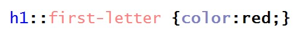
- **A.** pierwsza linia paragrafu
- **B.** tekst nagłówka pierwszego stopnia
- **C.** pierwsza litera nagłówka drugiego stopnia
- **D.** pierwsza litera nagłówka pierwszego stopnia ✅

### Q294. W języku HTML informacje dotyczące autora, streszczenia i słów kluczowych strony należy umieścić
- **A.** pomiędzy znacznikami <head> i </head>, w znaczniku <meta> ✅
- **B.** pomiędzy znacznikami <head> i </head>, w znaczniku <style>
- **C.** pomiędzy znacznikami <body> i </body>, w znaczniku <meta>
- **D.** pomiędzy znacznikami <body> i </body>, w znaczniku <html>

### Q295. Który z przedstawionych kodów XHTML sformatuje tekst według podanego wzoru?

- **A.** A
- **B.** B
- **C.** C
- **D.** D ✅

### Q296. Kolor zapisany kodem RGB o wartości rgb(128, 16, 8) w postaci szesnastkowej ma wartość
- **A.** #FF0F80
- **B.** #FF1008
- **C.** #801008 ✅
- **D.** #800F80

### Q297. Które ze zdań opisuje grafikę wektorową?
- **A.** Jest to prezentacja obrazu za pomocą pionowo-poziomej siatki odpowiednio kolorowanych pikseli na monitorze komputera, drukarce lub innym urządzeniu wyjściowym
- **B.** Może być przechowywana w formacie JPG lub PNG
- **C.** Jest wykorzystywana do zapisu fotografii cyfrowej
- **D.** Zapisywany obraz jest opisywany za pośrednictwem figur geometrycznych umieszczonych w układzie współrzędnych ✅

### Q298. Aby zbadać rozkład ilościowy poszczególnych kolorów zdjęcia, należy użyć
- **A.** desaturacji
- **B.** histogramu ✅
- **C.** balansu kolorów
- **D.** rozmycia Gaussa

### Q299. W standardzie HDTV jest stosowana rozdzielczość
- **A.** 704 x 576 px
- **B.** 720 x 480 px
- **C.** 1280 x 1024 px
- **D.** 1920 x 1080 px ✅

### Q300. Którą klauzulę powinno się zastosować w poleceniu CREATE TABLE języka SQL, aby dane pole rekordu nie było puste?
- **A.** NULL
- **B.** CHECK
- **C.** DEFAULT
- **D.** NOT NULL ✅

### Q301. Polecenie języka SQL w postaci

- **A.** zamienia nazwę tabeli miasta na nazwę kod
- **B.** dodaje do tabeli kolumnę o nazwie kod typu text ✅
- **C.** dodaje do tabeli dwie kolumny o nazwach: kod i text
- **D.** w tabeli miasta zamienia nazwę kolumny kod na nazwę text

### Q302. W bazie danych hurtowni zdefiniowano tabelę sprzedaz o polach: id, kontrahent, grupa_cenowa, obrot. Aby wyszukać wyłącznie kontrahentów z drugiej grupy cenowej, których obrót jest większy niż 4000zł, należy zastosować polecenie
- **A.** SELECT sprzedaz FROM kontrahent WHERE obrot > 4000;
- **B.** SELECT kontrahent FROM sprzedaz WHERE grupa_cenowa = 2 OR obrot > 4000;
- **C.** SELECT kontrahent FROM sprzedaz WHERE grupa_cenowa = 2 AND obrot > 4000; ✅
- **D.** SELECT sprzedaz FROM kontrahent WHERE grupa_cenowa = 2 AND obrot > 4000;

### Q303. Dana jest tabela programiści o polach: id, nick, ilosc_kodu, ocena. Pole ilosc_kodu zawiera liczbę linii kodu napisanych przez programistę w danym miesiącu. Aby policzyć sumę linii kodu, który napisali wszyscy programiści, należy użyć polecenia
- **A.** SELECT SUM(ocena) FROM ilosc_kodu;
- **B.** SELECT SUM(ilosc_kodu) FROM programisci; ✅
- **C.** SELECT COUNT(programisci) FROM ilosc_kodu;
- **D.** SELECT MAX(ilosc_kodu) FROM programisci

### Q304. W instrukcji CREATE TABLE użycie klauzuli PRIMARY KEY przy deklaracji pola tabeli spowoduje, że pole to stanie się
- **A.** kluczem obcym
- **B.** indeksem klucza
- **C.** indeksem unikalnym
- **D.** kluczem podstawowym ✅

### Q305. Baza danych księgarni zawiera tabelę ksiazki z polami: id, idAutor, tytul, ileSprzedanych oraz tabelę autorzy z polami: id, imie, nazwisko. Aby stworzyć raport sprzedanych książek z tytułami i nazwiskami autorów, należy
- **A.** stworzyć kwerendę wyszukującą tytuły książek
- **B.** Zdefiniować relację 1..n dla tabel ksiazki i autorzy, a następnie stworzyć kwerendę łączącą obie tabele ✅
- **C.** Zdefiniować relację 1..1 dla tabel ksiazki i autorzy, a następnie stworzyć kwerendę łączącą obie tabele
- **D.** stworzyć dwie osobne kwerendy: pierwszą wyszukującą tytuły książek, drugą wyszukującą nazwiska autorów

### Q306. Istnieje tabela pracownicy z polami: id, imie, nazwisko, pensja. W nowym roku postawiono podnieść pensję wszystkim pracownikom o 100 zł. Aktualizacja ta w bazie danych będzie miała postać
- **A.** UPDATE pracownicy SET pensja = pensja + 100; ✅
- **B.** UPDATE pracownicy SET pensja = 100;
- **C.** UPDATE pensja SET +100;
- **D.** UPDATE pensja SET 100;

### Q307. W tabeli artykuly wykonano następujące polecenia dotyczące praw użytkowania jan. Po wykonaniu poleceń użytkownik jan będzie miał prawa do

- **A.** tworzenia tabeli i aktualizowania w niej danych
- **B.** aktualizowania danych i przeglądania tabeli
- **C.** tworzenia tabeli i wypełniania jej danymi ✅
- **D.** przeglądania tabeli

### Q308. Aby przywrócić bazę danych MS SQL z kopii bezpieczeństwa, należy zastosować polecenie
- **A.** DBCC CHECKDB
- **B.** SAVE DATABASE
- **C.** RESTORE DATABASE ✅
- **D.** REBACKUP DATABASE

### Q309. Baza danych MySQL uległa uszkodzeniu. Które z działań NIE pomoże przy jej naprawie?
- **A.** Wykonanie replikacji bazy danych ✅
- **B.** Próba naprawy poleceniem REPAIR
- **C.** Odtworzenie bazy z kopii bezpieczeństwa
- **D.** Stworzenie nowej bazy i przeniesienie do niej tabel

### Q310. W formularzu, dane z pola input o typie number zostały zapisane do zmiennej a, a następnie przetworzone w skrypcie JavaScript w następujący sposób. Zmienna x będzie typu

- **A.** NaN
- **B.** napisowego
- **C.** zmiennoprzecinkowego
- **D.** liczbowego, całkowitego ✅

### Q311. Wstawki kodu JavaScript w dokumencie HTML mogą się znaleźć
- **A.** tylko w cześci <head>, w znaczniku <script>
- **B.** tylko w cześci <body>, w znaczniku <java>
- **C.** zarówno w cześci <head>, jak i <body>, w znaczniku <java>
- **D.** zarówno w cześci <head>, jak i <body>, w znaczniku <script> ✅

### Q312. W przedstawonym kodzie JavaScript dla ułatwienia ponumerowano linie. W kodzie znajduje się błąd, gdyż po uruchomieniu żaden komunikat nie zostaje wyświetlony. Aby wyeliminować błąd, należy

- **A.** wstawić znaki $ przed nazwami zmiennych.
- **B.** wstawić nawiasy klamrowe do sekcji if oraz else ✅
- **C.** w liniach 2 i 5 zmienne a i b wstawić w cudzysłów
- **D.** w liniach 3 i 6 zamienić znaki cudzysłowu na apostrof, np. ’jest mniejsze’

### Q313. Ile iteracji będzie miała przedstawiona pętla zapisana w języku PHP, zakładając, że zmienna sterująca nie jest modyfikowana we wnętrzu pętli?
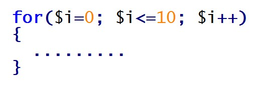
- **A.** 0
- **B.** 10
- **C.** 11 ✅
- **D.** Nieskończenie wiele

### Q314. W języku JavaScript metoda document.getElementById(id) ma za zadanie
- **A.** wstawić tekst o treści ’id’ na stronie WWW
- **B.** sprawdzić poprawność formularza o identyfikatorze id
- **C.** pobrać dane z pola formularza i wstawić je do zmiennej id
- **D.** zwrócić odniesienie do pierwszego elementu HTML o podanym id ✅

### Q315. W instrukcji warunkowej JavaScript należy sprawdzić przypadek, gdy zmienne a oraz b są dodatnie, z czego zmienna b jest mniejsza od 100. Warunek taki powinien być zapisany w następujący sposób:
- **A.** if ( a > 0 || b > 0 || b > 100)
- **B.** if ( a > 0 && b > 0 || b > 100)
- **C.** if ( a > 0 || (b > 0 && b < 100))
- **D.** if ( a > 0 && b > 0 && b < 100) ✅

### Q316. Zadaniem przedstawionej funkcji zapisanej w języku JavaScript jest

- **A.** zwrócenie wartości parzystych liczb od a do b
- **B.** wypisanie liczb parzystych z przedziału od a do b ✅
- **C.** wypisanie wszystkich liczb z przedziału od a do b
- **D.** sprawdzenie, czy liczba a jest nieparzysta; jeśli tak, wypisanie jej

### Q317. Przedstawiony kod został zapisany w języku JavaScript. W podanej definicji obiektu metodą jest element o nazwie

- **A.** obj1
- **B.** oblicz ✅
- **C.** czescCalkowita
- **D.** czescUlamkowa

### Q318. Aby uzyskać informacje o środowisku pracy serwera obsługującego PHP, należy skorzystać z funkcji
- **A.** php()
- **B.** phpinfo() ✅
- **C.** phpgetinfo()
- **D.** phpinformation()

### Q319. Fragment kodu w języku PHP wypisze

- **A.** nazwę konta ze znakiem @, czyli "adres@"
- **B.** cały adres e-mail, czyli "adres@host.pl"
- **C.** samą nazwę domeny, czyli "host.pl"
- **D.** samą nazwę konta, czyli "adres" ✅

### Q320. Do uruchomienia skryptu JavaScript wymagane jest oprogramowanie
- **A.** serwera WWW
- **B.** serwera MySQL
- **C.** debugera JavaScript
- **D.** przeglądarki internetowej ✅

### Q321. Zadaniem funkcji PHP o nazwie mysql_select_db() jest
- **A.** połączyć bazę danych z serwerem SQL
- **B.** określić bazę, z której będą pobierane dane ✅
- **C.** określić tabelę, z której będą pobierane dane
- **D.** pobrać dane z bazy danych na podstawie kwerendy

### Q322. W przedstawionym kodzie PHP, zamiast znaków zapytania powinien pojawić się komunikat:

- **A.** Błąd przetwarzania zapytania ✅
- **B.** Zapytanie przetworzono pomyślnie
- **C.** Nieprawidłowa nazwa bazy danych
- **D.** Nieprawidłowe hasło do bazy danych

### Q323. Testy wydajnościowe mają na celu sprawdzenie
- **A.** zdolności oprogramowania do działania w warunkach wadliwej pracy sprzętu
- **B.** zdolności oprogramowania do działania w warunkach wadliwej pracy systemu
- **C.** stopnia spełnienia wymagań wydajnościowych przez system lub moduł ✅
- **D.** ciągu zdarzeń, w którym prawdopodobieństwo każdego zdarzenia zależy jedynie od wyniku poprzedniego

### Q324. Aby prawidłowo udokumentować przedstawioną linię kodu języka JavaScript, należy po znakach // wpisać komentarz

- **A.** nieprawidłowe dane
- **B.** zmiana stylu atrybutu innerHTML
- **C.** wyświetlenie tekstu "Date()" w znaczniku o id = napis
- **D.** wyświetlenie daty i czasu w znaczniku o id = napis ✅

### Q325. Przekierowanie 301 służące przekierowaniu użytkownika z jednego adresu URL na inny można ustawić w pliku konfiguracji serwera Apache o nazwie
- **A.** conf.php
- **B.** .htaccess ✅
- **C.** .apacheConf
- **D.** configuration.php

### Q326. W języku HTML aby zdefiniować słowa kluczowe strony, należy użyć zapisu
- **A.** <meta keywords="psy, koty, gryzonie">
- **B.** <meta name="keywords" ="psy, koty, gryzonie">
- **C.** <meta name="keywords" content="psy, koty, gryzonie"> ✅
- **D.** <meta name="description" content="psy, koty, gryzonie">

### Q327. W języku HTML zdefiniowano znacznik a. Wartość nofollow atrybutu rel

- **A.** oznacza, że kliknięcie na link nie przeniesie do strony website.com
- **B.** oznacza, że kliknięcie na link otworzy go w osobnej karcie przeglądarki
- **C.** jest informacją dla robota wyszukiwarki Google, aby nie podążał za tym linkiem ✅
- **D.** jest informacją dla przeglądarki internetowej, aby nie formatowała słowa "link" jako odnośnika

### Q328. W języku HTML aby zdefiniować poziomą linię, należy użyć znacznika
- **A.** <line>
- **B.**  
- **C.** <hl>
- **D.** 
 ✅

### Q329. Zapisano kod HTML wstawiający grafikę na stronę internetową. Jeżeli rysunek.png nie zostanie odnaleziony, przeglądarka

- **A.** nie wyświetli strony internetowej
- **B.** w miejscu grafiki wypisze tekst "pejzaż" ✅
- **C.** w miejscu grafiki wypisze tekst "rysunek.png"
- **D.** w miejscu grafiki wypisze błąd wyświetlania strony

### Q330. Aby w języku HTML uzyskać takie formatowanie paragrafu dla tekstu należy zastosować kod

- **A.** 
Tekst może być <mark>zaznaczony</mark> albo <em>istotny dla autora

- **B.** 
Tekst może być <mark>zaznaczony albo <i>istotny</i> dla autora</mark>

- **C.** 
Tekst może być <mark>zaznaczony</mark> albo <em>istotny</em> dla autora
 ✅
- **D.** 
Tekst może być <mark>zaznaczony albo <em>istotny</em> dla autora</mark>

### Q331. Zamieszczony kod HTML formularza zostanie wyświetlony przez przeglądarkę w sposób:

- **A.** A
- **B.** B
- **C.** C
- **D.** D ✅

### Q332. W języku CSS wcięcie pierwszej linii akapitu na 30 pikseli uzyska się za pomocą zapisu
- **A.** p { text-indent: 30px; } ✅
- **B.** p { text-spacing: 30px; }
- **C.** p { line-height: 30px; }
- **D.** p { line-indent: 30px; }

### Q333. W języku CSS zdefiniowano następujące formatowanie. Kolorem czerwonym zostanie zapisany

- **A.** tylko tekst pochylony nagłówka pierwszego stopnia ✅
- **B.** tylko tekst pochylony we wszystkich poziomach nagłówków
- **C.** cały tekst nagłówka pierwszego stopnia oraz pochylony tekst akapitu
- **D.** cały tekst nagłówka pierwszego stopnia oraz cały tekst pochylony, niezależnie od tego, w którym miejscu strony się znajduje

### Q334. W języku CSS, aby sformatować dowolny element języka HTML w ten sposób, że po najechaniu na niego kursorem zmienia on kolor czcionki, należy zastosować pseudoklasę
- **A.** :active
- **B.** :hover ✅
- **C.** :visited
- **D.** :coursor

### Q335. Zapis CSS w takiej postaci sprawi, że na stronie internetowej

- **A.** punktorem listy nienumerowanej będzie rys.gif ✅
- **B.** rys.gif będzie stanowił ramkę dla listy nienumerowanej
- **C.** wyświetli się rys.gif jako tło listy nienumerowanej
- **D.** każdy z punktów listy będzie miał osobne tło pobrane z grafiki rys.gif

### Q336. W języku CSS aby zdefiniować odmienne formatowanie dla pierwszej litery akapitu, należy zastosować selektor
- **A.** klasy p.first-letter
- **B.** dziecka p + first-letter
- **C.** atrybutu p [first-letter]
- **D.** pseudoelementu p::first-letter ✅

### Q337. W kodzie źródłowym zapisanym w języku HTML wskaż błąd walidacji dotyczący tego fragmentu

- **A.** Nieznany znacznik h6
- **B.** Znacznik br nie został poprawnie zamknięty
- **C.** Znacznik br nie może występować wewnątrz znacznika p
- **D.** Znacznik zamykający /b niezgodny z zasadą zagnieżdżania ✅

### Q338. W ramce przedstawiono właściwości pliku graficznego. W celu optymalizacji czasu ładowania rysunku na stronę WWW należy

- **A.** zmniejszyć wymiary rysunku ✅
- **B.** zwiększyć rozdzielczość
- **C.** zmienić format grafiki na CDR
- **D.** zmienić proporcje szerokości do wysokości

### Q339. W programie INKSCAPE / COREL aby uzyskać przedstawiony efekt napisu, należy

- **A.** skorzystać z funkcji gradientu
- **B.** zastosować funkcję sumy z kołem
- **C.** zastosować funkcję wykluczenia z kołem
- **D.** skorzystać z funkcji wstaw / dopasuj tekst do ścieżki ✅

### Q340. Programem do edycji dźwięku jest
- **A.** Brasero
- **B.** Winamp
- **C.** Audacity ✅
- **D.** RealPlayer

### Q341. Dana jest tabela pracownicy. Polecenie MySQL usuwające wszystkie rekordy z tabeli, dla których nie wypełniono pola rodzaj_umowy, ma postać
- **A.** DROP pracownicy FROM rodzaj_umowy = 0;
- **B.** DROP pracownicy WHERE rodzaj_umowy IS NULL;
- **C.** DELETE pracownicy WHERE rodzaj_umowy = 'brak';
- **D.** DELETE FROM pracownicy WHERE rodzaj_umowy IS NULL; ✅

### Q342. W języku SQL, aby stworzyć tabelę, należy zastosować polecenie
- **A.** ADD TABLE
- **B.** ALTER TABLE
- **C.** INSERT TABLE
- **D.** CREATE TABLE ✅

### Q343. W przedstawionym fragmencie kwerendy języka SQL, komenda SELECT ma za zadanie zwrócić

- **A.** średnią tabeli
- **B.** liczbę wierszy ✅
- **C.** sumę w kolumnie wartosc
- **D.** średnią w kolumnie wartosc

### Q344. Dana jest tabela ksiazki z polami: tytul, autor (typu tekstowego), cena (typu liczbowego). Aby kwerenda SELECT zwróciła tylko tytuły, dla których cena jest mniejsza od 50zł, należy zapisać:
- **A.** SELECT * FROM ksiazki WHERE cena < 50;
- **B.** SELECT tytul FROM ksiazki WHERE cena < 50; ✅
- **C.** SELECT tytul FROM ksiazki WHERE cena > '50 zł';
- **D.** SELECT ksiazki FROM tytul WHERE cena < '50 zł';

### Q345. W bazie danych MYSQL dana jest tabela programów komputerowych o polach: nazwa, producent, rokWydania. Aby kwerenda SELECT zwróciła wszystkie nazwy producentów tak, by nazwy te nie powtarzały się, należy zapisać:
- **A.** SELECT UNIQUE producent FROM programy;
- **B.** SELECT DISTINCT producent FROM programy; ✅
- **C.** SELECT producent FROM programy WHERE UNIQUE;
- **D.** SELECT producent FROM programy WHERE producent NOT DUPLICATE;

### Q346. Tabela filmy zawiera klucz główny id oraz klucz obcy rezyserID. Tabela rezyserzy zawiera klucz główny id. Obydwie tabele połączone są relacją jeden po stronie rezyserzy do wielu po stronie filmy. Aby w kwerendzie SELECT połączyć tabele filmy i rezyserzy, należy zapisać
- **A.** ... filmy JOIN rezyserzy ON filmy.id = rezyserzy.id ...
- **B.** ... filmy JOIN rezyserzy ON filmy.id = rezyserzy.filmyID ...
- **C.** ... filmy JOIN rezyserzy ON filmy.rezyserID = rezyserzy.id ... ✅
- **D.** ... filmy JOIN rezyserzy ON filmy.rezyserID = rezyserzy.filmyID ...

### Q347. Na rysunku przedstawiono dwie tabele. Aby połączyć je relacją jeden do wielu, jeden po stronie Klienci wiele po stronie Zamowienia, należy

- **A.** Połączyć relacją pola ID z obu tabel
- **B.** Dodać pole klucza obcego do tabeli Zamowienia i połączyć je z ID tabeli Klienci ✅
- **C.** Dodać pole klucza obcego do tabeli Klienci i połączyć je z ID tabeli Zamowienia
- **D.** Zdefiniować trzecią tabelę z dwoma kluczami obcymi. Jeden klucz połączyć z ID tabeli Klienci, drugi klucz połączyć z ID tabeli Zamowienia

### Q348. Źródłem rekordów dla raportu może być
- **A.** Tabela ✅
- **B.** Inny raport
- **C.** Makropolecenie
- **D.** Zapytanie INSERT INTO

### Q349. Przedstawione polecenie MySQL ma za zadanie

- **A.** Usunąć kolumnę tytul z tabeli ksiazki
- **B.** Dodać do tabeli ksiazki kolumnę tytul
- **C.** Zmienić nazwę kolumny w tabeli ksiazki
- **D.** Zmienić typ kolumny w tabeli ksiazki ✅

### Q350. W tabeli podzespoly należy zmienić wartość pola URL na 'toshiba.pl' dla wszystkich rekordów, gdzie pole producent to TOSHIBA. W języku SQL modyfikacja będzie miała postać
- **A.** UPDATE podzespoly SET URL='toshiba.pl';
- **B.** UPDATE producent='TOSHIBA' SET URL='toshiba.pl';
- **C.** UPDATE podzespoly.producent='TOSHIBA' SET URL='toshiba.pl';
- **D.** UPDATE podzespoly SET URL='toshiba.pl' WHERE producent='TOSHIBA'; ✅

### Q351. Do zabezpieczeń serwera bazy danych przed atakami hakerów nie należy
- **A.** Włączenie zapory
- **B.** Defragmentacja dysków ✅
- **C.** Stosowanie złożonych haseł do bazy
- **D.** Blokowanie portów związanych z bazą danych

### Q352. W języku MySQL należy zastosować polecenie REVOKE, aby użytkownikowi anna odebrać prawo do dokonywania zmian jedynie w definicji struktury bazy danych. Polecenie odpowiadające odebraniu tych praw ma postać
- **A.** REVOKE ALL ON tabela1 FROM 'anna'@'localhost'
- **B.** REVOKE CREATE ALTER DROP ON tabela1 FROM 'anna'@'localhost' ✅
- **C.** REVOKE CREATE UPDATE DROP ON tabela1 FROM 'anna'@'localhost'
- **D.** REVOKE CREATE INSERT DELETE ON tabela1 FROM 'anna'@'localhost'

### Q353. W języku JavaScript, aby sprawdzić warunek czy liczba znajduje się w przedziale (100;200>, należy zapisać:
- **A.** if (liczba > 100 || liczba <= 200)
- **B.** if (liczba < 100 || liczba >= 200)
- **C.** if (liczba > 100 && liczba <= 200) ✅
- **D.** if (liczba < 100 && liczba <= 200)

### Q354. W wyniku działania pętli zapisanej w języku PHP zostanie wypisany ciąg liczb

- **A.** 10 15 20 25 30 35 40 45 ✅
- **B.** 10 15 20 25 30 35 40 45 50
- **C.** 0 5 10 15 20 25 30 35 40 45
- **D.** 0 5 10 15 20 25 30 35 40 45 50

### Q355. Które z poniższych zdań dotyczących zasad programowania w języku PHP jest prawdziwe?
- **A.** Jest to język o słabej kontroli typów ✅
- **B.** Nazwy zmiennych są poprzedzone znakiem !
- **C.** Deklaracja zmiennych następuje po słowie var
- **D.** W nazwach zmiennych nie jest rozróżniana wielkość liter

### Q356. W języku PHP instrukcja foreach jest instrukcją
- **A.** Wyboru, dla elementów tablicy
- **B.** Pętli, niezależnie od typu zmiennej
- **C.** Pętli, wyłącznie dla elementów tablicy ✅
- **D.** Warunkową, niezależnie od typu zmiennej

### Q357. Funkcją języka PHP tworzącą ciasteczko jest
- **A.** createcookie()
- **B.** echocookie()
- **C.** addcookie()
- **D.** setcookie() ✅

### Q358. W języku PHP funkcja trim ma za zadanie
- **A.** Podawać długość napisu
- **B.** Porównywać dwa napisy i wypisać część wspólną
- **C.** Zmniejszać napis o wskazaną w parametrze liczbę znaków
- **D.** Usuwać białe znaki lub inne znaki podane w parametrze, z obu końców napisu ✅

### Q359. W języku JavaScript zapis w ramce oznacza, że

- **A.** nazwa jest polem klasy przedmiot
- **B.** nazwa jest właściwością obiektu przedmiot
- **C.** zmienna x będzie przechowywać wynik działania metody nazwa ✅
- **D.** zmienna x będzie przechowywać wynik działania funkcji przedmiot

### Q360. W języku JavaScript zapisano następującą funkcję. Ma ona za zadanie

- **A.** Wypisać wartość odwrotną do f
- **B.** Zwrócić wartość odwrotną do f
- **C.** Wypisać wartość bezwzględną z f
- **D.** Zwrócić wartość bezwzględną z f ✅

### Q361. Za pomocą języka PHP nie jest możliwe
- **A.** Przetwarzanie danych formularzy
- **B.** Generowanie dynamicznej zawartości strony
- **C.** Przetwarzanie danych zgromadzonych w bazie danych
- **D.** Zmienianie dynamiczne zawartości strony HTML w przeglądarce ✅

### Q362. Działaniem przedstawionego kodu PHP będzie wypełnienie tablicy
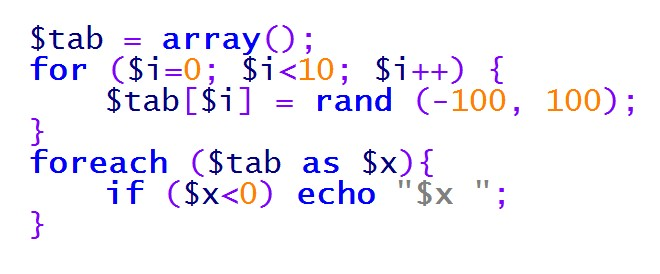
- **A.** Kolejnymi liczbami od 0 do 9 i wypisanie ich
- **B.** Kolejnymi liczbami od -100 do 100 i wypisanie wartości ujemnych
- **C.** 10 losowymi wartościami, a następnie wypisanie wartości ujemnych ✅
- **D.** 100 losowymi wartościami, a następnie wypisanie wartości dodatnich

### Q363. W języku JavaScript zapisano fragment kodu. Po wykonaniu skryptu zmienna x

- **A.** Będzie równa 11 i zostanie wypisana w oknie popup
- **B.** Będzie równa 10 i zostanie wypisana w dokumencie HTML
- **C.** Będzie równa 11 i zostanie wypisana w konsoli przeglądarki internetowej ✅
- **D.** Będzie równa 10 i zostanie wypisana w głównym oknie przeglądarki internetowej

### Q364. W języku PHP, wykonując operacje na bazie danych MySQL, aby zakończyć pracę z bazą, należy wywołać
- **A.** mysqli_exit();
- **B.** mysqli_close(); ✅
- **C.** mysqli_commit();
- **D.** mysqli_rollback();

### Q365. W ramce przedstawiono kod JavaScript z błędem logicznym. Program powinien wypisywać informację, czy liczby są sobie równe czy nie, lecz nie wykonuje tego. Wskaż odpowiedź, która dotyczy błędu
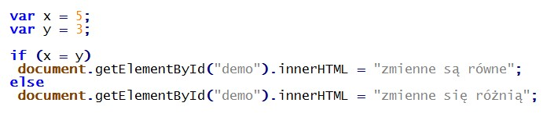
- **A.** Nieprawidłowo zadeklarowano zmienne
- **B.** Przed klauzulą else nie powinno być średnika
- **C.** W klauzuli if występuje przypisanie zamiast porównania ✅
- **D.** Instrukcje wewnątrz sekcji if oraz else powinny być zamienione miejscami

### Q366. Która z zasad tworzenia części <head> języka HTML jest poprawna?
- **A.** W części <head> zawiera się część <body>
- **B.** W części <head> mogą wystąpić znaczniki <meta>, <title>, <link> ✅
- **C.** W części <head> można definiować szablon strony znacznikami 

- **D.** W części <head> nie można umieszczać kodu CSS, a jedynie odwołanie do pliku CSS

### Q367. W języku HTML znacznik <strong>tekst</strong> będzie wyświetlany w ten sam sposób przez przeglądarkę co znacznik
- **A.** <b>tekst</b> ✅
- **B.** <h1>tekst</h1>
- **C.** <big>tekst</big>
- **D.** tekst

### Q368. Aby strona WWW była responsywna, należy między innymi definiować
- **A.** jedynie znane czcionki, np. Arial
- **B.** rozmiary obrazów w procentach ✅
- **C.** rozmiary obrazów wyłącznie w pikselach
- **D.** rozkład strony wyłącznie za pomocą tabel

### Q369. W języku HTML, aby zapisać sekcję cytatu, która może zawierać kilka paragrafów tak, by przeglądarka dodała wspólne wcięcie, należy zastosować znacznik
- **A.** <q>
- **B.** <indent>
- **C.** <blockq>
- **D.** <blockquote> ✅

### Q370. W języku CSS wartości underline, overline, blink przyjmują atrybut
- **A.** text-style
- **B.** font-style
- **C.** font-weight
- **D.** text-decoration ✅

### Q371. W przedstawionej definicji stylu CSS, powtarzanie dotyczy

- **A.** tła każdego ze znaczników akapitu
- **B.** rysunku umieszczonego znacznikiem img
- **C.** rysunku umieszczonego w tle strony w pionie ✅
- **D.** rysunku umieszczonego w tle strony w poziomie

### Q372. W języku CSS zdefiniowano styl. Sformatowana stylem sekcja będzie zawierała obramowanie o szerokości
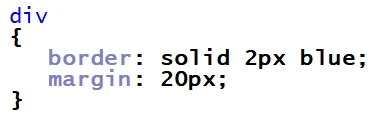
- **A.** 2 px oraz marginesy wewnątrz tego obramowania
- **B.** 20 px oraz marginesy wewnątrz tego obramowania
- **C.** 2 px oraz marginesy na zewnątrz tego obramowania ✅
- **D.** 20 px oraz marginesy na zewnątrz tego obramowania

### Q373. Strona HTML definiuje akapit oraz rysunek. Aby rysunek został umieszczony przez przeglądarkę w tej samej linii co akapit po jego lewej stronie, należy w stylu CSS rysunku zawrzeć własność
- **A.** float:left; ✅
- **B.** align:left;
- **C.** style:left;
- **D.** alt:left;

### Q374. W języku CSS określono formatowanie znacznika h1 według wzoru. Zakładając, że żadne inne formatowanie nie jest dodane do znacznika h1, wskaż sposób formatowania tego znacznika

- **A.** A
- **B.** B
- **C.** C ✅
- **D.** D

### Q375. Aby przygotować szablon strony z trzema kolumnami ustawionymi obok siebie, można posłużyć się stylem CSS

- **A.** A ✅
- **B.** B
- **C.** C
- **D.** D

### Q376. Przedstawiono fragment kodu HTML, który nie waliduje się poprawnie. Błąd walidacji tego fragmentu kodu będzie dotyczył

- **A.** Braku cudzysłowu ✅
- **B.** Niedomknięcia znacznika br
- **C.** Niedomknięcia znacznika img
- **D.** Powtórzenia nazwy pliku graficznego

### Q377. Modelem barw opisującym kolor z użyciem stożka przestrzeni barw jest
- **A.** CIE
- **B.** HSV ✅
- **C.** CMY
- **D.** CMYK

### Q378. Rozmycie Gaussa, wygładzanie, szum RGB są funkcjami programu do obróbki
- **A.** Grafiki rastrowej ✅
- **B.** Grafiki wektorowej
- **C.** Ścieżki dźwiękowej
- **D.** Dźwięku w formacie MIDI

### Q379. Aby edytować nakładające się na siebie pojedyncze fragmenty obrazu, pozostawiając pozostałe elementy niezmienione, należy zastosować
- **A.** Warstwy ✅
- **B.** Histogram
- **C.** Kanał alfa
- **D.** Kadrowanie

### Q380. W języku SQL wykorzystywanym przez bazę danych MySQL atrybut UNIQUE polecenia CREATE TABLE
- **A.** Wymusza unikatowe nazwy pól tabeli
- **B.** Blokuje możliwość wpisania wartości NULL
- **C.** Jest stosowany tylko w przypadku pól liczbowych
- **D.** Jest stosowany, jeśli wartość w kolumnie nie mogą się powtarzać ✅

### Q381. Funkcja agregująca MIN języka SQL ma za zadanie policzyć
- **A.** Liczbę wierszy zwróconych kwerendą
- **B.** Wartość minimalną kolumny zwróconej kwerendą ✅
- **C.** długość znaków w zwróconych kwerendą rekordach
- **D.** Średnią wartości różnych pól rekordu zwróconego zapytaniem

### Q382. Dana jest tabela o nazwie wycieczki z polami: nazwa, cena, miejsca (jako liczba wolnych miejsc). Aby dla dowolnego zbioru danych tabeli wyświetlić jedynie nazwy tych wycieczek, dla których cena jest niższa niż 2000 zł i mają przynajmniej cztery wolne miejsca, należy posłużyć się zapytaniem
- **A.** SELECT nazwa FROM wycieczki WHERE cena < 2000 AND miejsca > 3; ✅
- **B.** SELECT nazwa FROM wycieczki WHERE cena < 2000 OR miejsca > 4;
- **C.** SELECT * FROM wycieczki WHERE cena < 2000 AND miejsca > 4;
- **D.** SELECT * FROM wycieczki WHERE cena < 2000 OR miejsca > 3;

### Q383. Dana jest tabela o nazwie przedmioty z polami: ocena i uczenID. Aby policzyć średnią ocen ucznia o ID równym 7, należy posłużyć się zapytaniem
- **A.** AVG SELECT ocena FROM przedmioty WHERE uczenID = 7;
- **B.** SELECT AVG(ocena) FROM przedmioty WHERE uczenID = 7; ✅
- **C.** COUNT SELECT ocena FROM przedmioty WHERE uczenID = 7;
- **D.** SELECT COUNT(ocena) FROM przedmioty WHERE uczenID = 7;

### Q384. Tabela o nazwie naprawy zawiera pola: klient, czyNaprawione. Aby usunąć te rekordy, w których pole czyNaprawione jest prawdą, należy posłużyć się poleceniem
- **A.** DELETE FROM naprawy;
- **B.** DELETE naprawy WHERE czyNaprawione = TRUE;
- **C.** DELETE FROM naprawy WHERE czyNaprawione = TRUE; ✅
- **D.** DELETE klient FROM naprawy WHERE czyNaprawione = TRUE;

### Q385. Formularz nadrzędny wykorzystywany do nawigacji w bazie danych pomiędzy dostępnymi w systemie formularzami, kwerendami jest nazywany formularzem
- **A.** głównym
- **B.** sterującym ✅
- **C.** pierwotnym
- **D.** zagnieżdżonym

### Q386. W bazie danych sklepu komputerowego istnieje tabela komputery. Aby zdefiniować raport wyświetlający dla dowolnego zbioru danych tabeli, jedynie pola tabeli dla komputerów, w których jest nie mniej niż 8 GB pamięci, a procesor to Intel, można posłużyć sie kwerendą
- **A.** SELECT * FROM komputery WHERE procesor = "Intel" OR pamiec < 8;
- **B.** SELECT * FROM komputery WHERE procesor = "Intel" OR pamiec >= 8;
- **C.** SELECT * FROM komputery WHERE procesor = "Intel" AND pamiec < 8;
- **D.** SELECT * FROM komputery WHERE procesor = "Intel" AND pamiec >= 8; ✅

### Q387. Za pomocą polecenia ALTER TABLE można
- **A.** zmienić wartości rekordów
- **B.** zmienić strukturę tabeli ✅
- **C.** usunąć rekord
- **D.** usunąć tabelę

### Q388. W języku SQL, wykorzystywanym przez bazę danych MySQL w tabeli samochody, aby nadać wartość równą 0 dla kolumny przebieg, należy posłużyć się kwerendą
- **A.** UPDATE samochody SET przebieg = 0; ✅
- **B.** UPDATE przebieg SET 0 FROM samochody;
- **C.** UPDATE przebieg SET 0 TABLE samochody;
- **D.** UPDATE samochody SET przebieg VALUE 0;

### Q389. Przedstawione polecenie SQL, użytkownikowi adam@localhost nadaje prawa

- **A.** zarządzania strukturą tabeli klienci
- **B.** manipulowania danymi w tabeli klienci ✅
- **C.** zarządzania strukturą bazy danych klienci
- **D.** manipulowania danymi bazy danych klienci

### Q390. W języku JavaScript przedstawiona definicja jest definicją

- **A.** klasy
- **B.** tablicy ✅
- **C.** obiektu
- **D.** kolekcji

### Q391. Dla każdej iteracji pętli wartość bieżącego elementu tablicy jest przypisywana do zmiennej, a wskaźnik tablicy jest przesuwany o jeden, aż do ostatniego elementu tablicy. Zdanie to jest prawdziwe dla instrukcji
- **A.** for
- **B.** next
- **C.** while
- **D.** foreach ✅

### Q392. Wskaż zapisany w języku JavaScript warunek, który ma sprawdzić spełnienie z przypadków: 1) dowolna naturalna liczba a jest trzycyfrowa, 2) dowolna całkowita liczba b jest ujemna
- **A.** ((a>99) || (a<1000)) || (b<0)
- **B.** ((a>99) && (a<1000)) || (b<0) ✅
- **C.** ((a>99) || (a<1000)) && (b<0)
- **D.** ((a>99) && (a<1000)) && (b<0)

### Q393. Którą czynność gwarantującą poprawne wykonanie przedstawionego kodu JavaScript, należy wykonać przed pętlą?

- **A.** Zadeklarować zmienną i
- **B.** Zainicjować zmienną text ✅
- **C.** Sprawdzić rozmiar tabeli tab
- **D.** Sprawdzić czy text jest typu znakowego

### Q394. Hermetyzacja to zasada programowania obiektowego mówiąca o tym, że
- **A.** klasy/obiekty mogą współdzielić ze sobą funkcjonalność
- **B.** pola i metody wykorzystywane tylko przez daną klasę/obiekt są ograniczone zasięgiem private lub protected ✅
- **C.** klasy/obiekty mogą mieć zdefiniowane metody wirtualne, które są implementowane w pochodnych klasach/obiektach
- **D.** typy pól w klasach/obiektach mogą być dynamicznie zmieniane w zależności od danych im przypisywanych

### Q395. Przedstawiono fragment JavaScript. Po jego wykonaniu zmienna str2 będzie przechowywać

- **A.** vaSc ✅
- **B.** avaS
- **C.** vaScri
- **D.** nvaScr

### Q396. Który ze sposobów wypisania tekstu nie jest zdefiniowany w języku JavaScript?
- **A.** Własność innerHTML
- **B.** Metoda window.alert()
- **C.** Funkcja MessageBox() ✅
- **D.** Metoda document.write()

### Q397. Funkcja JavaScript powinna być wywołana za każdym razem, gdy użytkownik wpisze dowolny znak do pola edycji. Którego zdarzenia należy użyć?
- **A.** onload
- **B.** onclick
- **C.** onkeydown ✅
- **D.** onmouseout

### Q398. Która z wymienionych funkcji zapisanych językiem PHP zwraca sumę połowy a i połowy b
- **A.** function licz($a, $b) {return $a/2 + $b;}
- **B.** function licz($a, $b) {return 2/$a + 2/$b;}
- **C.** function licz($a, $b) {return $a/2 + $b/2;} ✅
- **D.** function licz($a, $b) {return ($a/2 + $b)/2;}

### Q399. W języku JavaScript zapisano definicję obiektu. Aby odwołać się do własności nazwisko należy zapisać

- **A.** osoba[1]
- **B.** osoba[2]
- **C.** osoba.nazwisko ✅
- **D.** osoba::nazwisko

### Q400. W języku PHP zapisano fragment kodu. Plik cookie stworzony tym poleceniem

- **A.** zostanie usunięty po jednym dniu od jego utworzenia ✅
- **B.** będzie przechowywany na serwerze przez jeden dzień
- **C.** zostanie usunięty po jednej godzinie od jego utworzenia
- **D.** będzie przechowywany na serwerze przez jedną godzinę

### Q401. W języku PHP zapisano fragment kodu. Po zakończeniu pętli zmienna a przyjmie wartość

- **A.** 0
- **B.** 2
- **C.** 10
- **D.** 20 ✅

### Q402. W języku JavaScript, aby zmienić wartość atrybutu znacznika HTML, po uzyskaniu obiektu za pomocą metody getElementById należy skorzystać z
- **A.** pola innerHTML
- **B.** metody getAttribute
- **C.** metody setAttribute ✅
- **D.** pola attribute i podać nazwę atrybutu

### Q403. W języku JavaScript zapisano kod, którego wynikiem działania jest

- **A.** wyświetlenie okna z pustym polem edycyjnym
- **B.** bezpośrednie wpisanie do zmiennej osoba wartości "Adam"
- **C.** pobranie z formularza wyświetlonego na stronie HTML imienia "Adam"
- **D.** wyświetlenie okna z polem edycyjnym, w którym jest wpisany domyślny tekst "Adam" ✅

### Q404. W języku PHP zapisano fragment kodu działającego na bazie MySQL. Jego zadaniem jest wypisanie

- **A.** ulicy i miasta z pierwszego zwróconego rekordu
- **B.** ulicy i miasta ze wszystkich zwróconych rekordów
- **C.** miasta i kodu pocztowego z pierwszego zwróconego rekordu ✅
- **D.** miasta i kodu pocztowego ze wszystkich zwróconych rekordów

### Q405. Który sposób komentowania jednoliniowego jest dozwolony w języku JavaScript?
- **A.** !
- **B.** #
- **C.** // ✅
- **D.** <!

### Q406. Znaczniki <header>, <article>, <section>, <footer> są charakterystyczne dla języka
- **A.** HTML 5 ✅
- **B.** XHTML 1.1
- **C.** HTML 4.01 Strict
- **D.** HTML 4.01 Transitional

### Q407. Przy użyciu którego znacznika w języku HTML nie można umieścić na stronie grafiki dynamicznej?
- **A.** 
- **B.** <strike> ✅
- **C.** <embed>
- **D.** <object>

### Q408. Które ze znaczników HTML umożliwią wyświetlenie na stronie tekstu w jednym wierszu, jeżeli żadne formatowanie CSS nie zostało zdefiniowane?

- **A.** 
Dobre strony 

mojej strony

- **B.** <h3>Dobre strony </h3><h3 style="letter-spacing:3px">mojej strony</h3>
- **C.** 
Dobre strony 

mojej strony

- **D.** Dobre strony mojej strony ✅

### Q409. W języku HTML atrybut shape znacznika area, określający typ obszaru, może przyjąć wartość
- **A.** rect, triangle, circle
- **B.** poly, square, circle
- **C.** rect, square, circle
- **D.** rect, poly, circle ✅

### Q410. Wskaż prawidłową kolejność stylów CSS mając na uwadze ich pierwszeństwo w formatowaniu elementów strony WWW.
- **A.** Lokalny, Wewnętrzny, Zewnętrzny ✅
- **B.** Zewnętrzny, Wydzielone bloki, Lokalny
- **C.** Rozciąganie stylu, Zewnętrzny, Lokalny
- **D.** Wewnętrzny, Zewnętrzny, Rozciąganie stylu

### Q411. W folderze www znajdują się podfoldery html i style, w których zapisane są odpowiednio pliki z rozszerzeniem html i pliki z rozszerzeniem css. Chcąc dołączyć styl.css do pliku HTML należy użyć
- **A.** <link rel="Stylesheet" type="text/css" href="/styl.css" />
- **B.** <link rel="Stylesheet" type="text/css" href="/style/styl.css" />
- **C.** <link rel="Stylesheet" type="text/css" href="/www/style/styl.css" />
- **D.** <link rel="Stylesheet" type="text/css" href="/../style/styl.css" /> ✅

### Q412. Chcąc zdefiniować marginesy wewnętrzne dla danych: margines górny 50px, dolny 40px, prawy 20px i lewy 30px należy użyć składni CSS
- **A.** padding: 50px, 40px, 20px, 30px;
- **B.** padding: 50px, 20px, 40px, 30px; ✅
- **C.** padding: 20px, 40px, 30px, 50px;
- **D.** padding: 40px, 30px, 50px, 20px;

### Q413. Chcąc sformatować w stylach CSS wszystkie obrazy zawarte w akapicie, powinno się użyć selektora
- **A.** p img ✅
- **B.** p#img
- **C.** p+img
- **D.** p.img

### Q414. Który z atrybutów background-attachment w języku CSS należy wybrać, aby tło strony było nieruchome względem okna przeglądarki?
- **A.** Scroll
- **B.** Fixed ✅
- **C.** Local
- **D.** Inherit

### Q415. Barwa zapisana w modelu RGB(255, 0, 0) jest
- **A.** żółta
- **B.** zielona
- **C.** niebieska
- **D.** czerwona ✅

### Q416. Połączenie dwóch barw leżących po przeciwnych stronach w kole barw jest połączeniem
- **A.** trójkątnym
- **B.** sąsiadującym
- **C.** dopełniającym ✅
- **D.** monochromatycznym

### Q417. Model barw oparty na 3 parametrach: odcień, nasycenie i jasność to
- **A.** RGB
- **B.** HSV ✅
- **C.** CMY
- **D.** CMYK

### Q418. Który z wymienionych formatów plików NIE JEST wykorzystywany do publikacji grafiki lub animacji na stronach internetowych?
- **A.** PNG
- **B.** SWF
- **C.** SVG
- **D.** AIFF ✅

### Q419. Aby stworzyć przycisk na stronę internetową według wzoru, należy w programie do grafiki rastrowej użyć opcji

- **A.** propagacja wartości
- **B.** zaznaczenie eliptyczne
- **C.** zniekształcenia i deformowanie
- **D.** zaokrąglenie lub wybranie opcji prostokąt z zaokrąglonymi rogami ✅

### Q420. Pierwszym krokiem podczas przetwarzania sygnału analogowego na cyfrowy jest
- **A.** próbkowanie ✅
- **B.** kwantyzacja
- **C.** filtrowanie
- **D.** kodowanie

### Q421. Wskaż FAŁSZYWE stwierdzenie dotyczące normalizacji sygnału dźwiękowego
- **A.** Polecenie normalizacja dostępne jest w menu programu do obróbki dźwięku
- **B.** W wyniku normalizacji wyrównywany jest poziom głośności całego nagrania
- **C.** Jeśli najgłośniejszy fragment dźwięku osiąga połowę skali, wszystko zostanie pogłośnione razy dwa - czyli tak, aby najgłośniejszy fragment osiągnął maksimum na skali ✅
- **D.** Normalizacja polega na zmniejszeniu poziomu najgłośniejszej próbki w sygnale do zadanej wartości i następnie w odniesieniu do niej proporcjonalnym zwiększeniu głośności reszty sygnału

### Q422. Wskaż PRAWDZIWE stwierdzenie dla polecenia: CREATE TABLE IF NOT EXISTS ADRES(ulica VARCHAR(70) CHARACTER SET utf8);
- **A.** Rekordem tabeli nie może być 3 MAJA
- **B.** Klauzula CHARACTER SET utf8 jest obowiązkowa
- **C.** Do tabeli nie można wprowadzać ulic zawierających w nazwie polskie znaki
- **D.** IF NOT EXISTS stosuje się opcjonalnie, aby upewnić się, że brak w bazie danych takiej tabeli ✅

### Q423. Jak działa instrukcja łącząca wyniki zapytań INTERSECT w języku SQL?
- **A.** Zwraca listę wyników z pierwszego zapytania oraz listę wyników z drugiego zapytania, powodując domyślne usuwanie powtarzających się wierszy.
- **B.** Zwraca te wiersze, które wystąpiły w wyniku pierwszego zapytania, ale nie było ich w wyniku drugiego zapytania.
- **C.** Zwraca te wiersze, które wystąpiły w wyniku drugiego zapytania, ale nie było ich w wyniku pierwszego zapytania.
- **D.** Zwraca część wspólną wyników dwóch zapytań. ✅

### Q424. W języku SQL dla dowolnych zestawów danych w tabeli Uczniowie, aby wybrać rekordy, które zawierają wyłącznie uczennice o imieniu "Aleksandra", urodzone po roku "1998", należy zapisać zapytanie
- **A.** SELECT * FROM Uczniowie WHERE imie="Aleksandra" AND rok_urodzenia > "1998"; ✅
- **B.** SELECT * FROM Uczniowie WHERE imie ="Aleksandra" OR rok_urodzenia < "1998";
- **C.** SELECT * FROM Uczniowie WHERE imie="Aleksandra" OR rok_urodzenia > "1998";
- **D.** SELECT * FROM Uczniowie WHERE imie="Aleksandra" AND rok_urodzenia < "1998";

### Q425. Którą relację w projekcie bazy danych należy ustalić między tabelami widocznymi na rysunku zakładając, że każdy klient sklepu internetowego dokona przynajmniej dwóch zamówień?

- **A.** 1:1
- **B.** 1:n, gdzie 1 jest po stronie Klienta, a wiele po stronie Zamówienia ✅
- **C.** 1:n, gdzie 1 jest po stronie Zamówienia, a wiele po stronie Klienta
- **D.** n:n

### Q426. Wyszukując z tabeli Pracownicy wyłącznie nazwiska, w których ostatnią literą jest "i", można użyć kwerendy SQL
- **A.** SELECT nazwisko FROM Pracownicy WHERE nazwisko LIKE "i";
- **B.** SELECT nazwisko FROM Pracownicy WHERE nazwisko LIKE "%i%";
- **C.** SELECT nazwisko FROM Pracownicy WHERE nazwisko LIKE "%i"; ✅
- **D.** SELECT nazwisko FROM Pracownicy WHERE nazwisko LIKE "i%";

### Q427. W celu dodania rekordu do tabeli Pracownicy należy użyć polecenia SQL
- **A.** INSERT INTO Pracownicy VALUES ("Jan", "Kowalski"); ✅
- **B.** INSERT VALUES (Jan; Kowalski) INTO Pracownicy;
- **C.** INSERT VALUES Pracownicy INTO (Jan, Kowalski);
- **D.** INSERT (Jan), (Kowalski) INTO TABLE Pracownicy;

### Q428. W języku SQL w wyniku wykonania zapytania ALTER TABLE osoba DROP COLUMN grupa; zostanie
- **A.** dodana kolumna grupa
- **B.** usunięta kolumna grupa ✅
- **C.** zmieniona nazwa tabeli na grupa
- **D.** zmieniona nazwa kolumny na grupa

### Q429. Właściwym zestawem kroków według kolejności, które należy wykonać w celu nawiązania współpracy między aplikacją internetową po stronie serwera a bazą SQL, jest
- **A.** zapytanie do bazy, wybór bazy, wyświetlenie na stronie WWW, zamknięcie połączenia
- **B.** wybór bazy danych, nawiązanie połączenia z serwerem baz danych, zapytanie do bazy, wyświetlenie na stronie WWW, zamknięcie połączenia
- **C.** wybór bazy, zapytanie do bazy, nawiązanie połączenia z serwerem baz danych, wyświetlenie na stronie WWW, zamknięcie połączenia
- **D.** nawiązanie połączenia z serwerem baz danych, wybór bazy, zapytanie do bazy - wyświetlane na stronie WWW, zamknięcie połączenia ✅

### Q430. Do poprawnego i spójnego działania bazy danych niezbędne jest umieszczenie w każdej tabeli
- **A.** kluczy PRIMARY KEY i FOREIGN KEY
- **B.** klucza FOREIGN KEY z wartością NOT NULL
- **C.** klucza obcego z wartością NOT NULL i UNIQUE
- **D.** klucza PRIMARY KEY z wartością NOT NULL i UNIQUE ✅

### Q431. W języku PHP, dla zmiennych a = 5 i b = 3 wartość typu zmiennoprzecinkowego zwróci wyrażenie
- **A.** a + b
- **B.** a * b
- **C.** a / b ✅
- **D.** a && b

### Q432. Wartość i typ zmiennej w języku PHP można sprawdzić za pomocą funkcji
- **A.** readfile()
- **B.** var_dump() ✅
- **C.** implode()
- **D.** strlen()

### Q433. W języku JavaScript zdefiniowana zmienna i, która ma przechowywać wynik dzielenia wynoszący 1, to
- **A.** var i=3/2;
- **B.** var i=Number(3/2);
- **C.** var i=parseInt(3/2); ✅
- **D.** var i=parseFloat(3/2);

### Q434. Wskaż BŁĘDNY opis optymalizacji kodu wynikowego programu
- **A.** Jej celem jest poprawienie wydajności programu
- **B.** W celu zwiększenia szybkości wykonywania kodu przez procesor może być prowadzona na różnych etapach pracy
- **C.** Jej celem jest sprawdzenie zgodności z wymogami formalnymi ✅
- **D.** Powinna prowadzić do modyfikacji kodu źródłowego do postaci, w której będzie on działał szybciej

### Q435. Podaj wynik działania programu zapisanego w języku JavaScript, znajdującego się w ramce, po podaniu na wejściu wartości 5

- **A.** 60
- **B.** 120 ✅
- **C.** 125
- **D.** 625

### Q436. W języku PHP chcąc wyświetlić ciąg n znaków @, należy użyć funkcji

- **A.** A
- **B.** B
- **C.** C
- **D.** D ✅

### Q437. Językami programowania działającymi po stronie serwera są:
- **A.** Java, C#, AJAX, Ruby, PHP
- **B.** Java, C#, Python, Ruby, PHP ✅
- **C.** C#, Python, Ruby, PHP, JavaScript
- **D.** Java, C#, Python, ActionScript, PHP

### Q438. Instrukcja przypisania elementu do tablicy w języku JavaScript dotyczy tablicy

- **A.** statycznej
- **B.** asocjacyjnej ✅
- **C.** numerycznej
- **D.** wielowymiarowej

### Q439. Jakie elementy wypisze funkcja wypisz(2) stworzona w języku JavaScript?

- **A.** 6
- **B.** 2 3 4 6
- **C.** 3 4 6 8
- **D.** 3 4 6 ✅

### Q440. W formularzu dokumentu PHP istnieje pole <input name="im" />. Po wprowadzeniu przez użytkownika ciągu znaków "Janek", w celu dodania zawartości pola do bazy danych, w tablicy $_POST zawarty jest element
- **A.** im o indeksie Janek
- **B.** Janek o indeksie im ✅
- **C.** im z kolejnym numerem indeksu
- **D.** Janek z kolejnym numerem indeksu

### Q441. W celu zmodyfikowania tekstu "ala ma psa" na "ALA MA PSA" należy użyć funkcji PHP
- **A.** strtoupper("ala ma psa"); ✅
- **B.** strtolower("ala ma psa");
- **C.** ucfirst("ala ma psa");
- **D.** strstr("ala ma psa");

### Q442. W kodzie JavaScript pętla zostanie wykonana
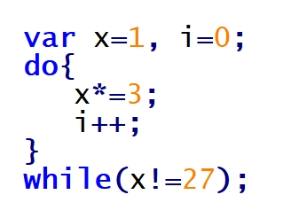
- **A.** 2 razy
- **B.** 3 razy ✅
- **C.** 26 razy
- **D.** 27 razy

### Q443. Poprawne udokumentowanie wzorca weryfikacji pola nazwa w części kodu aplikacji JavaScript to

- **A.** /* Pole nazwa może składać się z dowolnego ciągu cyfr (z wyłączeniem 0), małych i dużych liter. */
- **B.** /* Pole nazwa powinno składać się w kolejności: z ciągu cyfr (z wyłączeniem 0), następnie dużej litery i ciągu małych liter. */
- **C.** /* Pole nazwa musi składać się w kolejności: z ciągu cyfr (z wyłączeniem 0), następnie dużej litery i dwóch małych liter. */
- **D.** /* Pole nazwa może zawierać dowolny ciąg cyfr (z wyłączeniem 0), następnie musi zawierać dużą literę i ciąg minimum dwóch małych liter. */ ✅

### Q444. Włączenie do kodu skryptu zawartości pliku egzamin.php, zawierającego kod PHP, wymaga dodania instrukcji
- **A.** fgets("egzamin.php");
- **B.** fopen("egzamin.php");
- **C.** getfile("egzamin.php");
- **D.** include("egzamin.php"); ✅

### Q445. Do utworzenia kopii zapasowej bazy danych w MySQL należy użyć polecenia
- **A.** mysqlslap
- **B.** mysqlreplicate
- **C.** mysqldump ✅
- **D.** mysqlcheck

### Q446. Deklaracja typu dokumentu HTML: <!DOCTYPE HTML> oznacza, że kod jest napisany w wersji
- **A.** 4
- **B.** 5 ✅
- **C.** 6
- **D.** 7

### Q447. Dołączenie zewnętrznego arkusza stylów do kodu HTML jest realizowane przy użyciu znacznika
- **A.** <css>
- **B.** <link> ✅
- **C.** <style>
- **D.** <meta>

### Q448. Który z rysunków obrazuje efekt działania przedstawionego fragmentu kodu HTML?

- **A.** A
- **B.** B
- **C.** C ✅
- **D.** D

### Q449. Przedstawione pole input umożliwi

- **A.** wpisanie hasła
- **B.** zaznaczenie opcji ✅
- **C.** wpisanie dowolnego tekstu
- **D.** wybranie opcji z listy o wartościach text1 i text2

### Q450. W języku HTML zdefiniowano hiperłącze ze znakiem #. Co stanie się po wybraniu przedstawionego odsyłacza?
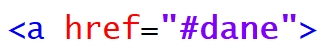
- **A.** Zostanie wywołany skrypt o nazwie dane
- **B.** Otworzy się osobna karta przeglądarki o nazwie dane
- **C.** Zostanie wybrany adres względny URL o nazwie dane
- **D.** Strona przewinie się do elementu o wartości id równej dane ✅

### Q451. Podana definicja stylu CSS sprawi, że nagłówki pierwszego stopnia będą

- **A.** wyjustowane, pisane wielkimi literami, a odstępy między liniami będą ustawione na 10 px
- **B.** wyjustowane, pisane małymi literami, a odstępy między literami będą ustawione na 10 px
- **C.** wyśrodkowane, pisane małymi literami, a odstępy między liniami będą ustawione na 10 px
- **D.** wyśrodkowane, pisane wielkimi literami, a odstępy między literami będą ustawione na 10 px ✅

### Q452. Jak zdefiniować w języku CSS formatowanie hiperłącza, żeby nieodwiedzony link był w kolorze żółtym, a odwiedzony w kolorze zielonym?
- **A.** a:visited {color: yellow;} a:link{color: green;}
- **B.** a:hover {color: green;} a:link{color: yellow;}
- **C.** a:hover {color: yellow;} a:visited{color: green;}
- **D.** a:link {color: yellow;} a:visited{color: green;} ✅

### Q453. W języku CSS zdefiniowano formatowanie dla stopki. Aby użyć tego formatowania dla bloku opisanego znacznikiem div, należy zapisać
- **A.** 

- **B.** 
 ✅
- **C.** 

- **D.** 

### Q454. Przedstawiono efekt formatowania CSS oraz kod HTML. Jak należy zdefiniować styl, aby osiągnąć takie formatowanie?
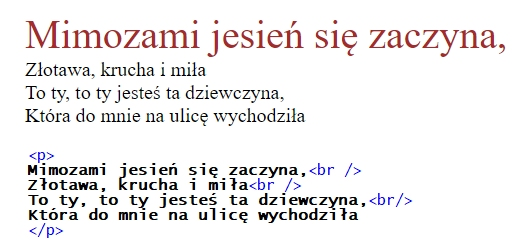
- **A.** .first-line {font-size: 200%; color:brown;}
- **B.** #first-line {font-size: 200%; color:brown;}
- **C.** p::first-line {font-size: 200%; color:brown;} ✅
- **D.** p.first-line {font-size: 200%; color:brown;}

### Q455. Przedstawione formatowanie CSS sprawi, że dla prezentowanego nagłówka trzeciego stopnia

- **A.** tło będzie szare
- **B.** tło będzie pomarańczowe ✅
- **C.** kolor czcionki będzie szary
- **D.** kolor czcionki będzie pomarańczowy

### Q456. W języku XHTML zapisano fragment kodu, który zawiera błąd walidacji. Na czym polega ten błąd?

- **A.** Znacznik   powinien być zamknięty ✅
- **B.** Nie istnieje nagłówek szóstego stopnia
- **C.** Znaczniki należy pisać wielkimi literami
- **D.** Znacznik <b> nie może być zagnieżdżany w znaczniku

### Q457. Kolor zapisany kodem heksadecymalnym: #1510FE w kodzie RGB będzie miał wartość
- **A.** rgb(15,10,FE)
- **B.** rgb(21,16,FE)
- **C.** rgb(21,16,254) ✅
- **D.** rgb(21,16,255)

### Q458. Edytując grafikę w edytorze grafiki rastrowej należy pozbyć się kolorów z rysunku tak, aby obraz był w odcieniach szarości. Można do tego efektu wykorzystać funkcję
- **A.** desaturacji ✅
- **B.** kadrowania
- **C.** szumu RGB
- **D.** filtru rozmycia

### Q459. W edytorze grafiki wektorowej stworzono przedstawiony kształt, który powstał z dwóch figur: trójkąta i koła. W celu stworzenia tego kształtu, po narysowaniu figur i odpowiednim ich ustawieniu, należy skorzystać z funkcji

- **A.** sumy ✅
- **B.** różnicy
- **C.** rozdzielenia
- **D.** wykluczenia

### Q460. Aby zapisać prostą animację na potrzeby strony internetowej, można skorzystać z formatu
- **A.** GIF ✅
- **B.** JPG
- **C.** PNG
- **D.** CDR

### Q461. Tworząc tabelę w języku SQL, zdefiniowano dla kolumny klucz główny. Aby zabezpieczyć ją przed wstawieniem wartości pustej, należy zastosować atrybut
- **A.** NULL
- **B.** UNIQUE
- **C.** DEFAULT
- **D.** NOT NULL ✅

### Q462. Dana jest tabela mieszkania zawierająca kolumny o nazwach: adres, metraz, ile_pokoi, standard, status, cena. Wykonanie przedstawionej kwerendy SQL SELECT sprawi, że zostaną wyświetlone

- **A.** Wszystkie dane tych mieszkań, które mają co najmniej 3 pokoje
- **B.** Metraż oraz cena tych mieszkań, które mają więcej niż 3 pokoje ✅
- **C.** Metraż oraz cena tych mieszkań, które mają co najmniej niż 3 pokoje
- **D.** Wszystkie dane oprócz adresu tych mieszkań, które mają więcej niż 3 pokoje

### Q463. Do tabeli pracownicy wpisano rekordy. Co zostanie wyświetlone po uruchomieniu kwerendy SQL SELECT podanej w ramce?

- **A.** Wartość 5400, czyli najwyższa pensja pracownika.
- **B.** Wartość 19500, czyli suma wszystkich pensji pracowników.
- **C.** Wartość 10000, czyli suma pensji pracownika o id=4 oraz o id=6 ✅
- **D.** Dwie wartości: 4600 i 5400, jako pensje pracowników wyższe niż 4000

### Q464. Na przedstawionej tabeli samochody wykonano zapytanie SQL: SELECT model FROM samochody WHERE rocznik=2016; W wyniku podanego zapytania zostaną zwrócone następujące wartości:

- **A.** Fiat, Opel, Toyota
- **B.** Czerwony, grafitowy
- **C.** Punto, Corsa, Corolla ✅
- **D.** Punto, Corsa, Astra, Corolla, Yaris

### Q465. Baza danych ma dwie tabele połączone relacją 1..n. Którą klauzulą SQL należy połączyć tabele, aby wybrać korespondujące ze sobą wartości z pól obu tabel?
- **A.** OUTER LINK
- **B.** INNER LINK
- **C.** JOIN ✅
- **D.** AND

### Q466. Zdefiniowanie klucza obcego jest niezbędne do utworzenia
- **A.** transakcji
- **B.** relacji 1..n ✅
- **C.** relacji 1..1
- **D.** klucza podstawowego

### Q467. Zgodnie z właściwościami ACID, dotyczącym wykonania transakcji, wymaganie trwałości (ang. durability) oznacza, że
- **A.** transakcja może być w pewnych warunkach podzielona na dwa niezależne etapy
- **B.** w czasie wykonania transakcji dane mogą być modyfikowane przez inne transakcje
- **C.** w przypadku naruszenia spójności bazy danych transakcja usuwa tabele z kluczami obcymi
- **D.** dane zatwierdzone przez transakcję powinny być dostępne niezależnie od tego, co się będzie działo po jej zakończeniu ✅

### Q468. Baza danych zawiera tabelę faktury o polach: numer, data, id_klienta, wartość, status. Każdego dnia generowany jest raport faktur z bieżącego dnia. Wyświetlane są jedynie numery i wartości faktur. Która z kwerend SQL służy do stworzenia tego raportu?
- **A.** SELECT * FROM faktury;
- **B.** SELECT numer,wartość FROM faktury;
- **C.** SELECT * FROM faktury WHERE data=CURRENT_DATE();
- **D.** SELECT numer, wartosc FROM faktury WHERE data=CURRENT_DATE(); ✅

### Q469. Polecenie SQL, które usuwa bazę danych o nazwie firma, ma postać
- **A.** DROP firma;
- **B.** ALTER firma DROP;
- **C.** DROP DATABASE firma; ✅
- **D.** ALTER firma DROP DATABASE;

### Q470. Zastosowanie kwerendy SQL: DELETE FROM mieszkania WHERE status=1; spowoduje usunięcie
- **A.** tabeli mieszkania z bazy danych
- **B.** pola o nazwie status z tabeli mieszkania
- **C.** rekordów, w których pole status jest równe 1, z tabeli mieszkania ✅
- **D.** tabel, w których pole status jest równe 1, z bazy danych mieszkania

### Q471. Aby przywrócić bazę danych z kopii bezpieczeństwa na serwerze MSSQL, należy posłużyć się poleceniem
- **A.** EXPORT DATABASE
- **B.** BACKUP DATABASE
- **C.** RESTORE DATABASE ✅
- **D.** UNBACKUP DATABASE

### Q472. W języku SQL wykonano przedstawione w ramce polecenia GRANT. Kto będzie miał prawo do przeglądania danych oraz ich zmiany?

- **A.** Adam i Anna
- **B.** Tylko Tomasz ✅
- **C.** Tomasz i Anna
- **D.** Tomasz i Adam

### Q473. W języku PHP zastosowano funkcję is_int(). Które z podanych wywołań tej funkcji zwróci wartość TRUE?
- **A.** is_int("135")
- **B.** is_int(NULL)
- **C.** is_int(13.5)
- **D.** is_int(135) ✅

### Q474. W języku JavaScript należy zapisać warunek, który będzie spełniony, gdy zmienna a będzie dowolną liczbą naturalną dodatnią (bez 0) lub gdy zmienna b będzie dowolną liczbą z przedziału domkniętego od 10 do 100. Użyte w tym warunku wyrażenie logiczne będzie miało postać
- **A.** (a>0) || ((b>=10) || (b<=100))
- **B.** (a>0) && ((b>=10) || (b<=100))
- **C.** (a>0) || ((b>=10) && (b<=100)) ✅
- **D.** (a>0) && ((b>=10) && (b<=100))

### Q475. Dana jest tabela firmy zawierająca następujące kolumny: nazwa, adres, NIP, obrot (obrót w ostatnim miesiącu), rozliczenie, status. Wykonanie kwerendy SQL SELECT sprawi, że zostaną wyświetlone

- **A.** wszystkie dane firm, które w ostatnim miesiącu miały obrót mniejszy niż 4000 zł
- **B.** wszystkie dane firm, które w ostatnim miesiącu miały obrót co najmniej 4000 zł
- **C.** jedynie nazwa oraz numer NIP firm, które w ostatnim miesiącu miały obrót co najmniej 4000 zł
- **D.** jedynie nazwa oraz numer NIP firm, które w ostatnim miesiącu miały obrót mniejszy niż 4000 zł ✅

### Q476. W języku JavaScript wynik działania instrukcji zmienna++; będzie taki sam jak instrukcji
- **A.** zmienna--;
- **B.** zmienna+=1; ✅
- **C.** zmienna=zmienna+10;
- **D.** zmienna===zmienna+1;

### Q477. W języku PHP zmienna predefiniowana $_SESSION zawiera
- **A.** zmienne zarejestrowane w bieżącej sesji ✅
- **B.** spis zarejestrowanych sesji na serwerze WWW
- **C.** zmienne przesyłane do skryptu za pomocą formularza
- **D.** zmienne przesyłane do skryptu za pomocą ciastek (cookie)

### Q478. Przedstawiony kod źródłowy ma za zadanie wyświetlić

- **A.** wylosowane liczby od 1 do 99
- **B.** kolejne liczby od 1 do 100
- **C.** wczytane z klawiatury liczby tak długo, aż nie zostanie wczytana wartość 0
- **D.** losowe liczby od 0 do 100 tak długo, aż nie zostanie wylosowana wartość 0 ✅

### Q479. W języku JavaScript należy odwołać się do elementu zawartego w pierwszym paragrafie przedstawionego fragmentu strony HTML. Można to wykonać za pomocą funkcji

- **A.** getElement("p");
- **B.** getElementById("p1");
- **C.** getElementByTagName("p")[0]; ✅
- **D.** getElementByClassName("p.1")[0];

### Q480. O przedstawionym obiekcie języka JavaScript można powiedzieć, że ma

- **A.** trzy metody
- **B.** trzy właściwości
- **C.** dwie metody i jedną właściwość
- **D.** dwie właściwości i jedną metodę ✅

### Q481. W języku JavaScript stworzono funkcję o nazwie liczba_max porównującą trzy liczby naturalne pobrane z parametrów funkcji i zwracającą maksymalną z nich. Prawidłowe wywołanie takiej funkcji wraz z pobraniem jej wyniku będzie miało postać
- **A.** liczba_max(a,b,c);
- **B.** liczba_max(a,b,c,wynik);
- **C.** liczba_max(a,b,c)=wynik;
- **D.** var wynik=liczba_max(a,b,c); ✅

### Q482. Które z zadań programistycznych powinno być wykonane po stronie serwera?
- **A.** Zmiana stylu HTML na stronie wywołana przesunięciem kursora
- **B.** Zapisanie danych pobranych z aplikacji internetowej w bazie danych ✅
- **C.** Sprawdzenie danych wpisanych do pola tekstowego w czasie rzeczywistym
- **D.** Ukrywanie i pokazywanie elementów strony w zależności od aktualnego stanu kursora

### Q483. Język JavaScrypt ma obsługę
- **A.** obiektów DOM ✅
- **B.** funkcji wirtualnych
- **C.** klas abstrakcyjnych
- **D.** wysyłania ciastek z tą samą informacją do wielu klientów strony

### Q484. W prezentowanym kodzie PHP w miejscu kropek powinno znaleźć się polecenie

- **A.** mysqli_fetch_row($zapytanie); ✅
- **B.** mysqli_free_result($zapytanie);
- **C.** mysqli_num_fields($zapytanie);
- **D.** mysqli_query($zapytanie);

### Q485. Który z elementów dokumentacji aplikacji powinien znaleźć się w dokumentacji użytkownika?
- **A.** Opis kodu źródłowego
- **B.** Opis obsługi funkcji systemu ✅
- **C.** Opis wykorzystanej technologii i bibliotek
- **D.** Opis algorytmów zastosowanych w kodzie

### Q486. Znacznik <s> w języku HTML powoduje
- **A.** migotanie tekstu
- **B.** pochylenie tekstu
- **C.** podkreślenie tekstu
- **D.** przekreślenie tekstu ✅

### Q487. Metainformacja "Description" zawarta w pliku źródłowym HTML powinna zawierać

- **A.** opis, co znajduje się na stronie ✅
- **B.** informację, kto jest autorem strony
- **C.** wykazy kluczowe, z których korzystają wyszukiwarki sieciowe
- **D.** nazwę programu, przy użyciu którego została stworzona strona

### Q488. Który opis odnosi się do metody POST wysyłania formularza?
- **A.** Może być zapisana jako zakładka w przeglądarce internetowej
- **B.** Dane przesyłane są za pomocą adresu URL, czyli w sposób widoczny dla użytkownika
- **C.** Posiada dodatkowe ograniczenia jakim jest długość adresu - maksymalnie 255 znaków
- **D.** Jest wskazana, gdy przesyłane są informacje poufne, np. hasło, numer telefonu czy numer karty kredytowej ✅

### Q489. Atrybut value w polu formularza XHTML
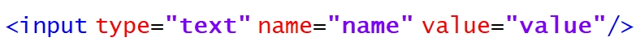
- **A.** ogranicza długość pola
- **B.** wskazuje na nazwę pola
- **C.** ustawia pole tylko do odczytu
- **D.** wskazuje odpowiedź domyślną ✅

### Q490. W języku HTML zapis < spowoduje wyświetlenie w przeglądarce znaku
- **A.** >
- **B.** &
- **C.** "
- **D.** < ✅

### Q491. Przy użyciu jakiego znacznika HTML otrzymamy tekst napisany czcionką o stałej szerokości znaku, który uwzględnia dodatkowe spacje, tabulacje i znaki końca linii?
- **A.** <ins> ... </ins>
- **B.** <pre> ... </pre> ✅
- **C.** <code> ... </code>
- **D.** <blockquote> ... </blockquote>

### Q492. W celu uzyskania efektu widocznego na rysunku, w kodzie HTML, należy umieścić znacznik skrótu <abbr> z atrybutem

- **A.** alt
- **B.** dfn
- **C.** title ✅
- **D.** name

### Q493. W HTML, aby wstawić obrazek z tekstem przyległym, znajdującym się pośrodku obrazka, należy zapisać znacznik
- **A.**  tekst
- **B.**  tekst ✅
- **C.**  tekst
- **D.**  tekst

### Q494. Który styl CSS pozwoli zdefiniować wyrównanie tekstu do prawej strony?
- **A.** 
tekst

- **B.** 
tekst

- **C.** 
tekst

- **D.** 
tekst
 ✅

### Q495. Przedstawiono kod tabeli 3x2. Której z modyfikacji w jej drugim wierszu należy dokonać, aby tabela wyglądała jak na obrazku z niewidocznym wierszem?

- **A.** <tr style="clear: none">
- **B.** <tr style="display: none">
- **C.** <tr style="visibility: hidden"> ✅
- **D.** <tr style="display: table-cell">

### Q496. Który zapis znacznika 
 może wystąpić w dokumencie HTML tylko jeden raz, a ponowne użycie tego zapisu spowoduje wygenerowanie błędów podczas walidacji dokumentu?
- **A.** 

- **B.** 
 ✅
- **C.** 

- **D.** 

### Q497. Przedstawiona linia kreskowana w stylu obramowania CSS jest określona właściwością

- **A.** solid
- **B.** double
- **C.** dotted
- **D.** dashed ✅

### Q498. Systemem zarządzania treścią pozwalającym na łatwe utworzenie i aktualizację serwisu WWW jest
- **A.** CMS ✅
- **B.** SQL
- **C.** PHP
- **D.** CSS

### Q499. W podanym kodzie HTML przedstawiony styl CSS jest stylem

- **A.** nagłówkowym
- **B.** dynamicznym
- **C.** zewnętrznym
- **D.** lokalnym ✅

### Q500. Kolor zapisany w notacji heksadecymalnej #0000FF to
- **A.** czarny
- **B.** zielony
- **C.** niebieski ✅
- **D.** czerwony

### Q501. Które stwierdzenie odnosi się do skalowania obrazu?
- **A.** Łączy lub odejmuje kształty
- **B.** Polega na zmianie sposobu zapisu obrazu tak, aby zmienić sposób kompresji
- **C.** Powoduje zmianę rozmiaru obrazu bez zmieniania ważnej zawartości wizualnej ✅
- **D.** Powoduje wycięcie z oryginalnego obrazu określonego jego fragmentu z celu uzyskania optymalnego widoku

### Q502. W języku HTML atrybutem znacznika video, który włącza tryb odtwarzania w kółko, jest
- **A.** loop ✅
- **B.** muted
- **C.** poster
- **D.** controls

### Q503. W języku HTML, aby dodać animację FLASH (z rozszerzeniem .swf) na stronę internetową, należy użyć znacznika
- **A.** 
- **B.** <audio>
- **C.** <video>
- **D.** <object> ✅

### Q504. Formatem plików dźwiękowych z kompresją bezstratną jest
- **A.** MP3
- **B.** WAW
- **C.** FLAC ✅
- **D.** MPEG

### Q505. Na tabeli muzyka, przedstawionej na rysunku, zostało wykonane następujące zapytanie SQL. Jaki wynik zwróci ta kwerenda?
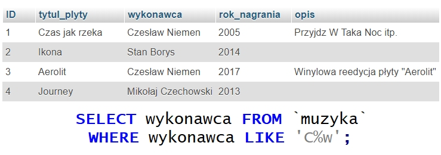
- **A.** Czesław
- **B.** pusty wynik ✅
- **C.** Czesław, Niemen
- **D.** Czesław, Czechowski

### Q506. Jaki wynik zwróci zapytanie z ramki wykonane na przedstawionej tabeli?

- **A.** 0
- **B.** 1
- **C.** 3 ✅
- **D.** 4

### Q507. W relacyjnym modelu baz danych krotkami nazywa się
- **A.** liczbę rekordów tabeli
- **B.** wszystkie wiersze tabeli wraz z wierszem nagłówkowym
- **C.** wszystkie kolumny tabeli, które zawierają atrybuty obiektu
- **D.** wiersze tabeli z wyjątkiem wiersza nagłówkowego, w którym umieszcza się nazwy kolumn ✅

### Q508. Co można powiedzieć o normalizacji przedstawionej tabeli?

- **A.** Tabela nie jest znormalizowana ✅
- **B.** Tabela jest w trzeciej postaci normalnej
- **C.** Tabela jest w drugiej postaci normalnej
- **D.** Tabela jest w pierwszej postaci normalnej

### Q509. Które zapytanie SQL dla tabeli pracownicy utworzonej według schematu: id, imie, nazwisko, plec, zarobek, obliczy osobno średni zarobek kobiet i średni zarobek mężczyzn?
- **A.** SELECT AVG(zarobek) FROM pracownicy GROUP BY plec; ✅
- **B.** SELECT AVG(zarobek) FROM pracownicy AS sredni_zarobek;
- **C.** SELECT AVG(zarobek) FROM pracownicy WHERE plec='k' AND plec='m';
- **D.** SELECT AVG(zarobek) FROM pracownicy GROUP BY plec HAVING plec='k' AND plec='m';

### Q510. Które polecenie SQL zamieni w tabeli tab w kolumnie kol wartość Ania na Zosia?
- **A.** UPDATE tab SET kol='Zosia' WHERE kol='Ania'; ✅
- **B.** UPDATE tab SET kol='Ania' WHERE kol='Zosia';
- **C.** ALTER TABLE tab CHANGE kol='Zosia' kol='Ania';
- **D.** ALTER TABLE tab CHANGE kol='Ania' kol='Zosia';

### Q511. Aby w tworzonej w języku SQL tabeli praca dodać w kolumnie stawka warunek, że musi przyjmować rzeczywiste wartości dodatnie mniejsze od 50, należy użyć zapisu
- **A.** ... stawka float CHECK(stawka IN (0, 50.00))
- **B.** ... stawka float CHECK(stawka>0 OR stawka<50.00)
- **C.** ... stawka float CHECK(stawka>0 AND stawka<50.00) ✅
- **D.** ... stawka float CHECK(stawka BETWEEN 0 AND 50.00)

### Q512. W jaki sposób wykonanie podanej w ramce kwerendy SQL wpłynie na tabelę pracownicy?

- **A.** Zmieni typ danych kolumny plec na znakowy o stałej długości 9 ✅
- **B.** Doda kolumnę plec ze znakowym typem danych o stałej długości 9
- **C.** Zmieni typ danych kolumny plec na znakowy o zmiennej długości 9
- **D.** Doda kolumnę plec ze znakowym typem danych o zmiennej długości 9

### Q513. Wykonując raport w systemie obsługi relacyjnych baz danych, umożliwia się
- **A.** analizę wybranych danych ✅
- **B.** usuwanie danych w tabelach
- **C.** dodawanie danych w tabelach
- **D.** aktualizowanie danych w tabelach

### Q514. Przedstawiona instrukcja JavaScript wyświetli
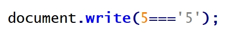
- **A.** 1
- **B.** 0
- **C.** true
- **D.** false ✅

### Q515. Która wartość tekstowa nie pasuje do podanego w ramce wzorca wyrażenia regularnego?

- **A.** Kowalski
- **B.** Kasprowicza
- **C.** Jelenia Góra ✅
- **D.** Nowakowska-Kowalska

### Q516. Który modyfikator wskazuje podany opis?

- **A.** static
- **B.** public
- **C.** private ✅
- **D.** protected

### Q517. Tworzenie i przypisanie do zmiennej tablicy asocjacyjnej zrealizuje się w PHP zapisem
- **A.** $tab = array (1, 2, 3, 4);
- **B.** $tab = array (array (1, 2), array (3, 4));
- **C.** $tab = array (); $tab[] = array (1, 2, 3, 4);
- **D.** $tab = array ("a" => 1, "b" => 2, "c" => 3); ✅

### Q518. W której technologii nie jest możliwe przetwarzanie danych użytkownika wprowadzanych na stronie WWW?
- **A.** CSS ✅
- **B.** PHP
- **C.** AJAX
- **D.** JavaScript

### Q519. W programowaniu obiektowym w języku JavaScript użyty w przedstawionym kodzie zapis: this.zawod oznacza

- **A.** klasę
- **B.** metodę ✅
- **C.** konstruktor
- **D.** właściwość

### Q520. W języku PHP sumę logiczną oznacza operator
- **A.** !
- **B.** || ✅
- **C.** +
- **D.** &&

### Q521. W jakim formacie będzie wyświetlana data po uruchomieniu przedstawionego kodu?

- **A.** Monday, 10 July 2017
- **B.** 10, Monday July 2017
- **C.** Monday, 10th July 17
- **D.** Monday, 10th July 2017 ✅

### Q522. Wynikiem działania pętli for w przedstawionym kodzie PHP jest wyświetlenie liczb

- **A.** 1 0
- **B.** 1 1 ✅
- **C.** 1 0 1
- **D.** 1 0 1 0

### Q523. W JavaScript wywołanie zdarzenia onKeydown nastąpi wtedy, gdy klawisz
- **A.** myszki został naciśnięty
- **B.** myszki został zwolniony
- **C.** klawiatury został naciśnięty ✅
- **D.** klawiatury został zwolniony

### Q524. Po wykonaniu przedstawionego kodu JavaScript wyświetli się wartość

- **A.** 11
- **B.** 12
- **C.** 13 ✅
- **D.** 14

### Q525. Wciśnięcie przycisku o treści "niebieski" spowoduje wykonanie przedstawionego kodu JavaScript. Jaki będzie efekt jego działania?

- **A.** Zmiana koloru przycisku na niebieski
- **B.** Zmiana koloru tekstu "i skrypt" na niebieski
- **C.** Zmiana koloru tekstu "Przykładowy tekst" na niebieski ✅
- **D.** Zmiana koloru tekstu "Przykładowy tekst i skrypt" na niebieski

### Q526. Którego znacznika nie należy umieszczać w nagłówku dokumentu HTML?
- **A.** <h2> ✅
- **B.** <link>
- **C.** <title>
- **D.** <meta>

### Q527. Znacznik języka HTML, który służy do oznaczenia fragmentu tekstu jako kodu komputerowego, to
- **A.** <em> </em>
- **B.**  
- **C.** <code> </code> ✅
- **D.** <blockquote> </blockquote>

### Q528. W języku HTML dla hiperłącza wartość atrybutu target, która odpowiada za załadowanie strony do nowego okna lub karty, to
- **A.** _parent
- **B.** _blank ✅
- **C.** _self
- **D.** _top

### Q529. Znacznik <ins> w języku HTML służy do oznaczenia
- **A.** cytowanego bloku tekstu.
- **B.** tekstu przeformatowanego.
- **C.** tekstu, który został dodany. ✅
- **D.** tekstu, który został usunięty.

### Q530. Do określenia listy definicji w kodzie HTML używa się znacznika
- **A.** <dl> ✅
- **B.** <td>
- **C.** <abbr>
- **D.** <label>

### Q531. Jaki rezultat zostanie wyświetlony po wykonaniu przedstawionego kodu HTML?
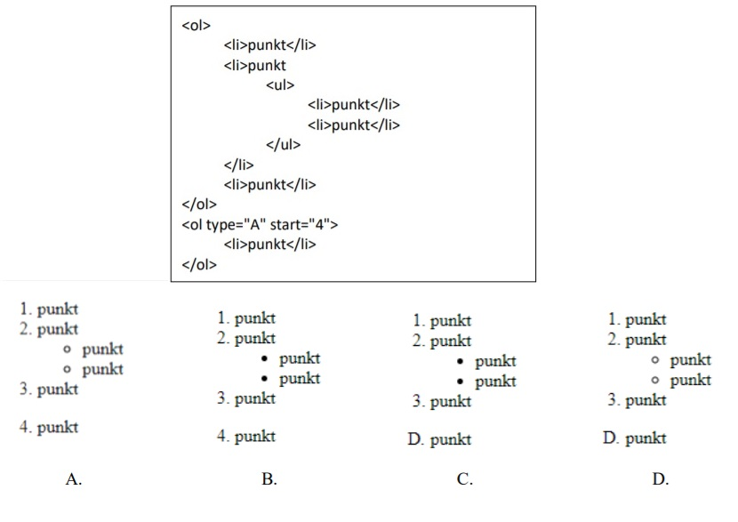
- **A.** A
- **B.** B
- **C.** C
- **D.** D ✅

### Q532. W języku HTML, aby scalić w pionie dwie sąsiednie komórki w kolumnie tabeli, należy zastosować atrybut
- **A.** colspan
- **B.** rowspan ✅
- **C.** cellpadding
- **D.** cellspacing

### Q533. Chcąc dodać do listy rozwijalnej przedstawionego formularza HTML możliwość zaznaczenia kilku opcji jednocześnie, należy w znaczniku select dodać atrybut
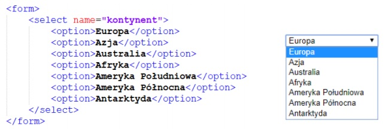
- **A.** size
- **B.** value
- **C.** multiple ✅
- **D.** disabled

### Q534. Jak nazywa się metoda dołączania arkusza stylów do dokumentu HTML użyta w przedstawionym kodzie?
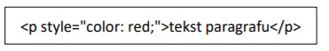
- **A.** Styl zewnętrzny.
- **B.** Styl wewnętrzny.
- **C.** Styl wpisany, lokalny. ✅
- **D.** Styl alternatywny, zewnętrzny.

### Q535. Tekst paragrafu, wyśrodkowany w pionie, opisuje w CSS reguła
- **A.** vertical-align: middle ✅
- **B.** vertical-align: center
- **C.** text-align: center
- **D.** align: middle

### Q536. Dla akapitu zdefiniowano styl CSS. Które właściwości stylu CSS poprawnie opisują dla akapitu krój czcionki: Arial; rozmiar czcionki: 16 pt; styl czcionki: pochylenie?
- **A.** p{font-style: Arial; size: 16px; font-weight: normal;}
- **B.** p{font-family: Arial; font-size: 16pt; font-style: italic;} ✅
- **C.** p{font-style: Arial; font-size: 16pt; font-variant: normal;}
- **D.** p{font-family: Arial; font-size: 16px; font-variant: normal;}

### Q537. W stylach CSS, aby ustalić styl linii obramowania jako linię kreskową, należy zastosować wartość
- **A.** solid
- **B.** dotted
- **C.** dashed ✅
- **D.** groove

### Q538. W CSS symbolem jednostki miary, wyrażonej w punktach edytorskich, jest
- **A.** em
- **B.** px
- **C.** pt ✅
- **D.** in

### Q539. Transformację w stylach CSS, polegającą na zamianie tylko pierwszych liter wszystkich wyrazów na wielkie, otrzymamy stosując polecenie
- **A.** underline
- **B.** capitalize ✅
- **C.** uppercase
- **D.** lowercase

### Q540. Podany styl tworzy obramowanie pojedyncze, o następujących cechach:

- **A.** krawędź górna jest koloru czerwonego, krawędź prawa koloru niebieskiego, krawędź dolna koloru zielonego, krawędź lewa koloru żółtego. ✅
- **B.** krawędź prawa jest koloru czerwonego, krawędź dolna koloru niebieskiego, krawędź lewa koloru zielonego, krawędź górna koloru żółtego.
- **C.** krawędź górna jest koloru czerwonego, krawędź lewa koloru niebieskiego, krawędź dolna koloru zielonego, krawędź prawa koloru żółtego.
- **D.** krawędź lewa jest koloru czerwonego, krawędź dolna koloru niebieskiego, krawędź prawa koloru zielonego, krawędź górna koloru żółtego.

### Q541. Która z operacji nie wpłynie na rozmiar / wielkość zajmowanej pamięci pliku graficznego?
- **A.** Skalowanie obrazu za pomocą atrybutów HTML. ✅
- **B.** Zmiana rozdzielczości obrazu.
- **C.** Interpolacja.
- **D.** Kompresja.

### Q542. Bitmapa jest obrazem
- **A.** rastrowym. ✅
- **B.** analogowym.
- **C.** wektorowym.
- **D.** interakcyjnym.

### Q543. Jednostka ppi (pixels per inch)
- **A.** określa rozdzielczość obrazów rastrowych. ✅
- **B.** określa rozdzielczości obrazów generowanych przez drukarki i plotery.
- **C.** jest parametrem określającym rozdzielczość cyfrowych urządzeń wykonujących pomiary.
- **D.** jest jednostką rozdzielczości skanerów określająca częstość wykonywanych próbkowań obrazu.

### Q544. Jaką funkcję pełni kwerenda krzyżowa w bazie MS Access?
- **A.** Modyfikuje istniejące dane w tabeli
- **B.** Usuwa rekordy tabel według podanych kryteriów.
- **C.** Dołącza do wybranej tabeli rekordy z innej tabeli.
- **D.** Prezentuje zliczone wartości z pola i przyporządkowuje je w wiersze i kolumny. ✅

### Q545. Funkcja CONCAT() w języku SQL odpowiada za
- **A.** usunięcie wskazanego tekstu.
- **B.** łączenie wyświetlanego tekstu. ✅
- **C.** przycięcie wyświetlanego tekstu.
- **D.** wyznaczenie z wejściowego tekstu podłańcucha znaków.

### Q546. Na podstawie tabeli Towar wykonano następujące zapytanie SQL: Jaki będzie wynik tej operacji?

- **A.** Zeszyt A5 w linie, Zeszyt A5, Kredki 24 kolory, Papier ksero A4
- **B.** Zeszyt A5, Zeszyt A5 w linie, Kredki 24 kolory, Papier ksero A4
- **C.** Papier ksero A4, Kredki 24 kolory, Zeszyt A5, Zeszyt A5 w linie ✅
- **D.** Papier ksero A4, Kredki 24 kolory, Zeszyt A5, Zeszyt A5 w linie
Papier ksero A4, Kredki 24 kolory, Zeszyt A5 w linie, Zeszyt A5

### Q547. W tabeli produkt znajdują się przedmioty wyprodukowane po 2000 roku, z polami nazwa i rok_produkcji. Klauzula SQL wyświetli listę przedmiotów wyprodukowanych

- **A.** w roku 2017. ✅
- **B.** po roku 2017.
- **C.** przed rokiem 2017.
- **D.** w latach innych niż 2017.

### Q548. Struktura prostych baz danych, w których wszystkie dane są przechowywane w jednej tabeli, nazywana jest modelem
- **A.** sieciowym
- **B.** relacyjnym.
- **C.** jednorodnym. ✅
- **D.** hierarchicznym.

### Q549. W przedstawionym diagramie bazy danych biblioteka, elementy: czytelnik, wypozyczenie i ksiazka są

- **A.** atrybutami.
- **B.** krotkami.
- **C.** encjami. ✅
- **D.** polami.

### Q550. W języku zapytań SQL, aby dodać do tabeli Towar kolumnę rozmiar typu znakowego o maksymalnej długości 20 znaków, należy wykonać polecenie
- **A.** ALTER TABLE Towar ADD rozmiar varchar(20); ✅
- **B.** ALTER TABLE Towar DROP COLUMN rozmiar varchar(20);
- **C.** ALTER TABLE Towar ALTER COLUMN rozmiar varchar(20);
- **D.** ALTER TABLE Towar CREATE COLUMN rozmiar varchar(20);

### Q551. Liczba 0x142, zapisana w kodzie skryptu JavaScript, ma postać
- **A.** dziesiętną.
- **B.** dwójkową.
- **C.** ósemkową.
- **D.** szesnastkową. ✅

### Q552. W aplikacjach internetowych tablice asocjacyjne to tablice, w których
- **A.** indeks jest łańcuchem tekstowym. ✅
- **B.** istnieją przynajmniej dwa wymiary.
- **C.** elementy tablicy są zawsze indeksowane od 0.
- **D.** w każdej komórce tablicy przechowywana jest inna tablica.

### Q553. Odwołaniem do imienia Agata, zawartym w przedstawionej tablicy JavaScript, jest element

- **A.** Imiona[4];
- **B.** Imiona[3]; ✅
- **C.** Imiona[Agata];
- **D.** Imiona['Agata'];

### Q554. Specjalna metoda danej klasy stosowana w programowaniu obiektowym, wywoływana automatycznie podczas tworzenia obiektu,której podstawowym zadaniem jest zwykle zainicjowanie pól, to
- **A.** obiekt.
- **B.** destruktor.
- **C.** konstruktor. ✅
- **D.** specyfikator dostępu.

### Q555. Wskaż poprawny zapis instrukcji zapisanej w języku JavaScript.
- **A.** document.write("Liczba π z dokładnością do 2 miejsc po przecinku ≈ " + 3.14 ); ✅
- **B.** document.write("Liczba π z dokładnością do 2 miejsc po przecinku ≈ " ; 3.14 );
- **C.** document.write("Liczba π z dokładnością do 2 miejsc po przecinku ≈ " . 3.14 );
- **D.** document.write("Liczba π z dokładnością do 2 miejsc po przecinku ≈ " 3.14 );

### Q556. W języku skryptowym JavaScript operatory: ||, && należą do grupy operatorów
- **A.** bitowych.
- **B.** logicznych. ✅
- **C.** przypisania.
- **D.** arytmetycznych.

### Q557. Wskaż pętlę, która w języku JavaScript wyświetli sześć kolejnych liczb parzystych.
- **A.** for(i=2;i<12;i+=2) {document.write(i);}
- **B.** for(i=2;i<=12;i+=2) {document.write(i);} ✅
- **C.** for(i=2;i<12;i++) {i++; document.write(i);}
- **D.** for(i=2;i<=12;i++) {i=i+2; document.write(i);}

### Q558. Wybierz poprawną definicję funkcji w języku JavaScript.
- **A.** nazwa_funkcji(argumenty) {instrukcje;}
- **B.** new nazwa_funkcji(argumenty) {instrukcje;}
- **C.** function nazwa_funkcji(argumenty) {instrukcje;} ✅
- **D.** typ_funkcji nazwa_funkcji(argumenty) {instrukcje;}

### Q559. W języku PHP zapisywanie danych do pliku realizuje funkcja?
- **A.** fgets()
- **B.** fputs() ✅
- **C.** fopen()
- **D.** freadfile()

### Q560. Plikiem konfiguracyjnym, który pozwala na zdefiniowanie ustawień PHP dla całego serwera, jest
- **A.** my.ini
- **B.** php.ini ✅
- **C.** httpd.conf
- **D.** config.inc.php

### Q561. Efektem wykonania przedstawionego kodu PHP jest wyświetlenie komunikatu

- **A.** warunek1
- **B.** warunek2 ✅
- **C.** warunek3
- **D.** warunek4

### Q562. Ile razy zostanie wykonana pętla zapisana w przedstawionym skrypcie PHP?

- **A.** 0
- **B.** 5
- **C.** 6 ✅
- **D.** 7

### Q563. Jaką wartość zwróci funkcja empty($a); zapisana w języku PHP, gdy zmienna $a przyjmie wartość liczbową równą 0?
- **A.** 0
- **B.** TRUE ✅
- **C.** NULL
- **D.** FALSE

### Q564. W języku JavaScript, funkcja matematyczna Math.pow() służy do wyznaczenia
- **A.** potęgi liczby. ✅
- **B.** wartości przybliżonej liczby.
- **C.** wartości bezwzględnej liczby.
- **D.** pierwiastka kwadratowego liczby.

### Q565. Jakie wartości muszą przyjmować zmienne w funkcji biblioteki mysqli, aby połączyć się z serwerem i bazą danych?

- **A.** adres serwera - $a, nazwa bazy danych - $b, login - $c, hasło - $d
- **B.** adres serwera - $c, nazwa bazy danych - $d, login - $a, hasło - $b
- **C.** adres serwera - $c, nazwa bazy danych - $d, login - $b, hasło - $a
- **D.** adres serwera - $a, nazwa bazy danych - $d, login - $b, hasło - $c ✅

### Q566. W którym z bloków należy umieścić warunek pętli?

- **A.** A
- **B.** B
- **C.** C ✅
- **D.** D

### Q567. Ile razy należy zapisać instrukcję warunkową, aby zaimplementować w języku programowania przedstawiony algorytm?

- **A.** Jeden raz.
- **B.** Dwa razy. ✅
- **C.** Trzy razy.
- **D.** Cztery razy.

### Q568. W języku C, aby zadeklarować stałą, należy użyć
- **A.** const ✅
- **B.** static
- **C.** #CONST
- **D.** #INCLUDE

### Q569. Które z wyrażeń logicznych zapisanych w języku C sprawdza, czy zmienna o nazwie zm1 należy do przedziału (6, 203> ?
- **A.** (zm1 > 6) || (zm1 <= 203)
- **B.** (zm1 > 6) || (zm1 != 203)
- **C.** (zm1 > 6) && (zm1 <= 203) ✅
- **D.** (zm1 > 6) && (zm1 != 203)

### Q570. Kwalifikatory dostępu: private, protected i public definiują mechanizm
- **A.** przeładowania.
- **B.** polimorfizmu.
- **C.** hermetyzacji. ✅
- **D.** rekurencji.

### Q571. bool gotowe=true;
cout << gotowe;
Co zostanie wypisane w wyniku wykonania przedstawionych instrukcji?
- **A.** 0
- **B.** 1 ✅
- **C.** tak
- **D.** nie

### Q572. Za pomocą którego słowa kluczowego deklaruje się zmienną w języku JavaScript?
- **A.** var ✅
- **B.** new
- **C.** variable
- **D.** instanceof

### Q573. Zadaniem przedstawionej pętli jest

- **A.** wypełnienie tabeli Ksiazka danymi.
- **B.** wypisanie na ekranie danych tabeli Ksiazka.
- **C.** utworzenie dziesięciu obiektów typu Ksiazka. ✅
- **D.** utworzenie jednego obiektu typu mojeKsiazki.

### Q574. Która z deklaracji funkcji w języku C++ ma parametr wejściowy typu rzeczywistego, a zwraca wartość całkowitą?
- **A.** void fun1(int a);
- **B.** int fun1(float a); ✅
- **C.** float fun1(int a);
- **D.** float fun1(void a);

### Q575. Jednym z wariantów testów jednostkowych jest analiza ścieżek, która polega na
- **A.** testowaniu wartości brzegowych zbioru danych.
- **B.** testowaniu obiektów pod względem inicjacji i zwolnienia zarezerwowanej pamięci.
- **C.** określeniu punktu początkowego i końcowego oraz badaniu możliwych dróg pomiędzy tymi
punktami. ✅
- **D.** utworzeniu kilku zbiorów danych o podobnym sposobie przetwarzania i użyciu ich do
przeprowadzenia testu.

### Q576. Który sposób komentowania w języku PHP pozwala na zapis bloku komentarza w kilku liniach?
- **A.** #
- **B.** / /
- **C.** /*   */ ✅
- **D.** <!--  -->

### Q577. Pole lub zbiór pól jednoznacznie identyfikujący każdy pojedynczy wiersz w tabeli w bazie danych to klucz
- **A.** inkrementacyjny.
- **B.** podstawowy. ✅
- **C.** przestawny.
- **D.** obcy.

### Q578. W języku SQL, aby zmienić strukturę tabeli, np. poprzez dodanie lub usunięcie kolumny, należy zastosować polecenie
- **A.** UPDATE
- **B.** TRUNCATE
- **C.** DROP TABLE
- **D.** ALTER TABLE ✅

### Q579. Atrybut kolumny NOT NULL jest wymagany w przypadku
- **A.** klucza podstawowego. ✅
- **B.** użycia atrybutu DEFAULT.
- **C.** definicji wszystkich pól tabeli.
- **D.** definicji wszystkich pól typu numerycznego.

### Q580. Aby za pomocą polecenia SELECT wyświetlić nazwiska osób mieszkających na osiedlu tak, aby te nazwiska nie powtarzały się, należy zapisać zapytanie w postaci
- **A.** SELECT nazwisko FROM mieszkancy ORDER BY nazwisko;
- **B.** SELECT DISTINCT nazwisko FROM mieszkancy; ✅
- **C.** SELECT TOP 10 nazwisko FROM mieszkancy;
- **D.** SELECT AVG(nazwisko) FROM mieszkancy;

### Q581. Baza danych zawiera dane multimedialne, co wiąże się z przechowywaniem dużych ilości danych binarnych. Do takich danych należy zastosować typ
- **A.** BLOB ✅
- **B.** ENUM
- **C.** DOUBLE
- **D.** LONGTEXT

### Q582. W tabeli Recepta pola Imie i Nazwisko dotyczą pacjenta, na którego recepta jest wydana. Którą kwerendę należy zastosować, aby dla wszystkich recept uzyskać datę wystawienia recepty oraz imię i nazwisko lekarza wystawiającego?

- **A.** SELECT Imie, Nazwisko, DataWystawienia FROM Recepta;
- **B.** SELECT Lekarz.Imie, Lekarz.Nazwisko, DataWystawienia FROM Recepta;
- **C.** SELECT Imie, DataWystawienia FROM Recepta JOIN Lekarz ON Recepta.Lekarz_id = Lekarz.id;
- **D.** SELECT Lekarz.Imie, Lekarz.Nazwisko, DataWystawienia FROM Recepta JOIN Lekarz ON Recepta.Lekarz_id = Lekarz.id; ✅

### Q583. W bazach danych do prezentacji danych spełniających określone warunki należy utworzyć
- **A.** raport. ✅
- **B.** relację.
- **C.** formularz.
- **D.** makropolecenie.

### Q584. Które polecenie służy do zmiany wartości o jeden w polu RokStudiów w tabeli Studenci dla studentów, którzy studiują na roku 1÷4?
- **A.** UPDATE Studenci, RokStudiow+1 WHERE RokStudiow < 5;
- **B.** UPDATE Studenci SET RokStudiow WHERE RokStudiow < 5;
- **C.** UPDATE RokStudiow SET RokStudiow++ WHERE RokStudiow < 5;
- **D.** UPDATE Studenci SET RokStudiow = RokStudiow+1 WHERE RokStudiow
< 5; ✅

### Q585. Wskaż różnicę pomiędzy poleceniami DROP TABLE i TRUNCATE TABLE.
- **A.** DROP TABLE usuwa tabelę, a TRUNCATE TABLE modyfikuje w niej dane spełniające
warunek.
- **B.** DROP TABLE usuwa tabelę, a TRUNCATE TABLE usuwa wszystkie dane, pozostawiając
pustą tabelę. ✅
- **C.** Obydwa polecenia usuwają jedynie zawartość tabeli, ale tylko polecenie DROP TABLE może
być cofnięte.
- **D.** Obydwa polecenia usuwają tabelę wraz zawartością, ale tylko polecenie TRUNCATE TABLE może być cofnięte.

### Q586. Aby nadać użytkownikowi uprawnienia do tabel w bazie danych, należy zastosować polecenie
- **A.** GRANT ✅
- **B.** SELECT
- **C.** CREATE
- **D.** REVOKE

### Q587. Aby przesłać dane za pomocą funkcji mysqli_query() w skrypcie PHP, który wstawia do bazy danych dane pobrane z formularza ze strony internetowej, jako jednego z parametrów należy użyć kwerendy
- **A.** INSERT INTO ✅
- **B.** UPDATE
- **C.** SELECT
- **D.** ALTER

### Q588. Przedstawiony fragment kodu PHP działa poprawnie i ma za zadanie wyświetlić na stronie internetowej dane pobrane kwerendą z bazy danych. Z ilu pól zostaną wyświetlone dane?

- **A.** Z jednego pola.
- **B.** Z dwóch pól.
- **C.** Z trzech pól. ✅
- **D.** Z czterech pól.

### Q589. Na rysunku przedstawiono strukturę bloków strony internetowej. Który z fragmentów formatowania strony pasuje do takiego układu? (Dla uproszczenia pominięto właściwości koloru tła, wysokości i czcionki)

- **A.** #pierwszy {float:left; width:30%; } 
#drugi {clear:both; width:70%; } 
#trzeci {float:left; width:70%; } 
#czwarty {clear:both; }
- **B.** #pierwszy {float:left; width:30%;} 
#drugi {float:left; width:70%;} 
#trzeci {float:left; width:70%;} 
#czwarty {clear:both; } ✅
- **C.** #pierwszy { width: 30%; } 
#drugi { width: 70%; } 
#trzeci { width: 70%; } 
#czwarty { width: 100%; }
- **D.** #pierwszy{float:left; width:30%;} 
#drugi {clear:both; width:70%;} 
#trzeci {clear:both; width:70%;} 
#czwarty {float:left; width:100%;}

### Q590. Wskaż nazwę Systemu Zarządzania Treścią, którego logo zostało przedstawione na rysunku.

- **A.** Drupal
- **B.** Joomla! ✅
- **C.** WordPress
- **D.** MediaWiki

### Q591. Który kod języka HTML da efekt formatowania jak na przedstawionym rysunku?

- **A.** 
 W tym <i> paragrafie zobaczysz sposoby formatowania </i> tekstu w HTML 

- **B.** 
 W tym <b> paragrafie <i> zobaczysz </i> sposoby formatowania </b> tekstu w HTML 

- **C.** 
 W tym <i> paragrafie <b> zobaczysz </b> sposoby formatowania </i> tekstu w HTML 
 ✅
- **D.** 
 W tym <i> paragrafie </i> <b> zobaczysz </b> <i> sposoby formatowania </i> tekstu w HTML 

### Q592. Który znacznik należy do znaczników definiujących listy w języku HTML?
- **A.** <tr>
- **B.** <th>
- **C.** <td>
- **D.** <ul> ✅

### Q593. Który z kodów HTML opisuje przedstawioną tabelę? (Dla uproszczenia pominięto zapis stylu obramowania tabeli i komórek)

- **A.** A
- **B.** B ✅
- **C.** C
- **D.** D

### Q594. Przedstawione w języku CSS formatowanie czcionki będzie obowiązywać dla

- **A.** znaczników o id równym *.
- **B.** znaczników z przypisaną klasą równą *.
- **C.** całego kodu HTML, niezależnie od późniejszych ustawień CSS.
- **D.** całego kodu HTML, jako formatowanie domyślne dla wszystkich elementów strony. ✅

### Q595. Której właściwości CSS należy użyć, aby zdefiniować marginesy wewnętrzne dla elementu?
- **A.** hight
- **B.** width
- **C.** margin
- **D.** padding ✅

### Q596. W kodzie CSS zastosowano formatowanie elementu listy, przy czym żadne inne formatowanie CSS nie zostało zdefiniowane. Zastosowane formatowanie sprawi, że

- **A.** tekst wszystkich elementów, którym przypisano id „hover” będzie w kolorze Maroon.
- **B.** po najechaniu kursorem na element listy, zmieni się kolor tekstu na Maroon. ✅
- **C.** tekst wszystkich elementów listy będzie w kolorze Maroon.
- **D.** kolor Maroon będzie obejmował co drugi element listy.

### Q597. Wartości: static, relative, fixed, absolute oraz sticky można przypisać do właściwości
- **A.** display
- **B.** position ✅
- **C.** list-style-type
- **D.** text-transform

### Q598. Aby dostosować stronę internetową dla niewidomych, należy nadać wyświetlanym za pomocą znacznika img obrazom atrybut
- **A.** alt ✅
- **B.** src
- **C.** text
- **D.** style

### Q599. Którą czynność należy wykonać podczas obróbki zdjęcia w edytorze grafiki, aby białe tło zamienić na przezroczystość?
- **A.** Dodać kanał alfa. ✅
- **B.** Skadrować obraz.
- **C.** Zmienić saturację obrazu.
- **D.** Maksymalnie zmniejszyć jasność.

### Q600. Aby zwiększyć szybkość działania strony zawierającej grafikę o wymiarach 2000 px na 760 px, należy zmniejszyć rozmiary grafiki
- **A.** w programie graficznym. ✅
- **B.** za pomocą atrybutów HTML.
- **C.** za pomocą właściwości CSS, podając rozmiar w pikselach.
- **D.** za pomocą właściwości CSS, podając rozmiar w procentach.

### Q601. Przedstawiona linia kodu została zapisana w języku

- **A.** C#
- **B.** PHP
- **C.** Python
- **D.** JavaScript ✅

### Q602. Na stronie internetowej znajduje się formularz, do którego należy zaprogramować następujące funkcje: 
- walidacja: w trakcie wypełniania formularza w czasie rzeczywistym jest sprawdzana poprawność danych 
- przesyłanie danych: po wypełnieniu formularza i jego zatwierdzeniu dane są przesyłane do bazy danych
na serwerze 
Aby zaimplementować tę funkcjonalność w możliwie najprostszy sposób, należy zapisać
- **A.** walidację i przesyłanie danych w języku PHP.
- **B.** walidację i przesyłanie danych w języku JavaScript.
- **C.** walidację w skrypcie PHP, a przesyłanie danych w JavaScript.
- **D.** walidację w języku JavaScript, a przesyłanie danych w skrypcie PHP. ✅

### Q603. Globalne tablice do przechowywania danych o ciastkach i sesjach: $ _ COOKIE oraz $ _ SESSION są częścią
języka
- **A.** C#
- **B.** Perl
- **C.** PHP ✅
- **D.** JavaScript

### Q604. Podczas walidacji dokumentu HTML5 pojawił się komunikat o treści: „Error: Element head is missing a required instance of child element title”. Oznacza to, że w dokumencie
- **A.** element <title> nie jest wymagany.
- **B.** element <title> nie został zamknięty przez </title>.
- **C.** nie zdefiniowano elementu <title> w części <head> dokumentu. ✅
- **D.** nie zdefiniowano obowiązkowego atrybutu title w znaczniku .

### Q605. Którego protokołu należy użyć, aby przesłać pliki strony internetowej na serwer hostingowy?
- **A.** FTP ✅
- **B.** IRC
- **C.** HTTP
- **D.** SMTP

### Q606. Przedstawiony blok reprezentuje czynność

- **A.** zastosowania gotowej procedury lub funkcji.
- **B.** wczytania lub wyświetlenia danych.
- **C.** wykonania zadania w pętli.
- **D.** podjęcia decyzji. ✅

### Q607. Aby zadeklarować pole klasy, do którego mają dostęp jedynie metody tej klasy i pole to nie jest dostępne dla klas pochodnych, należy użyć kwalifikatora dostępu
- **A.** public.
- **B.** private. ✅
- **C.** protected.
- **D.** published.

### Q608. Pętla while powinna być wykonywana tak długo, jak długo zmienna x będzie przyjmowała wartości z przedziału obustronnie otwartego (-2, 5). Zapis tego warunku w nagłówku pętli za pomocą języka PHP ma postać
- **A.** ($x > -2) && ($x < 5) ✅
- **B.** ($x == -2) && ($x < 5)
- **C.** ($x < -2) || ($x > 5)
- **D.** ($x > -2) || ($x > 5)

### Q609. Po wykonaniu się przedstawionego fragmentu kodu języka C/C++ zmiennej o nazwie zmienna2 zostanie

- **A.** przypisany adres zmiennej o nazwie zmienna1. ✅
- **B.** przypisana ta sama wartość, co przechowywana w zmienna1.
- **C.** przypisana zamieniona na łańcuch wartość przechowywana w zmienna1.
- **D.** przypisana liczba w kodzie binarnym odpowiadająca wartości przechowywanej w zmienna1.

### Q610. W języku PHP float reprezentuje typ
- **A.** logiczny.
- **B.** całkowity.
- **C.** łańcuchowy.
- **D.** zmiennoprzecinkowy. ✅

### Q611. Którym słowem kluczowym, w języku z rodziny C należy posłużyć się, aby przypisać alternatywną nazwę dla istniejącego typu danych?
- **A.** enum
- **B.** union
- **C.** switch
- **D.** typedef ✅

### Q612. Instrukcja for może być zastąpiona instrukcją
- **A.** case
- **B.** while ✅
- **C.** switch
- **D.** continue

### Q613. Przedstawiony kod źródłowy, zapisany w języku C++, ma za zadanie dla wprowadzanych dowolnych całkowitych liczb różnych od zera wypisać

- **A.** liczby pierwsze
- **B.** wszystkie liczby
- **C.** tylko liczby parzyste ✅
- **D.** tylko liczby nieparzyste

### Q614. DOM dostarcza metod i własności, które w języku JavaScript pozwalają na
- **A.** manipulowanie zadeklarowanymi w kodzie łańcuchami
- **B.** wysyłanie danych formularza bezpośrednio do bazy danych
- **C.** wykonywanie operacji na zmiennych przechowujących liczby
- **D.** pobieranie i modyfikowanie elementów strony wyświetlonej przez przeglądarkę ✅

### Q615. Testy dotyczące skalowalności oprogramowania mają za zadanie sprawdzić, czy aplikacja
- **A.** ma odpowiednią funkcjonalność.
- **B.** jest odpowiednio udokumentowana.
- **C.** potrafi działać przy zakładanym i większym obciążeniu. ✅
- **D.** jest zabezpieczona przed niedozwolonymi operacjami, np. dzielenie przez zero.

### Q616. Który z komentarzy opisuje zadanie zdefiniowanej w języku PHP funkcji?

- **A.** /*Funkcja zwraca wartość wyższą z dwóch podanych, gdy są równe zwraca wartość -1 */ ✅
- **B.** /* Funkcja zwraca wartość niższą z dwóch podanych, gdy są równe zwraca wartość -1 */
- **C.** /* Funkcja zwraca wartość wyższą z dwóch podanych, gdy są równe zwraca wartość $a */
- **D.** /*Funkcja zwraca wartość niższą z dwóch podanych, gdy są równe zwraca wartość $a */

### Q617. W relacyjnych bazach danych, jeżeli dwie tabele są połączone za pomocą ich kluczy głównych, mamy do czynienia z relacją
- **A.** 1..1 ✅
- **B.** 1..n
- **C.** n..1
- **D.** n..n

### Q618. Normalizacja tabel jest procesem, który ma na celu
- **A.** dodanie rekordów do bazy.
- **B.** przedstawienie graficzne bazy.
- **C.** jedynie utworzenie tabel i relacji w bazie.
- **D.** sprawdzenie i optymalizację bazy danych. ✅

### Q619. Wbudowanym w pakiet XAMPP narzędziem służącym do zarządzania bazą danych jest
- **A.** MySQL Workbench
- **B.** phpMyAdmin ✅
- **C.** pgAdmin
- **D.** SQLite

### Q620. Wskaż zapytanie, w którym dane zostały posortowane.
- **A.** SELECT DISTINCT produkt, cena FROM artykuly;
- **B.** SELECT AVG(ocena) FROM uczniowie WHERE klasa = 2;
- **C.** SELECT nazwisko FROM firma WHERE pensja > 2000 LIMIT 10;
- **D.** SELECT imie, nazwisko FROM mieszkancy WHERE wiek > 18 ORDER BY wiek; ✅

### Q621. Funkcją agregującą zwracającą liczbę rekordów jest
- **A.** SUM
- **B.** AVG
- **C.** COUNT ✅
- **D.** NUMBER

### Q622. Dana jest tabela zwierzeta z polami nazwa, gatunek, gromada, cechy, dlugosc_zycia. Dla dowolnego zestawu danych, aby wyświetlić nazwy tych zwierząt, które żyją przynajmniej 20 lat oraz są ssakami, należy wydać zapytanie:
- **A.** SELECT nazwa FROM zwierzeta WHERE gromada = ‘ssak‘;
- **B.** SELECT nazwa FROM zwierzeta WHERE dlugosc_zycia >=20;
- **C.** SELECT nazwa FROM zwierzeta WHERE dlugosc_zycia >=20 AND gromada = ‘ssak‘; ✅
- **D.** SELECT nazwa FROM zwierzeta WHERE dlugosc_zycia >=20 OR gromada = ‘ssak‘;

### Q623. W tabeli personel znajdują się pola: imie, nazwisko, pensja, staz. Aby otrzymać średnią pensję pracowników, dla których staż wynosi od 10 do 20 lat pracy włącznie, należy wykonać kwerendę:
- **A.** SELECT COUNT (pensja) FROM personel WHERE staz >= 10 AND staz <= 20;
- **B.** SELECT AVG(pensja) FROM personel WHERE staz >= 10 AND staz <= 20; ✅
- **C.** SELECT COUNT(*) FROM personel WHERE staz >= 10 AND staz <= 20;
- **D.** SELECT AVG (*) FROM personel WHERE staz >= 10 AND staz <= 20;

### Q624. Zapytanie z klauzulą JOIN stosuje się, aby
- **A.** wywołać funkcję agregującą.
- **B.** zdefiniować klucz obcy dla tabeli.
- **C.** otrzymać wynik jedynie z jednej tabeli.
- **D.** uzyskać wyniki z dwóch tabel pozostających ze sobą w relacji. ✅

### Q625. Aby usunąć tabelę należy zastosować kwerendę
- **A.** DELETE
- **B.** UNIQUE
- **C.** DROP TABLE ✅
- **D.** TRUNCATE TABLE

### Q626. Za pomocą przedstawionego zapytania w tabeli zostanie

- **A.** zmieniona nazwa kolumny z nazwa1 na nazwa2.
- **B.** zmieniona wartość kolumny nazwa2 na DOUBLE.
- **C.** dodana kolumna nazwa2 typu zmiennoprzecinkowego. ✅
- **D.** dodana kolumna nazwa2 przyjmująca wartość domyślną DOUBLE.

### Q627. Które tabele zostaną sprawdzone za pomocą przedstawionego polecenia?

- **A.** Tabele, które zmieniły się od ostatniej kontroli lub nie zostały poprawnie zamknięte. ✅
- **B.** Jedynie tabele, które nie zostały poprawnie zamknięte.
- **C.** Tabele, które zmieniły się w aktualnej sesji.
- **D.** Jedynie tabele referujące do innych.

### Q628. Jakie uprawnienia będzie miał użytkownik jan po wykonaniu na bazie danych przedstawionych poleceń?
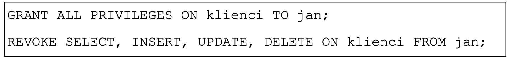
- **A.** Będzie mógł zmienić strukturę tabeli klienci. ✅
- **B.** Będzie mógł usuwać rekordy z tabeli klienci.
- **C.** Będzie mógł wyszukiwać dane w tabeli klienci.
- **D.** Będzie mógł wstawiać rekordy do tabeli klienci.

### Q629. Witryna internetowa wysyła dane poufne za pomocą formularza do kodu PHP. Która metoda wysłania jest najbardziej bezpieczna?
- **A.** Metoda GET, za pomocą protokołu HTTP
- **B.** Metoda POST, za pomocą protokołu HTTP
- **C.** Metoda GET, za pomocą protokołu HTTPS
- **D.** Metoda POST, za pomocą protokołu HTTPS ✅

### Q630. Przedstawiony fragment kodu PHP ma za zadanie umieścić dane znajdujące się w zmiennych $a, $b, $c w bazie danych, w tabeli dane. Tabela dane zawiera cztery pola, z czego pierwsze to autoinkrementowany klucz główny. Które z poleceń powinno być przypisane do zmiennej $zapytanie?

- **A.** SELECT '$a', '$b', '$c' FROM dane;
- **B.** SELECT NULL, '$a', '$b', '$c' FROM dane;
- **C.** INSERT INTO dane VALUES ('$a', '$b', '$c');
- **D.** INSERT INTO dane VALUES (NULL, '$a', '$b', '$c'); ✅

### Q631. Witryna internetowa ma mieć przedstawioną strukturę bloków. Aby uzyskać ten układ, należy znacznikom sekcji przypisać właściwości w następujący sposób:

- **A.** float tylko dla bloku 5; clear dla bloku 2
- **B.** float tylko dla bloków: 3, 4; clear dla bloku 5
- **C.** float tylko dla bloku 2; clear dla bloków: 3, 4
- **D.** float tylko dla bloków: 2, 3, 4; clear dla bloku 5 ✅

### Q632. Podstawowym zadaniem systemu CMS jest oddzielenie treści serwisu informacyjnego od jego wyglądu. Efekt ten jest uzyskany poprzez generowanie zawartości
- **A.** z bazy danych oraz wyglądu ze zdefiniowanego szablonu. ✅
- **B.** z bazy danych oraz wyglądu za pomocą atrybutów HTML.
- **C.** ze statycznych plików HTML oraz wyglądu ze zdefiniowanego szablonu.
- **D.** ze statycznych plików HTML oraz wyglądu za pomocą technologii FLASH.

### Q633. W języku HTML znacznik < i > nadaje znakom taki sam wizualny efekt jak znacznik
- **A.** <u>
- **B.** <em> ✅
- **C.** <pre>
- **D.** <strong>

### Q634. Przedstawiono tabelę zdefiniowaną kodem HTML, bez formatowania CSS. Który z fragmentów kodu HTML odpowiada pierwszemu wierszowi tabeli?

- **A.** A
- **B.** B
- **C.** C
- **D.** D ✅

### Q635. Aby obraz wstawiony kodem HTML mógł być interpretowany przez programy wspomagające osoby niewidzące, należy zdefiniować atrybut
- **A.** alt ✅
- **B.** src
- **C.** sizes
- **D.** border

### Q636. Na obrazie przedstawiono efekt formatowania stylami CSS oraz kod HTML generujący ten przykład. Zakładając, że marginesy wewnętrzne wynoszą 50 px, a zewnętrzne wynoszą 20 px, styl CSS dla obrazu ma postać

- **A.** img { 
    background-color: Teal;  
    border: 4px dotted Teal; 
    padding: 50px; 
    margin: 20px; 
}
- **B.** img { 
    background-color: Teal; 
    border: 4px solid black; 
    margin: 50px; 
    padding: 20px; 
}
- **C.** img { 
    background-color: Teal; 
    border: 4px solid black; 
    padding: 50px; 
    margin: 20px; 
} ✅
- **D.** img { 
    background-color: Teal; 
    border: 4px dotted Teal; 
    margin: 50px; 
    padding: 20px; 
}

### Q637. W kodzie CSS zdefiniowano cztery klasy formatowania, których następnie użyto do formatowania paragrafów. Efekt widoczny na rysunku powstał po zastosowaniu klasy o nazwie

- **A.** format1
- **B.** format2 ✅
- **C.** format3
- **D.** format4

### Q638. W jakim formacie należy zapisać obraz, aby mógł być wyświetlony na stronie internetowej z zachowaniem przezroczystości?
- **A.** JPG
- **B.** BMP
- **C.** PNG ✅
- **D.** CDR

### Q639. Na potrzeby strony internetowej przygotowano grafikę rysunek.jpg o rozmiarze: szerokość 200 px, wysokość 100 px. Aby wyświetlić tę grafikę jako miniaturę – pomniejszoną z zachowaniem proporcji, można zastosować znacznik
- **A.** 
- **B.**  ✅
- **C.** 
- **D.** 

### Q640. Której funkcji edytora grafiki rastrowej należy użyć, aby przygotować rysunek do wyświetlenia na stronie w ten sposób, żeby było widoczne tylko to, co znajduje się w ramce?

- **A.** Odbicie
- **B.** Skalowanie
- **C.** Kadrowanie ✅
- **D.** Perspektywa

### Q641. Przedstawiony fragment dokumentu HTML z kodem JavaScript spowoduje, że po wciśnięciu przycisku
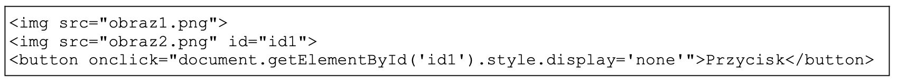
- **A.** obraz1.png zostanie ukryty.
- **B.** obraz2.png zostanie ukryty. ✅
- **C.** obraz2.png zostanie zastąpiony przez obraz1.png
- **D.** obraz1.png zostanie zastąpiony przez obraz2.png

### Q642. Co spowoduje fragment skryptu w języku JavaScript?

- **A.** Przypisze zmienną n do zmiennej s.
- **B.** Wyświetli długość napisu ze zmiennej n.
- **C.** Przypisze zmiennej s wartość odpowiadającą długości napisu ze zmiennej n. ✅
- **D.** Przypisze zmiennej s fragment napisu ze zmiennej n, o określonej przez zmienną length długości.

### Q643. Przedstawiony kod PHP nawiązuje połączenie z serwerem bazy danych. Jakiego typu operacje powinny się znaleźć w instrukcji warunkowej w miejscu trzech kropek?
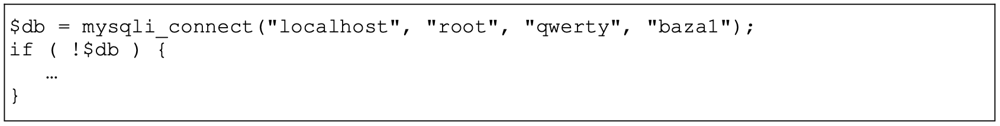
- **A.** Zamknięcie bazy danych.
- **B.** Obsługa błędu połączenia. ✅
- **C.** Obsługa danych pobranych z bazy.
- **D.** Komunikat o pomyślnym połączeniu z bazą.

### Q644. Który znacznik należący do sekcji head dokumentu HTML w wersji 5 jest wymagany przez walidator języka HTML, a jego brak jest zgłaszany jako błąd (error)?
- **A.** title ✅
- **B.** link
- **C.** metą
- **D.** style

### Q645. Za pomocą którego protokołu można opublikować stronę internetową na serwerze?
- **A.** FTP ✅
- **B.** ICMP
- **C.** SMTP
- **D.** NNTP

### Q646. W przedstawionym fragmencie algorytmu zastosowano

- **A.** dwie pętle
- **B.** jedną pętlę. ✅
- **C.** jeden blok decyzyjny.
- **D.** trzy bloki operacyjne (procesy).

### Q647. Do optymalnej realizacji algorytmu szukającego największej z trzech podanych liczb a, b i c, wystarczy
zastosować
- **A.** jedną pętlę.
- **B.** dwie tablice.
- **C.** dwa warunki. ✅
- **D.** pięć zmiennych.

### Q648. Które wyrażenie logiczne w języku PHP sprawdza, czy zmienna1 należy do przedziału jednostronnie
domkniętego <-5, 10)?
- **A.** $zmienna1 >= -5 || $zmienna1 < 10
- **B.** $zmienna1 <= -5 || $zmienna1 < 10
- **C.** $zmienna1 >= -5 && $zmienna1 < 10 ✅
- **D.** $zmienna1 <= -5 && $zmienna1 < 10

### Q649. Przedstawiona w języku C++ definicja typu wyliczeniowego sprawi, że enumerator CZWARTEK będzie
równy

- **A.** napisowi "CZWARTEK"
- **B.** napisowi 'CZWARTEK'
- **C.** liczbie 1
- **D.** liczbie 4 ✅

### Q650. Tablica tab[] jest wypełniona dowolnymi liczbami całkowitymi. Jaka wartość znajdzie się w zmiennej zm2
po wykonaniu prezentowanego fragmentu kodu?

- **A.** Suma liczb z tablicy.
- **B.** Suma liczb od 1 do 10.
- **C.** Średnia arytmetyczna liczb z tablicy. ✅
- **D.** Średnia geometryczna liczb od 0 do 9.

### Q651. W języku JavaScript metoda getElementById odwołuje się do
- **A.** zmiennej liczbowej.
- **B.** klasy zdefiniowanej w CSS.
- **C.** znacznika HTML o podanym id. ✅
- **D.** znacznika HTML o podanej nazwie klasy.

### Q652. W języku C++ funkcja zwracająca wynik potęgowania, działająca na dwóch parametrach wejściowych:
liczbie x i wykładniku w, ma deklarację
- **A.** int potega(int x);
- **B.** int potega(int x, int w); ✅
- **C.** void potega(int x, int w);
- **D.** void potega(int x, int w, int wynik);

### Q653. Aby skorzystać ze skryptu zapisanego w pliku przyklad.js, należy połączyć go ze stroną za pomocą kodu
- **A.** 
- **B.**  ✅
- **C.** 
- **D.** <link rel="script" href="przyklad.js">

### Q654. Programista napisał w języku C++ pętlę, która miała obliczyć wynik działania 5! (5! = 1 * 2 * 3 * 4 * 5).
Popełnił jednak błąd logiczny polegający na tym, że

- **A.** zmienna a powinna być inicjowana wartością 0 zamiast 1.
- **B.** parametr i pętli powinien być inicjowany wartością 0 zamiast 1.
- **C.** parametr i pętli powinien być dekrementowany zamiast inkrementowany.
- **D.** w drugim parametrze pętli powinno być porównanie i < 6 zamiast i < 5. ✅

### Q655. Który ze sposobów komentowania kodu nie jest stosowany w kodzie PHP?
- **A.** # komentarz
- **B.** // komentarz
- **C.** /* komentarz */
- **D.** < !-- komentarz -- > ✅

### Q656. Klucz obcy w tabeli jest tworzony po to, aby
- **A.** łączyć go z innymi kluczami obcymi tabeli.
- **B.** stworzyć formularz wpisujący dane do tabeli.
- **C.** umożliwić jednoznaczną identyfikację rekordu w tabeli.
- **D.** zdefiniować relację 1..n wiążącą go z kluczem głównym innej tabeli. ✅

### Q657. Które ze stwierdzeń dotyczących klucza podstawowego jest prawdziwe?
- **A.** Jest unikalny w obrębie tabeli. ✅
- **B.** Składa się tylko z jednego pola.
- **C.** Może przyjmować tylko wartości liczbowe.
- **D.** Dla tabeli z danymi osobowymi może być to pole nazwisko.

### Q658. W języku SQL aby zmodyfikować dane w tabeli, należy posłużyć się poleceniem
- **A.** CREATE
- **B.** UPDATE ✅
- **C.** SELECT
- **D.** JOIN

### Q659. Które zapytanie SQL posłuży do wyszukania z przedstawionej tabeli wyłącznie wszystkich imion i nazwisk
pacjentów urodzonych przed rokiem 2002?

- **A.** SELECT * FROM Pacjenci WHERE rok_urodzenia <= 2002;
- **B.** SELECT * FROM Pacjenci WHERE rok_urodzenia LIKE 2002;
- **C.** SELECT imie, nazwisko FROM Pacjenci WHERE rok_urodzenia < 2002; ✅
- **D.** SELECT imie, nazwisko FROM Pacjenci WHERE data_ostatniej_wizyty < 2002;

### Q660. Aby utworzyć tabelę, należy się posłużyć poleceniem
- **A.** INSERT INTO
- **B.** ALTER TABLE
- **C.** CREATE TABLE ✅
- **D.** CREATE DATABASE

### Q661. Wynikiem uruchomienia zapytania SQL jest

- **A.** liczba wszystkich uczniów.
- **B.** średnia ocen wszystkich uczniów.
- **C.** liczba uczniów, których średnia ocen wynosi 5. ✅
- **D.** suma ocen uczniów, których średnia ocen wynosi 5.

### Q662. Aby wyświetlić jedynie imię, nazwisko i ulicę wszystkich mieszkańców, należy zastosować zapytanie

- **A.** SELECT * FROM Mieszkancy, Adresy ON Mieszkancy.id = Adresy.id;
- **B.** SELECT * FROM Mieszkancy JOIN Adresy ON Adresy.id = Mieszkancy.Adresy.id;
- **C.** SELECT imie, nazwisko, ulica FROM Mieszkancy, Adresy ON Mieszkancy.Adresy_id
= Adresy.id;
- **D.** SELECT imie, nazwisko, ulica FROM Mieszkancy JOIN Adresy ON
Mieszkancy.Adresy_id = Adresy.id; ✅

### Q663. Przedstawiona baza danych zawiera trzy tabele i dwie relacje. Aby wyświetlić dane wszystkich lekarzy
przypisanych do konkretnego pacjenta, należy przyrównać klucze

- **A.** Lekarze.id = Recepty.id
- **B.** Lekarze.id = Pacjenci.id
- **C.** Lekarze.id = Pacjenci.Lekarze_id ✅
- **D.** Lekarze.id = Pacjenci.Recepty_id

### Q664. W wyniku połączenia relacją kluczy głównych dwóch tabel otrzymuje się relację typu
- **A.** wiele do wielu.
- **B.** jeden do wielu.
- **C.** jeden do jednego. ✅
- **D.** wiele do jednego.

### Q665. Obiektem służącym w bazie danych do podsumowywania, wyświetlania i wydruków danych jest
- **A.** raport. ✅
- **B.** zapytanie.
- **C.** formularz.
- **D.** zestawienie.

### Q666. Za pomocą polecenia ALTER TABLE można
- **A.** usuwać tabelę.
- **B.** tworzyć tabelę.
- **C.** modyfikować strukturę tabeli. ✅
- **D.** modyfikować wartości zapisane w rekordach tabeli.

### Q667. W bazie danych zdefiniowano tabelę Mieszkancy wypełnioną danymi. Aby usunąć tę tabelę wraz
z zawartością, należy posłużyć się poleceniem
- **A.** DROP TABLE Mieszkancy; ✅
- **B.** DELETE FROM Mieszkancy;
- **C.** ALTER TABLE Mieszkancy;
- **D.** TRUNCATE TABLE Mieszkancy;

### Q668. Aby odebrać uprawnienia użytkownikowi, należy zastosować polecenie
- **A.** DELETE
- **B.** REVOKE ✅
- **C.** DELETE PRIVILEGES
- **D.** GRANT NO PRIVILEGES

### Q669. Aby aplikacja PHP mogła komunikować się z bazą danych, niezbędne jest w pierwszej kolejności wywołanie
funkcji o nazwie
- **A.** mysqli_close
- **B.** mysqli_connect ✅
- **C.** mysql_select_db
- **D.** mysql_create_db

### Q670. Który z wymienionych znaczników języka HTML może posłużyć do budowy struktury strony internetowej?
- **A.** <em>
- **B.** <aside> ✅
- **C.** <input>
- **D.** <mark>

### Q671. Logo systemu CMS o nazwie Joomla! to

- **A.** A
- **B.** B ✅
- **C.** C
- **D.** D

### Q672. Język HTML dysponuje nagłówkami do budowania hierarchii treści. Nagłówki te występują jedynie
w zakresie
- **A.** h1 – h4
- **B.** h1 – h6 ✅
- **C.** h1 – h8
- **D.** h1 – h10

### Q673. W języku HTML zdefiniowano odnośnik do strony internetowej. Aby strona otwierała się w nowym oknie
lub zakładce przeglądarki, należy dopisać do definicji odnośnika atrybut

- **A.** rel = "next"
- **B.** rel = "external"
- **C.** target = "_blank" ✅
- **D.** target = "_parent"

### Q674. Która lista jest interpretacją przedstawionego kodu?

- **A.** A
- **B.** B
- **C.** C ✅
- **D.** D

### Q675. Na potrzeby strony internetowej zdefiniowano styl. Styl będzie przypisany tylko do niektórych znaczników
(np. niektórych nagłówków, kilku akapitów). W takim wypadku, aby przypisać styl do kilku konkretnych
znaczników, najlepiej jest zastosować

- **A.** klasę. ✅
- **B.** pseudoklasę.
- **C.** identyfikator.
- **D.** selektor akapitu.

### Q676. Aby zdefiniować krój czcionki w stylu CSS, należy użyć właściwości
- **A.** text-style
- **B.** font-style
- **C.** text-family
- **D.** font-family ✅

### Q677. Który z obrazów został sformatowany za pomocą przedstawionego stylu CSS?

- **A.** A ✅
- **B.** B
- **C.** C
- **D.** D

### Q678. Aby na stronie internetowej wyświetlić logo, którego tło jest przezroczyste, należy zastosować format
- **A.** JPG
- **B.** CDR
- **C.** PNG ✅
- **D.** BMP

### Q679. Aby obraz umieszczony na stronie internetowej automatycznie skalował się do rozmiaru ekranu, na którym
jest wyświetlana strona, należy
- **A.** oba jego wymiary ustawić w pikselach.
- **B.** jeden z jego wymiarów ustawić w pikselach.
- **C.** nie modyfikować obu jego wymiarów stylami CSS.
- **D.** jego szerokość ustawić w wartościach procentowych. ✅

### Q680. W procesie przygotowywania grafiki na stronę internetową należy wyciąć jedynie jej fragment. Taka
operacja to
- **A.** skalowanie.
- **B.** kadrowanie. ✅
- **C.** odbicie obrazu
- **D.** łączenie warstw.

### Q681. W aplikacji internetowej komunikat powinien pojawiać się tylko wtedy, gdy dany użytkownik jest na stronie
po raz pierwszy. Którą funkcję PHP należy w tym celu zastosować?
- **A.** define
- **B.** setcookie ✅
- **C.** session_destroy
- **D.** mysqli_change_user

### Q682. Przedstawiona definicja formularza została zastosowana na stronie internetowej, która wysyła dane do pliku
zapisanego w języku PHP. W której tablicy będą dostępne dane z formularza?

- **A.** $ _ GET
- **B.** $ _ POST ✅
- **C.** $ _ COOKIE
- **D.** $ _ ACTION

### Q683. W skrypcie JavaScript zastosowano metodę DOM getElementsByClassName('akapit'). Metoda ta
odwoła się do akapitu
- **A.** 
 akapit 

- **B.** 
 akapit2 

- **C.** 
 akapit3 

- **D.** 
 akapit4 
 ✅

### Q684. Dla przedstawionego fragmentu kodu walidator HTML zwróci błąd, ponieważ

- **A.** zastosowano błędny znacznik do wyświetlenia obrazu.
- **B.** zastosowano nieznany atrybut alt.
- **C.** nie znaleziono obrazu kwiat.jpg.
- **D.** nie domknięto cudzysłowu. ✅

### Q685. Program FileZilla może posłużyć do
- **A.** kompilacji skryptu na stronie.
- **B.** walidacji strony internetowej.
- **C.** publikacji strony internetowej. ✅
- **D.** debugowania skryptu na stronie.

### Q686. Która wartość zostanie wypisana przez algorytm?

- **A.** 3
- **B.** 5
- **C.** 7
- **D.** 15 ✅

### Q687. Wskaż złożoność obliczeniową algorytmu naiwnego (zwykłego) wyszukiwania minimum w zbiorze liczb?
- **A.** O(n) ✅
- **B.** O(n2)
- **C.** O(n3)
- **D.** O(n!)

### Q688. Do którego pola klasy Dane możliwy będzie dostęp z zewnątrz poprzez nazwę obiektu utworzonego jako instancja tej klasy?

- **A.** Do wszystkich pól.
- **B.** Do pola $a. ✅
- **C.** Do pola $b.
- **D.** Do pola $c.

### Q689. W języku JavaScript utworzono obiekt. Aby pobrać wartość własności w można zapisać

- **A.** obiekt:w
- **B.** obiekt.w ✅
- **C.** obiekt::w
- **D.** obiekt->w

### Q690. W języku PHP zainicjowano zmienną $a wartością 1. Porównanie $a === $b przyjmuje wartość true, w przypadku, gdy zmienna $b jest zainicjowana wartością
- **A.** *1
- **B.** '1'
- **C.** 1 ✅
- **D.** "1" lub '1'

### Q691. Która pętla w języku PHP pozwala wykonać operacje na wszystkich elementach tablicy z automatycznym indeksowaniem jej elementów?
- **A.** for
- **B.** while
- **C.** foreach ✅
- **D.** do...while

### Q692. Wskaż wynik wykonania przedstawionego kodu PHP, jeżeli zmienna tab jest tablicą.

- **A.** jelenie sarny
- **B.** lisy borsuki
- **C.** sarny dziki ✅
- **D.** dziki lisy

### Q693. Zapisaną językiem PHP funkcję o nazwie policz wywołano z argumentem $Z = 1. Jaki wynik zostanie zwrócony?
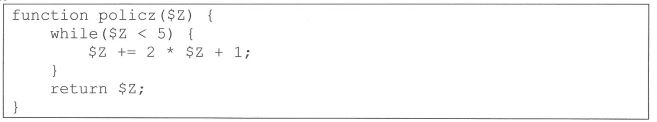
- **A.** 13 ✅
- **B.** 7
- **C.** 4
- **D.** 1

### Q694. Wskaż funkcję JavaScript, za pomocą której można obliczyć połowę kwadratu liczby przekazanej jako argument.
- **A.** function wynik(a) { return a/2+a/2; }
- **B.** function wynik(a) { return a*2/2; }
- **C.** function wynik(a) { return a*a/2; } ✅
- **D.** function wynik(a) { return 2*a/a; }

### Q695. Która z przedstawionych funkcji języka PHP zamieni słowo "kota" na słowo "mysz" w napisie "ala ma kota"?
- **A.** replace ("ala ma kota", "kota", "mysz");
- **B.** replace ("kota", "mysz", "ala ma kota");
- **C.** str_replace("ala ma kota", "kota", "mysz");
- **D.** str_replace("kota", "mysz", "ala ma kota"); ✅

### Q696. Która z przedstawionych metod pozwoli wypisać w języku JavaScript komunikat w konsoli przeglądarki internetowej?
- **A.** console.write("test");
- **B.** console.print("test");
- **C.** console.echo("test");
- **D.** console.log("test"); ✅

### Q697. Polecenie wysyłane do serwera bazy danych, polegające na zbieraniu, poszukiwaniu lub modyfikowaniu danych w bazie jest nazywane
- **A.** formularzem.
- **B.** kwerendą. ✅
- **C.** kolumną.
- **D.** kopią.

### Q698. Kolumna pełniąca rolę klucza głównego w tabeli musi
- **A.** zawierać ciągłą numerację.
- **B.** zawierać unikalne wartości. ✅
- **C.** zawierać wartości liczbowe.
- **D.** być innego typu niż pozostałe kolumny.

### Q699. Która z wbudowanych funkcji agregujących języka SQL oblicza średnią wartości we wskazanej kolumnie?
- **A.** MIN
- **B.** AVG ✅
- **C.** SUM
- **D.** COUNT

### Q700. Aby w wyniku zapytania wyeliminować powtarzające się wiersze, należy użyć klauzuli
- **A.** LIMIT
- **B.** UNIQUE
- **C.** DISTINCT ✅
- **D.** ORDER BY

### Q701. Za pomocą, którego polecenia SQL można usunąć z tabeli artykuły wiersze zawierające słowo "sto" znajdujące się w dowolnym miejscu pola tresc?
- **A.** DELETE FROM artykuly WHERE tresc = "%sto%";
- **B.** DELETE * FROM artykuly WHERE tresc = "%sto%";
- **C.** DELETE FROM artykuly WHERE tresc LIKE "%sto%"; ✅
- **D.** DELETE * FROM artykuly WHERE tresc LIKE "%sto%";

### Q702. W bazie danych sklepu istnieją dwie tabele powiązane relacją: produkty oraz ceny. Tabela oceny zawiera dowolną liczbę ocen klientów dla danego produktu opisaną polami: id, ocena (pole numeryczne), produktID (klucz obcy). Aby wskazać maksymalną ocenę dla produktu o ID równym 10, należy posłużyć się zapytaniem
- **A.** MAX SELECT ocena FROM oceny WHERE produktID = 10;
- **B.** SELECT MAX(ocena) FROM oceny WHERE produktID = 10; ✅
- **C.** COUNT MAX SELECT ocena FROM oceny WHERE produktID = 10;
- **D.** SELECT MAX COUNT(ocena) FROM oceny WHERE produktID = 10;

### Q703. Aby zmodyfikować strukturę tabeli w bazie MySQL należy wykonać polecenie
- **A.** ALTER TABLE ✅
- **B.** INSERT INTO
- **C.** UPDATE
- **D.** GRANT

### Q704. Za pomocą, którego zapytania Administrator odbierze prawo przeglądania oraz aktualizacji danych w bazie gazeta, dla użytkownika redaktor?
- **A.** REVOKE SELECT, UPDATE ON gazeta.* FROM 'redaktor'@'localhost'; ✅
- **B.** REVOKE SELECT, ALTER ON gazeta.* FROM 'redaktor'@'localhost';
- **C.** GRANT SELECT, UPDATE ON gazeta.* TO 'redaktor'@'localhost';
- **D.** GRANT SELECT, ALTER ON gazeta.* TO 'redaktor'@'localhost';

### Q705. Za pomocą, której funkcji języka PHP można ustanowaić połączenie z bazą danych o nazwie zwierzaki?
- **A.** $polacz = db_connect('localhost', 'root', '', 'zwierzaki');
- **B.** $polacz = sql_connect('localhost', 'root', '', 'zwierzaki');
- **C.** $polacz = server_connect('localhost', 'root', '', 'zwierzaki');
- **D.** $polacz = mysqli_connect('localhost', 'root', '', 'zwierzaki'); ✅

### Q706. Po uszkodzeniu serwera bazy danych, aby możliwe najsprawniej przywrócić działanie kompletnej bazy należy użyć
- **A.** najnowszej wersji instalacyjnej serwera.
- **B.** pełnej listy użytkowników serwera.
- **C.** aktualnej wersji kopii zapasowej. ✅
- **D.** opisu struktur danych w tabelach.

### Q707. Która z przedstawionych grup znaczników HTML zawiera znaczniki służące do grupowania elementów i tworzenia struktur dokumentu?
- **A.** br, img, hr
- **B.** table, tr, td
- **C.** span, strong, em
- **D.** div, article, header ✅

### Q708. Który zapis w języku HTML jest deklaracją kodowania znaków w dokumencie?
- **A.** <charset="UTF-8">
- **B.** <encoding="UTF-8">
- **C.** <meta charset="UTF-8"> ✅
- **D.** <meta encoding="UTF-8">

### Q709. Który zapis w dokumencie HTML pozwala na połączenie z zewnętrznym arkuszem stylów o nazwie style.css?
- **A.** <link rel="stylesheet" href="style.css"> ✅
- **B.** <link rel="stylesheet' src="style.css">
- **C.** <a href="style.css">
- **D.** <a src="style.css">

### Q710. Który znacznik HTML jest elementem blokowym?
- **A.** p ✅
- **B.** img
- **C.** span
- **D.** strong

### Q711. Ile maksymalnie należy użyć znaczników < td > w tabeli o trzech kolumnach i trzech wierszach niezawierającej złączeń komórek i wiersza nagłówkowego?
- **A.** 3
- **B.** 6
- **C.** 9 ✅
- **D.** 12

### Q712. Atrybutem określającym lokalizację pliku graficznego dla znacznika < img > jest
- **A.** alt
- **B.** src ✅
- **C.** href
- **D.** link

### Q713. Formatowanie CSS akapitu określa styl szarej ramki o cechach:

- **A.** linia kropkowa; grubość 2 px; marginesy pomiędzy tekstem a ramką 15 px. ✅
- **B.** linia ciągła; grubość 2 px; marginesy pomiędzy tekstem a ramką 15 px.
- **C.** linia kreskowa; grubość 2 px; marginesy poza ramką 15 px.
- **D.** linia ciągła; grubość 2 px; marginesy poza ramką 15 px.

### Q714. Który selektor formatuje akapity tekstu o klasie tekst oraz element blokowy o ID obrazki?
- **A.** p.tekst, div#obrazki ✅
- **B.** p#tekst, div.obrazki
- **C.** p.tekst + div#obrazki
- **D.** p#tekst + div.obrazki

### Q715. Pogrubienie tekstu za pomocą znacznika < b > można uzyskać także przy wykorzystaniu właściwości CSS
- **A.** text-weight
- **B.** font-weight ✅
- **C.** font-size
- **D.** text-size

### Q716. Aby w języku CSS ustawić czerwony kolor dla tekstu można użyć stylu
- **A.** color: rgb(255,0,0); ✅
- **B.** color: rgb(#FF0000);
- **C.** text-color: rgb(255,0,0);
- **D.** text-color: rgb(#FF0000);

### Q717. Za pomocą, którego zapisu zostanie utworzony w dokumencie HTML element wyświetlający obraz kotek.jpg z tekstem alternatywnym "obrazek kotka"?
- **A.** 
- **B.** 
- **C.** 
- **D.**  ✅

### Q718. Wskaż poprawne stwierdzenie dotyczące przedstawionego kodu HTML.

- **A.** Plik animacja.mp4 musi mieć rozdzielczość 640x480 pikseli, aby mógł być uruchomiony.
- **B.** Użytkownik nie będzie miał możliwości sterowania odtwarzaniem animacji.
- **C.** Kod może nie działać w przeglądarce, jeśli nie obsługuje ona HTML5. ✅
- **D.** Lokalizacja pliku jest niepoprawna, nie zawiera ścieżki bezwzględnej.

### Q719. Które zdarzenie pozwala wykonać kod w języku JavaScript w chwili wysyłania formularza HTML i zablokować lub pozwolić na jego wysłanie?
- **A.** onClick
- **B.** onEnter
- **C.** onSubmit ✅
- **D.** onChange

### Q720. W kodzie JavaScript pobrano element za pomocą metody getElementById. Aby zmodyfikować zawartość (treść) elementu można użyć właściwości
- **A.** Body
- **B.** HTML
- **C.** innerBody
- **D.** innerHTML ✅

### Q721. Przedstawiona linia kodu zapisana językiem PHP ma za zadanie

- **A.** porównać dwa napisy.
- **B.** przypisać dwie wartości do tablicy.
- **C.** zdefiniować stałą o nazwie OSOBA. ✅
- **D.** zdefiniować wartość dla zmiennej $OSOBA.

### Q722. Walidacja pól formularzy polega na sprawdzeniu
- **A.** czy użytkownik jest zalogowany.
- **B.** który użytkownik wprowadził dane.
- **C.** czy istnieje plik PHP, który odbierze dane.
- **D.** czy wprowadzone dane spełniają określone reguły. ✅

### Q723. Zgodnie z regułami walidacji HTML5, poprawnym zapisem znacznika hr jest
- **A.** 
 ✅
- **B.** 

- **C.** </hr?>
- **D.** 

### Q724. Użytkownik wprowadził adres nieistniejącego zasobu na serwerze. Próba połączenia wygeneruje błąd
- **A.** 400
- **B.** 404 ✅
- **C.** 500
- **D.** 503

### Q725. Program o nazwie FileZilla pozwala na
- **A.** uruchomienie testów aplikacji.
- **B.** walidację plików HTML i CSS.
- **C.** załadowanie baz danych do strony CMS Jommla!
- **D.** publikację strony internetowej na odległym serwerze. ✅

### Q726. Który odnośnik jest prawidłowo zdefiniowany?
- **A.** <a src="www.strona.pl">strona</a>
- **B.** <a href=http://strona.pl>strona</a>
- **C.** <a href="http::/strona.pl>strona</a>
- **D.** < a href="http://strona.pl">strona ✅

### Q727. W którym standardzie języka hipertekstowego zostały wprowadzone do składni znaczniki sekcji <footer>, <header>, <nav>?
- **A.** HTML4
- **B.** HTML5 ✅
- **C.** XHTML1.0
- **D.** XHTML2.0

### Q728. Selektor klasy w kaskadowych arkuszach stylów należy zdefiniować za pomocą symbolu
- **A.** . (kropka) ✅
- **B.** : (dwukropek)
- **C.** #
- **D.** *

### Q729. W języku CSS, aby uzyskać efekt pochylenia tekstu, należy użyć właściwości
- **A.** font-size
- **B.** font-style ✅
- **C.** font-family
- **D.** font-variant

### Q730. Dla którego akapitu zastosowano przedstawioną właściwość stylu CSS?
border-radius: 20%;

- **A.** A
- **B.** B ✅
- **C.** C
- **D.** D

### Q731. Aby za pomocą CSS zdefiniować przedstawione opływanie obrazu tekstem należy w stylu obrazu wprowadzić zapis
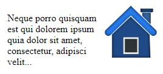
- **A.** float: left;
- **B.** table: left;
- **C.** clear: both;
- **D.** float: right; ✅

### Q732. Pojęcie "front-end" stosowane w kontekście tworzenia stron WWW odnosi się do
- **A.** organizowania informacji na serwerze WWW.
- **B.** bazy danych z informacjami publikowanymi na stronie.
- **C.** działania skryptów i programów wykonywanych po stronie serwera WWW.
- **D.** interfejsu strony internetowej związanego z technologiami działającymi po stronie przeglądarki internetowej. ✅

### Q733. Który zestaw pojęć definiuje interfejs użytkownika strony internetowej?
- **A.** Wysyłanie kwerend do bazy, skrypty PHP.
- **B.** Przyciski, menu, interakcja użytkownika z aplikacją. ✅
- **C.** Szkic strony, diagram witryny, diagram przepływu informacji.
- **D.** Przetwarzanie informacji, system zarządzania treścią, projektowanie informacji.

### Q734. Na rysunku pokazano schemat rozmieszczenia bloków na stronie WWW, w której jego części umieszcza się zwykle stopkę strony?

- **A.** 1
- **B.** 2
- **C.** 4
- **D.** 5 ✅

### Q735. Aby zweryfikować poprawność składni kodu CSS można użyć
- **A.** debbugera
- **B.** walidatora ✅
- **C.** konsolidatora
- **D.** optymalizatora

### Q736. Który z poniższych przykładów kodu HTML5 zostanie zakwalifikowany przez walidator HTML jako błędny?
- **A.** 
tekst

- **B.** 
tekst

- **C.** 
tekst

- **D.** 
tekst
 ✅

### Q737. Aby bezpiecznie przesłać pliki strony internetowej na serwer WWW można użyć protokołu
- **A.** POP3
- **B.** SFTP ✅
- **C.** TELNET
- **D.** IMAP

### Q738. Kolor zielony, w notacji szesnastkowej skróconej, można zapisać w CSS sekwencją
- **A.** #F00
- **B.** #0F0 ✅
- **C.** #00F
- **D.** #FFF

### Q739. Składowymi modelu barw CMYK są kolory:
- **A.** czerwony, zielony i niebieski.
- **B.** cyjan, magenta, żółty i czarny. ✅
- **C.** cyjan, magenta, żółty i karmazyn.
- **D.** czerwony, zielony, niebieski i kanał alfa.

### Q740. Powstające podczas zapisu pliku graficznego prostokątne zniekształcenia obrazu są charakterystyczne dla formatu

- **A.** BMP bez kompresji
- **B.** GIF z kompresją bezstratną LZW.
- **C.** PNG z kompresją bezstratną LZ77.
- **D.** JPEG z dużym stopniem kompresji stratnej. ✅

### Q741. Który rastrowy format graficzny jest obsługiwany przez przeglądarki internetowe?
- **A.** PCX
- **B.** TGA
- **C.** PNG ✅
- **D.** FLIF

### Q742. Proporcje obrazu 16:9 (przy założeniu, że piksel ma kształt kwadratu) można uzyskać przy rozdzielczości
- **A.** 320 na 240 pikseli.
- **B.** 800 na 480 pikseli.
- **C.** 1366 na 768 pikseli. ✅
- **D.** 2560 na 2048 pikseli.

### Q743. Który z wymienionych formatów umożliwia zapis dźwięku i obrazu?
- **A.** MP3
- **B.** MP4 ✅
- **C.** PNG
- **D.** WAV

### Q744. Podczas strumieniowego przesyłania cyfrowego materiału wideo parametrem wpływającym na jakość obrazu i dźwięku jest przepływność. Wielkość ta opisuje liczbę
- **A.** próbek dźwięku w jednostce czasu.
- **B.** pikseli obrazu wyświetlanych na ekranie.
- **C.** bitów transmitowanych w jednostce czasu. ✅
- **D.** pikseli wyświetlanego obrazu wyrażoną ilorazem jego długości do wysokości.

### Q745. Funkcja COUNT języka SQL realizuje
- **A.** zliczanie znaków w polu tekstowym.
- **B.** zliczanie rekordów wybranych kwerendą. ✅
- **C.** obliczenie średniej wartości w wybranej kolumnie.
- **D.** obliczenie wartości bezwzględnej w polu liczbowym.

### Q746. Ustalenie relacji pomiędzy tabelami w systemie bazodanowym MySQL umożliwia klauzula
- **A.** INDEX
- **B.** ORDER BY
- **C.** REFERENCES ✅
- **D.** PRIMARY KEY

### Q747. Aby wyświetlić rekordy z tabeli pracownicy tylko dla pracowników, którzy skończyli 26 lat należy użyć zapytania
- **A.** SELECT * FROM pracownicy OR wiek > 25;
- **B.** SELECT * FROM pracownicy AND wiek > 25;
- **C.** SELECT * FROM wiek WHERE pracownicy > 25;
- **D.** SELECT * FROM pracownicy WHERE wiek > 25; ✅

### Q748. W bazach danych relacja wiele-do-wielu pomiędzy tabelami występuje, gdy
- **A.** wielu wierszom tabeli A przypada wiele wierszy tabeli B. ✅
- **B.** wielu wierszom z tabeli A przypada tylko jeden wiersz tabeli B.
- **C.** jednemu wierszowi z tabeli A może odpowiadać wiele wierszy w tabeli B.
- **D.** jednemu wierszowi z tabeli A może odpowiadać wyłącznie jeden wiersz wtabeli B.

### Q749. Aby zaimportować plik z danymi SQL do bazy danych MySQL można użyć narzędzia
- **A.** FileZilla
- **B.** Symfony 3.
- **C.** phpMyAdmin. ✅
- **D.** TotalCommander.

### Q750. Aby w systemie MySQL nadać użytkownikowi prawo do nadawania i zmiany uprawnień innym użytkownikom należy zastosować klauzulę
- **A.** TRGGER
- **B.** GRANT OPTION ✅
- **C.** ALL PRIVILEGES
- **D.** FLUSH PRIVILEGES

### Q751. Aby wykonać kopię zapasową bazy danych MySQL można posłużyć się
- **A.** importem bazy.
- **B.** eksportem bazy. ✅
- **C.** agregacją danych.
- **D.** modyfikacją danych.

### Q752. Którą integralność opisuje cytowana definicja?  "... polega na wprowadzeniu i utrzymaniu powiązań pomiędzy tabelami. Związki te tworzy się przez umieszczenie kolumny pełniącej rolę klucza głównego tabeli w innej tabeli, co nadaje kolumnie funkcję klucza obcego."
- **A.** Encji.
- **B.** Statyczną.
- **C.** Referencyjną. ✅
- **D.** Semantyczną.

### Q753. Czynnością zalecaną przed wykonaniem kopii bezpieczeństwa danych w bazie MySQL jest
- **A.** sprawdzenie czy baza jest dostatecznie wydajna.
- **B.** zdefiniowanie systemu kodowania znaków w bazie.
- **C.** nadanie uprawnień do przeglądania bazy dla Administratora.
- **D.** sprawdzenie integralności bazy i ewentualnie jej naprawa. ✅

### Q754. Zmienna typu integer lub int może przechowywać
- **A.** znak.
- **B.** ciąg znaków.
- **C.** liczbę całkowitą. ✅
- **D.** liczbę rzeczywistą.

### Q755. Wskaż typ złożony
- **A.** char
- **B.** bool
- **C.** float
- **D.** class ✅

### Q756. Wskaż instrukcję iteracyjną
- **A.** for ✅
- **B.** else
- **C.** throw
- **D.** switch

### Q757. Debugger to oprogramowanie, którego zadaniem jest
- **A.** instalowanie środowiska programistycznego.
- **B.** wykrywanie błędów składniowych języka programowania w kodzie źródłowym.
- **C.** łączenie plików bibliotek i wstępnie przetworzonego kodu źródłowego w plik wykonywalny.
- **D.** dynamiczna analiza uruchomionego programu w celu wykrycia przyczyn nieprawidłowego działania. ✅

### Q758. Którą wartość będzie przechowywała zmienna a po wykonaniu przedstawionej sekwencji instrukcji języka PHP?

- **A.** 1
- **B.** 10
- **C.** 11 ✅
- **D.** 12

### Q759. Który framework został opracowany dla skryptowego języka PHP?
- **A.** Spring.
- **B.** Angular.
- **C.** Symfony. ✅
- **D.** ASP.NET

### Q760. Formularz, którego fragment przedstawiono, został obsłużony w skrypcie PHP. Wskaż prawidłowo zapisane pobranie wartości wprowadzonej do pola edycyjnego

- **A.** name = GET['imie'];
- **B.** name = $ _ GET[imie];
- **C.** $name = $POST['Imię'];
- **D.** $name = $ _ POST['imie']; ✅

### Q761. Aby przetestować poprawność działania kodu JavaScript należy użyć
- **A.** interpretera PHP.
- **B.** kompilatora C++.
- **C.** interpretera PERL.
- **D.** konsoli w przeglądarce internetowej. ✅

### Q762. Wskaż komentarz wieloliniowy w języku PHP
- **A.** #
- **B.** / /
- **C.** /* */ ✅
- **D.** <!-- -->

### Q763. CAPTCHA to technika zabezpieczeń na stronach WWW pozwalająca
- **A.** przyspieszyć proces logowania do aplikacji internetowej.
- **B.** pominąć proces uwierzytelniania do aplikacji internetowej.
- **C.** potwierdzić, że dane z formularza są wysyłane przez człowieka. ✅
- **D.** automatycznie wypełnić formularz logowania danymi użytkownika.

### Q764. Wskaż znacznik HTML pozwalający na zapisanie tekstu nieprawidłowego lub nieodpowiedniego w sposób 
przekreślony.
- **A.** < s > < /s > ✅
- **B.** < b > < /b >
- **C.** < em > < /em >
- **D.** < sub > < /sub >

### Q765. Element < meta charset="utf-8" > jest stosowany do określenia metadanych strony internetowej dotyczących
- **A.** opisu strony
- **B.** języka strony
- **C.** słów kluczowych
- **D.** kodowania znaków ✅

### Q766. W języku HTML zdefiniowano listę, która

- **A.** jest punktowana z zagłębioną listą numerowaną
- **B.** jest numerowana z zagłębioną listą punktową ✅
- **C.** nie ma zagłębień i jest punktowana, wyświetla 5 punktów
- **D.** nie ma zagłębień i jest numerowana, słowo "niebieski" ma przyporządkowany numer 5

### Q767. Jaką szerokość strony pozostawiono na jej treść, na podstawie przedstawionej definicji CSS?

- **A.** 2 px
- **B.** 560 px ✅
- **C.** 600 px
- **D.** 640 px

### Q768. Algorytm sortowania tablicy polegający na n-krotnym porównywaniu ze sobą dwóch sąsiadujących 
elementów tablicy i zamianie miejscami w przypadku spełnienia warunku jest nazywany sortowaniem
- **A.** szybkim
- **B.** przez wybór
- **C.** bąbelkowym ✅
- **D.** przez scalanie

### Q769. W sklepie z farbami jest ustalony schemat wyliczania ceny farby: za kolor niebieski i zielony przy pojemności
2 litry cena farby jest równa cenie bazowej + 20%. Wyrażenie logiczne zapisane w języku JavaScript 
sprawdzające tę regułę ma postać
- **A.** kolor = 'niebieski' || kolor = 'zielony' && pojemnosc = 2
- **B.** (kolor = 'niebieski' || kolor = 'zielony') || pojemnosc = 2
- **C.** kolor == 'niebieski' && kolor == 'zielony' && pojemnosc == 2 ✅
- **D.** (kolor == 'niebieski' || kolor == 'zielony') && pojemnosc == 2

### Q770. Instrukcją równoważną funkcjonalnie do przedstawionej instrukcji JavaScript jest

- **A.** kod 1
- **B.** kod 2 ✅
- **C.** kod 3
- **D.** kod 4

### Q771. Zmienna typu double może przyjąć wartości
- **A.** "Ala"; 'd'
- **B.** 1,44; 2,55
- **C.** 2.4; 4; 3.2 ✅
- **D.** 1979-12-05; 12:33

### Q772. W języku JavaScript metoda Math.random() ma za zadanie
- **A.** porównać dwa napisy
- **B.** zwrócić zaokrągloną liczbę
- **C.** zwrócić liczbę pseudolosową ✅
- **D.** zaokrąglić liczbę do najbliższej większej całkowitej

### Q773. Jaki będzie efekt wykonania przedstawionych instrukcji JavaScript?

- **A.** Tylko dla elementu o id równym styl1 zostanie przypisany styl pogrubienia tekstu na bolder
- **B.** Dla wszystkich elementów na stronie zostanie przypisany styl pogrubienia tekstu na bolder
- **C.** Dla wszystkich elementów przypisanych do klasy styl1 zostanie nadany styl pogrubienia tekstu bolder ✅
- **D.** Tylko dla pierwszego elementu przypisanego do klasy styl1 zostanie nadany styl pogrubienia tekstu
bolder

### Q774. Po wykonaniu przedstawionego kodu JavaScript działającego na wcześniej zainicjalizowanej tablicy liczby
w zmiennej wynik jest przechowywana suma
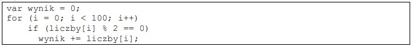
- **A.** dodatnich elementów tablicy
- **B.** wszystkich elementów tablicy
- **C.** parzystych elementów tablicy ✅
- **D.** nieparzystych elementów tablicy

### Q775. Ile iteracji zrealizuje przedstawiona pętla zapisana w języku PHP?

- **A.** 0
- **B.** 5 ✅
- **C.** 25
- **D.** 26

### Q776. Przedstawiona funkcja zapisana w języku PHP

- **A.** zwraca wartość ✅
- **B.** nie zwraca wartości
- **C.** pobiera dwa parametry z domyślną wartością
- **D.** jest zdefiniowana z dwoma parametrami rzeczywistymi

### Q777. Po wykonaniu przedstawionego kodu PHP w zmiennej $napis jest przechowywany ciąg znaków

- **A.** gr
- **B.** og
- **C.** gramo ✅
- **D.** ogram

### Q778. Przedstawiony błąd, wygenerowany podczas interpretacji kodu PHP, może być spowodowany

- **A.** odwołaniem się do niezadeklarowanej zmiennej
- **B.** niepowodzeniem wydania kwerendy na bazie danych
- **C.** próbą odwołania się do nieistniejącego elementu tablicy ✅
- **D.** brakiem bazy danych o nazwie wskazanej w funkcji mysqli_connect

### Q779. Wskaż wszystkie znaki umożliwiające komentowanie kodu języku PHP
- **A.** jedynie /* */
- **B.** < ?php ? > oraz / /
- **C.** /* */ oraz < !-- -- >
- **D.** /* */ oraz / / oraz # ✅

### Q780. W relacyjnych bazach danych encja jest reprezentowana przez
- **A.** tabelę ✅
- **B.** rekord
- **C.** relację
- **D.** kwerendę

### Q781. Wybrany minimalny zestaw atrybutów relacji, jednoznacznie identyfikujący każdy rekord tej relacji, 
przyjmujący wartości niepowtarzalne i niepuste, nazywamy kluczem
- **A.** obcym
- **B.** głównym ✅
- **C.** złożonym
- **D.** kandydującym

### Q782. W tabeli mieszkancy z polami id, imie, nazwisko, ulica, numer, czynsz (wartość całkowita) należy wybrać 
dane osób mieszkających na ulicy Mickiewicza pod numerami 71, 72, 80, których czynsz jest niższy niż 
1000 zł. Klauzula WHERE do zapytania będzie miała postać
- **A.** WHERE ulica = 'Mickiewicza' OR numer IN (71, 72, 80) OR czynsz < 1000
- **B.** WHERE ulica = 'Mickiewicza' AND numer IN (71, 72, 80) OR czynsz < 1000
- **C.** WHERE ulica = 'Mickiewicza' AND numer IN (71, 72, 80) AND czynsz < 1000 ✅
- **D.** WHERE ulica = 'Mickiewicza' AND numer > 70 AND numer < 81 OR czynsz < 1000

### Q783. Wskaż kwerendę, która z tabeli klienci wybierze jedynie nazwiska trzech najlepszych klientów, czyli takich, 
którzy na swoim koncie mają najwięcej punktów (pole całkowite punkty)
- **A.** SELECT nazwisko FROM klienci LIMIT 3;
- **B.** SELECT nazwisko FROM klienci ORDER BY punkty DESC LIMIT 3; ✅
- **C.** SELECT nazwisko FROM klienci ORDER BY nazwisko DESC LIMIT 3;
- **D.** SELECT LIMIT 3 nazwisko FROM klienci ORDER BY nazwisko DESC;

### Q784. Z tabeli mieszkancy należy wybrać niepowtarzające się nazwy miast, w tym celu należy skorzystać 
z wyrażenia SQL zawierającego klauzulę
- **A.** CHECK
- **B.** HAVING
- **C.** UNIQUE
- **D.** DISTINCT ✅

### Q785. Tabela gory, której fragment przedstawiono, zawiera polskie pasma górskie wraz z ich szczytami. Wskaż kwerendę licząca dla każdego pasma górskiego średnią wysokość jego szczytów.
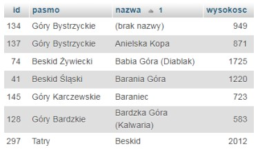
- **A.** SELECT pasmo, AVG(wysokosc) FROM gory LIMIT pasmo;
- **B.** SELECT pasmo, AVG(wysokosc) FROM gory GROUP BY pasmo; ✅
- **C.** SELECT pasmo, SUM(wysokosc) FROM gory GROUP BY pasmo;
- **D.** SELECT pasmo, COUNT(wysokosc) FROM gory ORDER BY pasmo;

### Q786. Które dane zostaną wybrane w wyniku działania kwerendy na przedstawionych rekordach? 
SELECT id FROM samochody WHERE rocznik LIKE "2%4";

- **A.** puste dane
- **B.** wszystkie id
- **C.** jedynie id równe 8
- **D.** pole id równe 7 oraz 8 ✅

### Q787. Z przedstawionych tabel Artykuly i Autorzy należy wybrać jedynie nazwiska autorów i tytuły ich artykułów, 
które zostały ocenione na 5. Kwerenda wybierająca te dane ma postać

- **A.** SELECT nazwisko, tytul FROM autorzy, artykuly WHERE ocena == 5;
- **B.** SELECT nazwisko, tytul FROM autorzy JOIN artykuly ON autorzy.id = autorzy_id;
- **C.** SELECT nazwisko, tytul FROM autorzy JOIN artykuly ON autorzy.id = 
artykuly.id;
- **D.** SELECT nazwisko, tytul FROM autorzy JOIN artykuly ON autorzy.id = autorzy_id 
WHERE ocena = 5; ✅

### Q788. Podczas tworzenia tabeli produkty należy utworzyć pole cena będące reprezentacją ceny produktu. 
Odpowiedni typ dla tego pola, to
- **A.** DECIMAL(10,2) ✅
- **B.** INTEGER(11)
- **C.** TINYTEXT
- **D.** ENUM

### Q789. Tworząc tabelę, do pola które będzie przyjmowało kolejne liczby całkowite nadawane automatycznie, należy 
dodać własność
- **A.** NULL
- **B.** NOT NULL
- **C.** PRIMARY KEY
- **D.** AUTO_INCREMENT ✅

### Q790. Aby użyć zewnętrznego skryptu JavaScript o nazwie skrypt.js, należy zapisać w kodzie HTML
- **A.** <link rel="script" href="skrypt.js" />
- **B.**  ✅
- **C.** <link rel="JavaScript" type="js" href="skrypt.js" />
- **D.** 

### Q791. Sklep internetowy korzysta z tabeli faktury. Podczas tworzenia faktury nie zawsze pole dataPlatnosci jest 
wypełniane. Aby to naprawić, na koniec dnia należy wpisać aktualną datę do wierszy, w których to pole jest 
puste (niewypełnione). Można w tym celu posłużyć się kwerendą
- **A.** UPDATE faktury SET dataPlatnosci=CURTIME() WHERE id = 3;
- **B.** UPDATE faktury SET dataPlatnosci=CURDATE() WHERE dataPlatnosci IS NULL; ✅
- **C.** UPDATE faktury SET dataPlatnosci=CURTIME() WHERE dataPlatnosci IS NOT NULL;
- **D.** UPDATE faktury SET dataPlatnosci=CURDATE() WHERE dataplatnosci = '0000-00-
00 ';

### Q792. Po wydaniu polecenia SQL prezentowanego w ramce użytkownik Ela będzie mógł
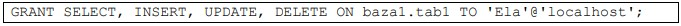
- **A.** jedynie dodawać i modyfikować dane
- **B.** wykonywać wszystkie akcje na danych ✅
- **C.** jedynie tworzyć i modyfikować strukturę tabel
- **D.** wykonywać wszystkie operacje na strukturze danych

### Q793. Polecenie służące do sprawdzenia i optymalizacji bazy danych to
- **A.** mysqlshow
- **B.** mysqldump
- **C.** mysqlcheck ✅
- **D.** mysqlimport

### Q794. W języku HTML 5 atrybut action stosowany jest w znaczniku
- **A.** < head >
- **B.** < body >
- **C.** < code >
- **D.** < form > ✅

### Q795. Który wykaz znaczników definiujących przedstawiony projekt witryny w sposób semantyczny (znaczeniowy)
jest zgodny ze standardem HTML 5?

- **A.** wykaz 1
- **B.** wykaz 2
- **C.** wykaz 3
- **D.** wykaz 4 ✅

### Q796. O czym informuje przeglądarkę internetową zapis < !DOCTYPE html >?
- **A.** Dokument został zapisany w języku HTML 4
- **B.** Dokument został zapisany w języku HTML 5 ✅
- **C.** W dokumencie wszystkie znaczniki są zapisywane wielkimi literami
- **D.** W dokumencie jest wymagane zamknięcie dla każdego znacznika, również samozamykającego

### Q797. W stylu CSS przedstawionym w ramce zdefiniowano klasę uzytkownik. Czcionką koloru niebieskiego na 
stronie będą zapisane

- **A.** wszystkie paragrafy
- **B.** tylko znaczniki tekstowe typu < p >, < h1 >
- **C.** paragrafy, do których została przypisana klasa uzytkownik ✅
- **D.** dowolne znaczniki w sekcji < body > z przypisaną klasą uzytkownik

### Q798. Wskaż paragraf sformatowany przedstawionym stylem CSS.

- **A.** paragraf 1
- **B.** paragraf 2
- **C.** paragraf 3
- **D.** paragraf 4 ✅

### Q799. W arkuszu CSS zapisano przedstawione style. Jeżeli hiperłącze zostanie wybrane, to po powrocie na stronę 
to hiperłącze będzie w kolorze
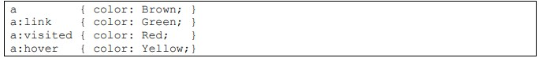
- **A.** żółtym
- **B.** zielonym
- **C.** brązowym
- **D.** czerwonym ✅

### Q800. Kolor zielony ma w notacji szesnastkowej wartość #008000. Wartość ta zapisana w notacji RGB to
- **A.** rgb(0, 80, 0)
- **B.** rgb(0, 100, 0)
- **C.** rgb(0, 128, 0) ✅
- **D.** rgb(0, 160, 0)

### Q801. Dla uzyskania przedstawionego efektu w edytorze grafiki rastrowej zastosowano

- **A.** kanał alpha
- **B.** gradient liniowy ✅
- **C.** gradient kołowy
- **D.** zmianę nasycenia

### Q802. Przedstawiona ikona funkcji edytora grafiki rastrowej o nazwie „różdżka” umożliwia

- **A.** zaznaczenie obszaru na podstawie koloru ✅
- **B.** wybiórcze rozsmarowywanie koloru za pomocą pędzla
- **C.** pobranie wskazanego koloru i ustawienie go jako aktywny
- **D.** odręczne zaznaczanie obszarów przez przeciąganie po nich kursora

### Q803. Testując skrypt JavaScript można wyświetlać w konsoli aktualnie przechowywane wartości zmiennych 
za pomocą funkcji
- **A.** console.log() ✅
- **B.** console.warn()
- **C.** console.error()
- **D.** console.count()

### Q804. Aby za pomocą skryptu JavaScript zmienić wartość cechy elementu opisanej językiem CSS, należy posłużyć 
się szablonem zapisu
- **A.** document.getElementById(id).innerHTML = < nowa wartość >;
- **B.** document.getElementById(id).< nazwa-atrybutu > = < nowa wartość >;
- **C.** document.getElementById(id).< nazwa właściwości > = < nowa wartość >;
- **D.** document.getElementById(id).style.< nazwa właściwości > = < nowa wartość >; ✅

### Q805. W której tablicy superglobalnej w środowisku PHP powinno się przechowywać dane związane z logowaniem 
użytkownika w sposób zapewniający ich bezpieczeństwo?
- **A.** $ _ SESSION ✅
- **B.** $ _ SERVER
- **C.** $ _ COOKIE
- **D.** $ _ FILES

### Q806. W wyniku walidacji dokumentu HTML został wygenerowany błąd przedstawiony na zrzucie. Aby go 
wyeliminować należy

- **A.** dodać atrybut alt do obrazu ✅
- **B.** zamienić zapis < /h1 > na < h1 >
- **C.** w znaczniku img zamienić nazwę atrybutu src na alt
- **D.** w znaczniku img zamienić nazwę atrybutu src na href

### Q807. Program FileZilla może zostać wykorzystany do
- **A.** walidacji strony internetowej
- **B.** publikacji strony internetowej na serwerze ✅
- **C.** zarządzania bazami danych strony internetowej
- **D.** zmiany domyślnych ustawień hostingu dla strony internetowej

### Q808. Które z poleceń algorytmu odpowiada graficznej reprezentacji bloku przedstawionego na obrazie?

- **A.** n > 70
- **B.** n ← n - 3 ✅
- **C.** wypisz w konsoli zmienną n
- **D.** wykonaj podprogram sortowania tablicy t

### Q809. Metoda projektowania algorytmów, polegająca na podziale problemu na dwa lub więcej mniejszych 
podproblemów, tak długo aż fragmenty staną się wystarczająco proste do bezpośredniego rozwiązania, to
- **A.** dziel i zwyciężaj ✅
- **B.** sito Eratostenesa
- **C.** słowa Fibonacciego
- **D.** sortowanie przez wybór

### Q810. Program zapisany w języku C++ ma za zadanie wczytać zmienną całkowitą liczba i wyświetlić ją wtedy, gdy 
przyjmuje trzycyfrowe wartości parzyste. Instrukcja warunkowa sprawdzająca ten warunek powinna zawierać 
wyrażenie logiczne
- **A.** liczba % 2 == 0 || liczba > 99 || liczba < 999
- **B.** liczba % 2 == 0 && liczba > 99 && liczba < 999 ✅
- **C.** liczba % 2 == 0 || (liczba > 99 && liczba < 999)
- **D.** liczba % 2 == 0 && (liczba > 99 || liczba < 999)

### Q811. Wskaż instrukcję równoważną funkcjonalnie do instrukcji while zapisanej w języku PHP.

- **A.** Instrukcja 1
- **B.** Instrukcja 2
- **C.** Instrukcja 3 ✅
- **D.** Instrukcja 4

### Q812. Co będzie wynikiem po wywołaniu przedstawionego skryptu?

- **A.** Nie wyświetli się żaden napis
- **B.** Wyświetli się tylko napis „test1”
- **C.** Wyświetli się tylko napis „test2”
- **D.** Wyświetlą się oba napisy: „test1” i „test2” ✅

### Q813. W języku C++ zdefiniowano zmienną char zm1[10];
Zmienna ta jest
- **A.** liczbą
- **B.** znakiem
- **C.** tablicą znaków ✅
- **D.** tablicą łańcuchów

### Q814. Która definicja tablicy asocjacyjnej w języku PHP jest poprawna składniowo?
- **A.** $wiek = array("Anna"=35, "Ewa"=37, "Oliwia"=43);
- **B.** $wiek = array([Anna, 35], [Ewa, 37], [Oliwia, 43]);
- **C.** $wiek = array("Anna"=>"35", "Ewa"=>"37", "Oliwia"=>"43"); ✅
- **D.** $wiek = array({"Anna", "35"}, {"Ewa", "37"}, {"Oliwia", "43"});

### Q815. W języku JavaScript, aby sprawdzić jednym poleceniem czy dany napis zawiera w sobie inny napis, można 
skorzystać z metody
- **A.** repeat()
- **B.** substr()
- **C.** valueOf()
- **D.** includes() ✅

### Q816. W jaki sposób w języku PHP należy ustawić zmienną sesji o nazwie wyborID na wartość 4?
- **A.** session.wyborID = 4;
- **B.** session.wyborID = {4};
- **C.** $ _SESSION[4] = wyborID;
- **D.** $ _SESSION["wyborID"] = 4; ✅

### Q817. W języku PHP zmienna $ _SERVER przechowuje między innymi informacje o
- **A.** danych dotyczących sesji
- **B.** adresie IP serwera, nazwie protokołu ✅
- **C.** danych formularza przetwarzanego na serwerze.
- **D.** nazwie ciasteczek zapisanych na serwerze i danych z nimi związanych

### Q818. Którą wartość zwróci funkcja zapisana w języku C++, jeżeli jej parametrami są a = 4 oraz b = 3?
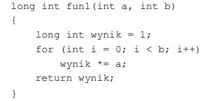
- **A.** 1
- **B.** 12
- **C.** 16
- **D.** 64 ✅

### Q819. Program PHP wyświetla aktualny czas w postaci godzina:minuta:sekunda, np. 15:38:20. Czas sformatowany 
w ten sposób zostanie zwrócony przez funkcję
- **A.** date("H:i:s"); ✅
- **B.** date("G:m:s");
- **C.** time("H:i:s");
- **D.** time("G:m:s");

### Q820. Które wyrażenie należy wstawić w miejsce ??? w pętli zapisanej w języku C++, aby zostały wyświetlone 
jedynie elementy tablicy tab

- **A.** i > = 6
- **B.** i < - 6
- **C.** i < 6 ✅
- **D.** i > 6

### Q821. Który zapis definiuje w języku JavaScript komentarz jednoliniowy?
- **A.** #
- **B.** ?
- **C.** / / ✅
- **D.** /*

### Q822. Z relacji przedstawionej na obrazie można wyczytać, że jest ona relacją

- **A.** wiele do wielu pomiędzy kluczami głównymi obu tabel
- **B.** jeden do wielu, gdzie kluczem obcym jest pole w tabeli uslugi ✅
- **C.** jeden do wielu, gdzie kluczem obcym jest pole w tabeli kadra
- **D.** Jeden do jednego, gdzie obie tabele mają zdefiniowane klucze obce

### Q823. Które z mechanizmów są niezbędne dla Systemu Zarządzania Bazą Danych?
- **A.** Wielodostępność danych ✅
- **B.** Pakiety do tworzenia statystyk
- **C.** System zarządzania wersjami bazy
- **D.** Przystawka do wizualizacji diagramów encji

### Q824. Za pomocą której kwerendy w bazie MariaDB można wybrać artykuły, których ceny zawierają się 
w przedziale obustronnie domkniętym < 10, 20 >?
- **A.** SELECT * FROM Artykuly WHERE Cena IN (10, 20);
- **B.** SELECT * FROM Artykuly WHERE Cena LIKE 1%, 2%;
- **C.** SELECT * FROM Artykuly WHERE Cena BETWEEN 10 AND 20; ✅
- **D.** SELECT * FROM Artykuly WHERE Cena > 10 AND Cena < 20;

### Q825. Z bazy danych należy zwrócić zapytaniem SQL nazwiska pracowników, którzy są kierownikami, a ich pensja 
znajduje się w przedziale jednostronnie domkniętym (3000, 4000 >. Która z klauzul bada ten warunek?
- **A.** WHERE kierownik = true OR pensja > 3000 OR pensja <= 4000;
- **B.** WHERE kierownik = true AND pensja => 3000 OR pensja < 4000;
- **C.** WHERE kierownik = true AND pensja > 3000 AND pensja <= 4000; ✅
- **D.** WHERE kierownik = true AND pensja => 3000 AND pensja <= 4000;

### Q826. Tabela odloty zawiera rekordy przedstawione na obrazie. Zastosowanie zapytania SQL spowoduje 
zwrócenie danych:

- **A.** 5; 8 ✅
- **B.** 3; 5; 8
- **C.** 4; 5; 6; 7; 8
- **D.** zbiór pusty

### Q827. W bazie MySQL zdefiniowano podczas tworzenia tabeli pole id. Wpis AUTO_INCREMENT oznacza, że

- **A.** dozwolone jest dodawanie rekordu z dowolną wartością pola id
- **B.** pole id będzie mogło przyjmować wartości: NULL, 1, 2, 3, 4 i tak dalej
- **C.** wartości pola będą automatycznie generowane podczas dodawania nowego rekordu do bazy ✅
- **D.** wartość pola id zostanie automatycznie nadana przez bazę i będzie to wygenerowana losowo liczba 
całkowita

### Q828. Tabele: Firmy i Zamowienia są powiązane relacją jeden do wielu. Aby wybrać jedynie id zamówienia wraz 
z odpowiadającą mu nazwą firmy dla firm, których poziom jest równy 4, należy zastosować polecenie

- **A.** SELECT Zamowienia.id, nazwa FROM Zamowienia JOIN Firmy WHERE poziom = 4;
- **B.** SELECT id, nazwa FROM Zamowienia JOIN Firmy ON Zamowienia.Firmy_id = 
Firmy.id WHERE poziom = 4;
- **C.** SELECT Zamowienia.id, nazwa FROM Zamowienia JOIN Firmy ON Zamowienia.id = 
Firmy.id WHERE poziom = 4;
- **D.** SELECT Zamowienia.id, nazwa FROM Zamowienia JOIN Firmy ON 
Zamowienia.Firmy_id = Firmy.id WHERE poziom = 4; ✅

### Q829. Typowym narzędziem SZBD służącym do generowania zestawień danych w celu ich wydrukowania jest
- **A.** raport ✅
- **B.** makro
- **C.** formularz
- **D.** kwerenda UPDATE

### Q830. W języku SQL usunięcie wszystkich danych z tabeli bez usuwania samej tabeli możliwe jest za pomocą 
polecenia
- **A.** DROP
- **B.** ALTER
- **C.** UPDATE
- **D.** TRUNCATE ✅

### Q831. Pole autor w tabeli ksiazka jest

- **A.** kluczem głównym tabeli ksiazka
- **B.** kluczem obcym związanym z tabelą autorzy ✅
- **C.** polem wykorzystanym przy relacji z tabelą dane
- **D.** polem typu napisowego zawierającym dane o autorze

### Q832. W bazie danych MySQL, aby wyświetlić wszystkie prawa nadane użytkownikowi anna, można posłużyć się 
poleceniem
- **A.** GRANT * TO anna;
- **B.** SHOW GRANTS FOR anna; ✅
- **C.** SELECT GRANTS FOR anna;
- **D.** REVOKE GRANTS FROM anna;

### Q833. Aby wstawić dane do bazy za pomocą polecenia PHP w jego parametrach należy przekazać

- **A.** id wiersza w $zm1 i zapytanie INSERT INTO w $zm2
- **B.** identyfikator połączenia z bazą danych w $zm1 i zapytanie SELECT w $zm2
- **C.** NULL w $zm1, aby baza zapisała tam kod błędu i zapytanie SELECT w $zm2
- **D.** identyfikator połączenia z bazą danych w $zm1 i zapytanie INSERT INTO w $zm2 ✅

### Q834. W aplikacji PHP obsługującej bazę danych, aby po wykonaniu dowolnej operacji otrzymać numer błędu oraz 
jego opis, należy zastosować
- **A.** tylko funkcję mysqli_error
- **B.** funkcje mysqli_error i mysqli_errno ✅
- **C.** funkcje mysqli_error i mysqli_error_number
- **D.** funkcje mysqli_error i mysqli_connect_errno

### Q835. Na obrazie przedstawiono projekt układu bloków witryny internetowej. Zakładając, że bloki są realizowane 
za pomocą znaczników sekcji, a szerokość została zdefiniowana jedynie dla bloków 2, 3 i 4, ich formatowanie, 
powinno zawierać właściwość

- **A.** float: left dla wszystkich bloków.
- **B.** clear: both dla wszystkich bloków.
- **C.** float: left jedynie dla bloków 3 i 4 i clear: both dla bloku 2
- **D.** clear: both dla bloku 5 i float: left jedynie dla bloków 2, 3 i 4 ✅

### Q836. Na obrazie przedstawiono tabelę ze scalonymi komórkami. Które atrybuty scalania zastosowano, aby 
uzyskać ten efekt?
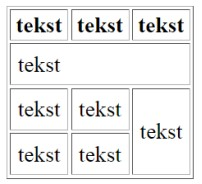
- **A.** rowspan w drugim wierszu i pierwszej komórce oraz colspan w trzecim 
wierszu, trzeciej komórce
- **B.** colspan w drugim wierszu i pierwszej komórce oraz rowspan w trzecim 
wierszu, trzeciej komórce ✅
- **C.** colspan w drugim wierszu we wszystkich trzech komórkach oraz 
rowspan w trzecim wierszu ostatniej komórce
- **D.** colspan w drugim wierszu i pierwszej komórce oraz rowspan w trzecim 
wierszu i czwartym wierszu

### Q837. Formularz wysyła dane do skryptu skrypt.php po wciśnięciu przycisku o treści „WYŚLIJ”. Wskaż poprawną 
definicję formularza.

- **A.** skrypt 1
- **B.** skrypt 2
- **C.** skrypt 3
- **D.** skrypt 4 ✅

### Q838. Które formatowanie obramowania odpowiada stylowi border-style: dotted solid;?

- **A.** formatowanie 1
- **B.** formatowanie 2 ✅
- **C.** formatowanie 3
- **D.** formatowanie 4

### Q839. Które pole edycyjne zostało sformatowane przedstawionym stylem zakładając, że pozostałe własności pola 
przyjmują wartości domyślne, a użytkownik wpisał imię Krzysztof w przeglądarce?

- **A.** pole 1
- **B.** pole 2 ✅
- **C.** pole 3
- **D.** pole 4

### Q840. Które zdanie dotyczące antyaliasingu jest prawdziwe?
- **A.** Antyaliasing to jeden z filtrów wyostrzających obraz
- **B.** Antyaliasing stosuje się na obrazach, w celu dodania przezroczystości
- **C.** Za pomocą antyaliasingu można pozbyć się tak zwanego schodkowania obrazu ✅
- **D.** Zastosowanie antyaliasingu odnosi się do krzywych Beziera w grafice wektorowej

### Q841. Przedstawiona transformacja obrazu rastrowego jest możliwa dzięki funkcji

- **A.** barwienie ✅
- **B.** desaturacja
- **C.** jasność i kontrast
- **D.** redukcja kolorów

### Q842. Który ze skryptów wyświetla aktualną datę oraz czas, w formacie przedstawionym na obrazie?

- **A.** < ?php date("Y-m-d”) + time("G:i:s"); ? >
- **B.** < ?php echo date("Y-m-d G:i:s"); ? > ✅
- **C.** < ?php echo date("Ymd Gis"); ? >
- **D.** < ?php date("Y-m-d G:i:s"); ? >

### Q843. Efektem wielokrotnego wykonania kodu PHP jest

- **A.** zliczanie liczby odwiedzin strony ✅
- **B.** wyświetlenie ciasteczka z zapisaną zmienną
- **C.** zapisanie do ciasteczka wartości 1 za każdym odświeżeniem witryny
- **D.** zapisanie danych do ciasteczka jedynie przy pierwszym uruchomieniu strony

### Q844. Aby za pomocą JavaScript w witrynie internetowej wyświetlić aktualną datę i czas można posłużyć się 
instrukcją
- **A.** echo Date();
- **B.** innerHTML = Date();
- **C.** echo Date() + Time();
- **D.** document.write(Date()); ✅

### Q845. Brak którego elementu języka HTML wygeneruje błąd walidatora HTML5?
- **A.** < body >
- **B.** przynajmniej jednego < h1 >
- **C.** prologu < !DOCTYPE html > ✅
- **D.** < meta name="author" content="...." >

### Q846. Program FileZilla może posłużyć do
- **A.** interpretacji kodu PHP
- **B.** walidacji strony internetowej
- **C.** publikowania strony internetowej ✅
- **D.** testowania prędkości wczytywania strony

### Q847. Która lista zostanie wyświetlona w przeglądarce po wykonaniu kodu HTML>
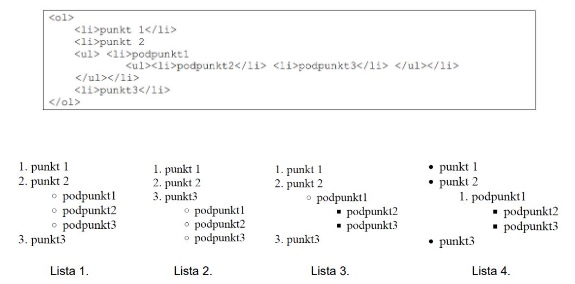
- **A.** Lista 4
- **B.** Lista 1
- **C.** Lista 2
- **D.** Lista 3 ✅

### Q848. Który rodzaj komunikatu jest zawsze przekazywany tylko pionowo w dół, czyli od przełożonego do podwładnego?
- **A.** Powierzenie zadania ✅
- **B.** Poszukiwanie rozwiązań
- **C.** Uwagi o polityce organizacji
- **D.** Raportowanie

### Q849. Tabela programy zawiera pola: nazwa_programu, nazwa_producenta, rok_wydania. Aby kwerenda SELECT wybrała wszystkie nazwy producentó tak, by nazwy te nie powtarzały się, należy zapisać:
- **A.** SELECT nazwa_producenta FROM programy WHERE nazwa_producenta NOT DUPLICATE;
- **B.** SELECT DISTINCT nazwa_producenta FROM programy; ✅
- **C.** SELECT UNIQUE nazwa_producenta FROM programy;
- **D.** SELECT nazwa_producenta FROM programy WHERE UNIQUE;

### Q850. Za pomocą przedstawionego polecenia można

- **A.** utworzyć kopię zapasową tabeli sklep
- **B.** sprawdzić spójność bazy danych sklep
- **C.** naprawić błędy w tabeli sklep
- **D.** utworzyć kopię zapasową bazy danych sklep ✅

### Q851. Prześladowanie, uporczywe nękanie i zastraszanie, stosowanie przemocy psychicznej wobec podwładnego lub współpracownika w miejscu pracy, to
- **A.** dyskryminacja
- **B.** manipulacja
- **C.** mobbing ✅
- **D.** perswazja

### Q852. Który znak ostrzegawczy określa strefę ochronną w otoczeniu źródła pola elektromagnetycznego?

- **A.** Znak 1
- **B.** Znak 2
- **C.** Znak 3 ✅
- **D.** Znak 4

### Q853. Na stronie WWW zdefiniowano rysunek, następnie akapit. Aby rysunek został umieszczony przez przeglądarkę w tej samej linii co akapit, po lewej stronie akapitu, należy w stylu CSS dla rysunku zapisać własność:
- **A.** float: left; ✅
- **B.** style: left;
- **C.** align: left;
- **D.** alt: left;

### Q854. W ramce przedstawiono zapisane w języku CSS formatowanie selektora. Zakładając, że żadne inne formatowanie nie jest dodane, wskaż sposób formatowania znaczniki h1

- **A.** Efekt 1
- **B.** Efekt 2 ✅
- **C.** Efekt 3
- **D.** Efekt 4

### Q855. Który z podanych formatów można zapisać materiał wideo wraz ze ścieżką dźwiękową?
- **A.** MP4 ✅
- **B.** AAC
- **C.** WMA
- **D.** WAV

### Q856. Wskaż wynik wykonania skryptu PHP

- **A.** czarny, zielony, niebieski, biały,
- **B.** zielony, niebieski, czarny, biały, ✅
- **C.** biały, niebieski, zielony, czarny,
- **D.** biały, czarny, niebieski, zielony,

### Q857. Który z wymienionych poniżej języków jest typowo front-endowy (wykonywany po stronie klienta)?
- **A.** Perl
- **B.** PHP
- **C.** CSS ✅
- **D.** Node.js

### Q858. O zmiennej predefiniowanej $ _POST z języka PHP można powiedzieć, że
- **A.** zawiera dane przesłane do skryptu z formularza ✅
- **B.** jest kopią tablicy $ _COOKIE
- **C.** jest rozszerzoną wersją tablicy $ _SESSION
- **D.** zawiera dane bezpośrednio przesłane do skryptu z ciasteczka

### Q859. Dana jest tabela uczniowie, do której wpisano rekordy jak na rysunku. Co będzie wynikiem działania przedstawionego zapytania SQL?
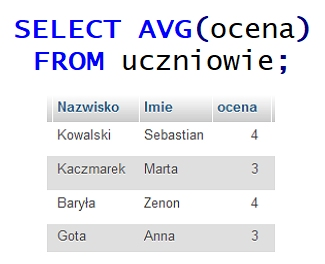
- **A.** Suma ocen równa 14
- **B.** Wartość 3.5 ✅
- **C.** Liczba wierszy równa 4
- **D.** Dane 4, 3, 4, 3

### Q860. Wynikiem wykonania przedstawionego kodu PHP jest wypisanie wartości

- **A.** 147 ✅
- **B.** 47
- **C.** 136
- **D.** 14

### Q861. W języku CSS przypisano regułę: float:left; dla bloku. Reguła ta zostanie wykorzystana do
- **A.** wyrównania tekstu do lewej strony
- **B.** ustawienia bloków jeden pod drugim
- **C.** ustawienia bloku na lewo względem innych ✅
- **D.** wyrównanie elementów tabeli do lewej strony

### Q862. Dokonując konwersji obrazu z 8 bitową głębią kolorów na obraz z 4 bitową głębią, liczba kolorów zmniejszy się o
- **A.** 256
- **B.** 24
- **C.** 240 ✅
- **D.** 16

### Q863. Jaką wartość przyjmie zmienna x po wykonaniu kodu PHP przedstawionego w ramce?

- **A.** Liczby wierszy dodanych do tabeli produkty
- **B.** Liczby wierszy przetworzonych zapytaniem DELETE FROM ✅
- **C.** Liczby wierszy tabeli produkty, dla których pole status jest większe od zera
- **D.** Liczby wierszy znajdujących się w bazie danych

### Q864. W języku PHP przekierowanie użytkownika na inną stronę WWW jest możliwe za pomocą funkcji
- **A.** require();
- **B.** include();
- **C.** upload();
- **D.** header(); ✅

### Q865. W języku HTML, aby scalić w poziomie dwie sąsiednie komórki w wierszu tabeli należy zastosować atrybut
- **A.** cellpadding
- **B.** cellspacing
- **C.** colspan ✅
- **D.** rowspan

### Q866. Które z formatowań NIE JEST wyrażone w języku CSS?

- **A.** A
- **B.** B
- **C.** C ✅
- **D.** D

### Q867. Kod JavaScript wywołany zdarzeniem kliknięcia przycisku ma za zadanie

- **A.** zamienić obraz1.gif na obraz2.gif ✅
- **B.** wyświetlić obraz2.gif obok obraz1.gif
- **C.** zmienić styl obrazu o id równym i1
- **D.** ukryć obraz2.gif

### Q868. Podane polecenie SQL ma za zadanie

- **A.** Ustawić na 1 wartość pola Uczen
- **B.** zwiększyć o jeden wartość kolumny id_klasy dla wszystkich rekordów tabeli Uczen ✅
- **C.** ustawić wartość kolumny id_klasy na 1 dla wszystkich rekordów w tabeli Uczen
- **D.** zwiększyć o jeden wartość pola Uczen

### Q869. Która z wymienionych zasad NIE WPŁYNIE korzystnie na zwiększenie czytelności kodu?
- **A.** W każdej linii kodu powinna występować tylko jedna instrukcja
- **B.** Kod powinien być napisany bez wcięć i zbędnych enterów ✅
- **C.** Należy wprowadzać komentarze w trudniejszych częściach kodu
- **D.** Nazwy zmiennych powinny odzwierciedlać ich zadanie

### Q870. W języku PHP należy zapisać warunek, który będzie spełniony, gdy zmienna $a będzie dowolną liczbą całkowitą mniejszą od -10 lub gdy zmienna $b będzie dowolną liczbą z przedziału (25, 75). Wyrażenie logiczne użyte w tym warunku ma postać
- **A.** ($a < -10) and (($b > 25) or ($b < 75))
- **B.** ($a < -10) or (($b > 25) or ($b < 75))
- **C.** ($a < -10) or (($b > 25) and ($b < 75)) ✅
- **D.** ($a < -10) and (($b > 25) and ($b < 75))

### Q871. Baza danych zawiera tabele artykuły z polami: nazwa, typ, producent, cena. Aby wyświetlić wszystkie nazwy artykułów wyłącznie typu pralka, dla których cena jest z przedziału 1000 PLN i 1500 PLN, należy zastosować polecenie
- **A.** SELECT nazwa FROM artykuly WHERE typ="pralka" OR cena BETWEEN 1000 AND 1500;
- **B.** SELECT nazwa FROM artykuly WHERE typ="pralka" AND cena FROM 1000 TO 1500;
- **C.** SELECT nazwa FROM artykuly WHERE typ="pralka" AND cena BETWEEN 1000 AND 1500; ✅
- **D.** SELECT nazwa FROM artykuly WHERE typ="pralka" OR cena BETWEEN 1000 OR 1500;

### Q872. W języku SQL, aby zaktualizować dane w wierszach tabeli, należy zastosować polecenie
- **A.** UPDATE ✅
- **B.** SELECT
- **C.** ALTER TABLE
- **D.** INSERT INTO

### Q873. Kodowanie polskich znaków można zdefiniować w języku HTML za pomocą
- **A.** atrybutu znacznika 

- **B.** znacznika <charset>
- **C.** atrybutu znacznika <meta> ✅
- **D.** znacznika <title>

### Q874. Poprawny zapis znacznika , za pomocą którego można umieścić na stronie internetowej obraz rys.jpg przeskalowany do szerokości 120 px i wysokości 80 px z tekstem alternatywnym "krajobraz" to
- **A.** 
- **B.** 
- **C.**  ✅
- **D.** 

### Q875. Które z podanych par znaczników HTML mają wizualnie to samo działanie na stronie internetowej, jeżeli żadne style CSS NIE ZOSTAŁY zdefiniowane
- **A.** 
 i <h2>
- **B.** <meta> i <title>
- **C.** <b> i <big>
- **D.** <b> i <strong> ✅

### Q876. Aby edytować dane w bazie danych można posłużyć się
- **A.** filtrowaniem
- **B.** kwerendą SELECT
- **C.** formularzem ✅
- **D.** raportem

### Q877. Kwerenda ma za zadanie w tabeli artykuly

- **A.** usunąć kolumnę cena typu float
- **B.** dodać kolumnę cena o typie float, jeśli nie istnieje
- **C.** zmienić typ na float dla kolumny cena ✅
- **D.** zmienić nazwę kolumny z cena na float

### Q878. W tabeli pracownicy zdefiniowano klucz główny typu INTEGER z atrybutami NOT NULL oraz AUTO_INCREMENT. Ponadto zdefiniowano pola imie oraz nazwisko. W przypadku zastosowania przedstawionej kwerendy SQL wprowadzającej dane, w której zostało pominięte pole klucza, w bazie danych MySQL nastąpi

- **A.** zignorowanie polecenia, tabela pozostanie bez zmian
- **B.** wpisanie rekordu do tabeli, dla klucza głównego zostanie przydzielona wartość NULL
- **C.** błąd nieprawidłowej liczby pól
- **D.** wpisanie rekordu do tabeli, dla klucza głównego zostanie przydzielona kolejna wartość naturalna ✅

### Q879. Aby obsłużyć połączenie z bazą MySQL podczas tworzenia aplikacji internetowej, można wykorzystać język
- **A.** HTML
- **B.** PHP ✅
- **C.** XHTML
- **D.** CSS

### Q880. Tabele Osoby i Adresy są połączone relacją jeden do wielu. Jakie zapytanie SQL należy zapisać, aby korzystając z tej relacji, prawidłowo wyświetlić nazwiska oraz przyporządkowane im miasta?

- **A.** SELECT nazwisko, Miasto FROM Osoby JOIN Adresy ON Osoby.Adresy_id=Adresy.id; ✅
- **B.** SELECT nazwisko, Miasto FROM Osoby.Adresy_id=Adresy.id FROM Osoby, Adresy;
- **C.** SELECT nazwisko, Miasto FROM Osoby, Adresy;
- **D.** SELECT nazwisko, Miasto FROM Osoby, Adresy WHERE Osoby.id=Adresy.id;

### Q881. W stylu CSS aby zadeklarować krój czcionki, należy użyć właściwości
- **A.** font-face
- **B.** font-style
- **C.** font-size
- **D.** font-family ✅

### Q882. Która informacja dotycząca przedstawionego kodu jest prawdziwa?

- **A.** Zostanie wypisany komunikat "OlaAla"
- **B.** W zmiennej $a wartość "Ala" zostanie zamieniona na wartość "Ola"
- **C.** Znak "=" jest operatorem porównania dwóch zmiennych
- **D.** Znak kropki "." jest operatorem konkatenacji ✅

### Q883. Dana jest tabela uczniowie o polach id, imie, nazwisko, data_ur (format rrrr-mm-dd). Które zapytanie w języku SQL wyświetli tylko imiona i nazwiska uczniów urodzonych w 2001 roku?
- **A.** SELECT imie, nazwisko FROM uczniowie WHERE data_ur like "2001-%-%" ✅
- **B.** SELECT * FROM uczniowie WHERE data_ur like "2001"
- **C.** SELECT id, imie, nazwisko, data_ur FROM uczniowie WHERE data_ur like "2001-*-*"
- **D.** SELECT * FROM uczniowie WHERE data_ur == 2001-%-%

### Q884. Fragment kodu SQL oznacza, że klucz obcy

- **A.** jest referencją do samego siebie
- **B.** ustawiony jest na kolumnie obiekty
- **C.** znajduje się w tabeli obiekty
- **D.** łączy się z kolumną imiona ✅

### Q885. Który znacznik służy budowaniu hierarchii tekstu w języku HTML?
- **A.** <u>
- **B.** <style>
- **C.** <head>
- **D.** <h6> ✅

### Q886. Która z definicji CSS określa formatowanie nagłówka h1: tekst nadkreślony, z odstępami między wyrazami 10 px i czerwonym kolorem tekstu?

- **A.** A ✅
- **B.** B
- **C.** C
- **D.** D

### Q887. W języku CSS, należy zdefiniować tło dokumentu jako obraz rys.png. Obraz ma powtarzać się jedynie w poziomie. Którą definicję należy przypisać selektorowi body?
- **A.** {background-image: url("rys.png"); background-repeat: repeat-x;} ✅
- **B.** {background-image: url("rys.png"); background-repeat: round;}
- **C.** {background-image: url("rys.png"); background-repeat: repeat-y;}
- **D.** {background-image: url("rys.png"); background-repeat: repeat;}

### Q888. Za pomocą którego zapisu zostanie utworzony w dokumencie HTML element wyświetlający obraz kotek.jpg z tekstem alternatywnym "obrazek kotka"
- **A.**  ✅
- **B.** 
- **C.** 
- **D.** 

### Q889. Przedstawione formatowanie CSS, przy założeniu, że żadne inne formatowanie nie jest zdefiniowane, sprawi, że

- **A.** marginesy wewnętrzne wszystkich komórek będą wynosiły 10 px
- **B.** margines wewnętrzny komórki z napisem Anna będzie miał 30 px, a z napisem Ewa – 10 px
- **C.** marginesy wewnętrzne wszystkich komórek będą wynosiły 30 px
- **D.** margines wewnętrzny komórki z napisem Anna będzie miał 10 px, a z napisem Ewa – 30 px ✅

### Q890. W języku JavaScript podany w ramce fragment funkcji ma za zadanie
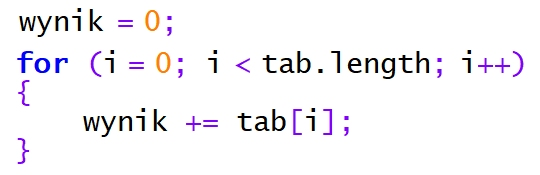
- **A.** wyświetlić wszystkie elementy tablicy
- **B.** wprowadzić do każdego elementu tablicy aktualną wartość zmiennej i
- **C.** policzyć sumę wszystkich elementów tablicy ✅
- **D.** dodać do każdego elementu tablicy stałą wartość

### Q891. W języku SQL, aby wstawić wiersz danych do bazy, należy zastosować polecenie
- **A.** CREATE INTO
- **B.** CREATE ROW
- **C.** INSERT INTO ✅
- **D.** SELECT ROW

### Q892. Wskaż kod CSS odpowiadający układowi bloków 2 - 5, zakładając, że są one zbudowane w oparciu o przedstawiony kod HTML
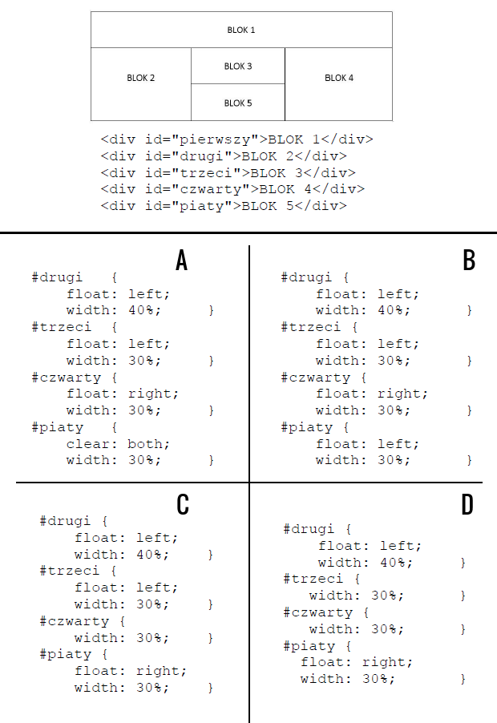
- **A.** A
- **B.** B ✅
- **C.** C
- **D.** D

### Q893. Rozproszonym systemem kontroli wersji projektu programistycznego jest
- **A.** GIT ✅
- **B.** FileZilla
- **C.** TotalCommander
- **D.** Eclipse

### Q894. Jak zdefiniować w języku CSS takie formatowanie tabeli, żeby wiersz, na którym aktualnie znajduje się kursor myszy, zmieniał kolor tła na szary
- **A.** tr:active { color: gray; }
- **B.** tr:active { background-color: gray; }
- **C.** tr:hover { background-color: gray; } ✅
- **D.** tr:hover { color: gray; }

### Q895. Formatami Video obsługiwanymi w standardzie HTML5 są
- **A.** Ogg, QuickTime
- **B.** Ogg, AVI, MPEG
- **C.** MP4, Ogg, WebM ✅
- **D.** MP4, AVI

### Q896. Który z typów relacji wymaga utworzenia tabeli pośredniej łączącej klucze główne obu tabel?
- **A.** 1..n
- **B.** n..m ✅
- **C.** n..1
- **D.** 1..1

### Q897. W kodzie HTML przypisano pewne znaczniki do klasy o nazwie „nomargin”. Aby wykonać za pomocą języka JavaScript operacje na tych znacznikach, można posłużyć się funkcją
- **A.** getElement("nomargin")
- **B.** getElementById("nomargin")
- **C.** getElementsByTagName("nomargin")
- **D.** getElementsByClassName("nomargin") ✅

### Q898. Kompresja bezstratna pliku graficznego gwarantuje
- **A.** lepszą jakość
- **B.** mniejszą liczbę warstw
- **C.** rozmiar większy niż grafika oryginalna
- **D.** pierwotną jakość grafiki ✅

### Q899. Wskaż poprawny składniowo warunek zapisany w języku PHP i sprawdzający brak połączenia z bazą MySQL
- **A.** if {mysql_connect_errno()}{}
- **B.** if {mysqli_connect_error()}{}
- **C.** if (mysqli_connect_errno()){} ✅
- **D.** if (mysql_connect_error())()

### Q900. Tabele Osoby i Zainteresowania są połączone relacją jeden do wielu. Które zapytanie SQL należy zapisać, aby korzystając z tej relacji, prawidłowo wyświetlić imiona oraz odpowiadające im hobby?

- **A.** SELECT imie, hobby FROM Osoby.Zainteresowania_id = Zainteresowania.id FROM Osoby, Zainteresowania;
- **B.** SELECT imie, hobby FROM Osoby, Zainteresowania;
- **C.** SELECT imie, hobby FROM Osoby JOIN Zainteresowania ON Osoby.Zainteresowania_id = Zainteresowania.id; ✅
- **D.** SELECT imie, hobby FROM Osoby, Zainteresowania WHERE Osoby.id = Zainteresowania.id;

### Q901. W języku HTML, aby wstawić na stronę obraz zapisany w formacie JPG, należy zastosować znacznik
- **A.** <src>
- **B.**  ✅
- **C.** <jpg>
- **D.** <table>

### Q902. Za pomocą, którego znacznika można wstawić listę numerowaną (uporządkowaną) w dokumencie HTML?
- **A.** <li>
- **B.** <ul>
- **C.** <ol> ✅
- **D.** <dl>

### Q903. W języku CSS zapis selektora p > i { color: red; } oznacza, że kolorem czerwonym zostanie sformatowany
- **A.** jedynie ten tekst w znaczniku <i>, który jest umieszczony bezpośrednio wewnątrz znacznika 
 ✅
- **B.** jedynie ten tekst znacznika 
, do którego jest przypisana klasa o nazwie i
- **C.** każdy tekst w znaczniku 
 lub każdy tekst w znaczniku <i>
- **D.** każdy tekst w znaczniku 
 za wyjątkiem tych w znaczniku <i>

### Q904. Język PHP posiada obsługę
- **A.** sesji i ciastek ✅
- **B.** zdarzeń myszy
- **C.** zdarzeń klawiatury
- **D.** obiektów przeglądarki

### Q905. Tworząc tabelę w języku SQL zdefiniowano pole, którego wartości nie mogą się powtarzać. Do jego definicji należy zastosować atrybut
- **A.** IDENTITY
- **B.** UNIQUE ✅
- **C.** DEFAULT
- **D.** NOT NULL

### Q906. Aby wskazać błędy składniowe w kodzie HTML, należy zastosować
- **A.** kompilator
- **B.** debugger
- **C.** interpreter
- **D.** walidator ✅

### Q907. Projektując stronę internetową, umieszczono kod definiujący jej styl. Jaką szerokość pozostawiono na treść strony?

- **A.** 600 px
- **B.** 640 px
- **C.** 560 px ✅
- **D.** 2 px

### Q908. Instrukcją pętli, która jest przeznaczona do wykonania określonej liczby operacji na pewnym obiekcie lub zmiennej niebędącej tablicą, jest
- **A.** foreach
- **B.** if
- **C.** switch
- **D.** for ✅

### Q909. Przedstawiona funkcja, zapisana językiem JavaScript, ma za zadanie

- **A.** umożliwić przejście do wskazanej lokalizacji hosta
- **B.** wyświetlić w elemencie o id = "info" adres hosta wskazany pierwszym odnośnikiem
- **C.** wyświetlić na przycisku lokalizację hosta, a po jego wciśnięciu umożliwić przejście do wskazanej lokalizacji
- **D.** wyświetlić w elemencie o id = "info" nazwę hosta, z którego pochodzi wyświetlona strona ✅

### Q910. Która cecha grafiki wektorowej jest prawdziwa?
- **A.** Raz utworzoną nie można edytować
- **B.** Grafika wektorowa jest niezależna od rozdzielczości ✅
- **C.** Grafika wektorowa jest nieskalowalna
- **D.** Nie można przetworzyć ją na grafikę rastrową

### Q911. W języku PHP operatorem reszty z dzielenia jest:
- **A.** &
- **B.** @
- **C.** % ✅
- **D.** #

### Q912. W formularzu HTML zastosowano znacznik <input>. Wyświetlone pole będzie służyło do wprowadzania maksymalnie

- **A.** 20 znaków, które są widoczne podczas wprowadzania
- **B.** 20 znaków, które nie są widoczne w polu tekstowym ✅
- **C.** 30 znaków, które nie są widoczne w polu tekstowym
- **D.** 30 znaków, które są widoczne podczas wprowadzania

### Q913. Wśród czterech podstawowych kolorów modelu barw CMYK jest
- **A.** brązowy
- **B.** pomarańczowy
- **C.** zielony
- **D.** czarny ✅

### Q914. Które z poleceń nadaje najniższy poziom uprawnień użytkownikowi uczen pod względem modyfikacji danych i struktury tabel?
- **A.** GRANT ALTER, SELECT ON szkola.przedmioty TO uczen;
- **B.** GRANT SELECT ON szkola.przedmioty TO uczen; ✅
- **C.** GRANT INSERT, DROP ON szkola.przedmioty TO uczen;
- **D.** GRANT DROP ON szkola.przedmioty TO uczen;

### Q915. W języku PHP, aby połączyć się z bazą danych MySQL przy pomocy biblioteki mysqli, stosując zamieszczony zapis, w miejscu litery 'c' należy zapisać

- **A.** nazwę bazy danych
- **B.** nazwę użytkownika ✅
- **C.** lokalizację serwera bazy danych
- **D.** hasło użytkownika

### Q916. Aby w JavaScript wykonać wymienione kroki, należy w znaczniku <script> umieścić kod

- **A.** A = prompt("Podaj kwalifikację: "); document.write("Kwalifikacja: ".A);
- **B.** A << prompt("Podaj kwalifikację: "); document.write("Kwalifikacja: " + A);
- **C.** A = prompt("Podaj kwalifikację: "); document.write("Kwalifikacja: " + A); ✅
- **D.** A = alert("Podaj kwalifikację: "); document.write("Kwalifikacja: " + A);

### Q917. Funkcja agregująca AVG użyta w zapytaniu ma za zadanie

- **A.** zsumować koszt wszystkich usług
- **B.** obliczyć średnią arytmetyczną cen wszystkich usług ✅
- **C.** wskazać najwyższą cenę za usługi
- **D.** policzyć ile jest usług dostępnych w tabeli

### Q918. Kolorem o barwie niebieskiej jest kolor
- **A.** #00EE00
- **B.** #EE0000
- **C.** #EE00EE
- **D.** #0000EE ✅

### Q919. Zestaw komponentów i podprogramów służący pisaniu aplikacji, który ponadto narzuca szkielet wyglądu aplikacji, jej strukturę, a czasem nawet wzorzec według którego ma powstać aplikacja, to
- **A.** komponent
- **B.** middleware
- **C.** biblioteka
- **D.** framework ✅

### Q920. Rozwinięcie słowne akronimu ACID w SQL to
- **A.** atomic, constaint, isolated, dependable
- **B.** atomic, consistent, isolated, durable ✅
- **C.** atomic, consistent, iss, dependable
- **D.** atomic, comming, is, do

### Q921. Które dane z 8 rekordów wpisanych do tabeli zwierzeta zostaną wyświetlone w wyniku podanego zapytania SQL?

- **A.** Anna Kowalska, Jan Nowak
- **B.** Dika, Fuks ✅
- **C.** Figaro, Dika, Fuks
- **D.** Fafik, Brutus, Dika, Fuks

### Q922. W języku JavaScript instrukcję a++; można inaczej zapisać jako
- **A.** a&1
- **B.** 1+=a
- **C.** a<<1
- **D.** a=a+1 ✅

### Q923. Z którym ze słów kluczowych programowania obiektowego w języku JavaScript wiąże się dostęp do pól i metod tylko z poziomu klasy, w której są zdefiniowane
- **A.** static
- **B.** public
- **C.** private
- **D.** Żadne z powyższych, w JavaScript należy użyć # ✅

### Q924. Przedstawiony na rysunku kolor zapisany w modelu RGB, w systemie szesnastkowym będzie zdefiniowany następująco

- **A.** 77A0C1 ✅
- **B.** 76A3C1
- **C.** 71A0B2
- **D.** 77A1C1

### Q925. Za pomocą której funkcji języka PHP można ustanowić połączenie z bazą danych o nazwie zwierzaki?
- **A.** $polacz = server_connect('localhost', 'root','','zwierzaki');
- **B.** $polacz = mysqli_connect('localhost', 'root','','zwierzaki'); ✅
- **C.** $polacz = sql_connect('localhost', 'root','','zwierzaki');
- **D.** $polacz = db_connect('localhost', 'root','','zwierzaki');

### Q926. Aby zmienić maksymalną długość pola imie w tabeli klienci na 30 znaków, należy użyć w języku SQL następującego kodu
- **A.** CHANGE TABLE klienci MODIFY imie CHAR(30);
- **B.** CHANGE TABLE klienci TO COLUMN imie SET CHAR(30);
- **C.** ALTER TABLE klienci MODIFY COLUMN imie VARCHAR(30); ✅
- **D.** ALTER TABLE klienci CHANGE imie TEXT;

### Q927. Jeśli zmienna $x przechowuje dowolną liczbę naturalną dodatnią, przedstawiony kod źródłowy PHP ma za zadanie wyświetlić

- **A.** kolejne liczby od x do 0
- **B.** liczby wczytywane z klawiatury, tak długo aż zostanie wczytana wartość x
- **C.** losowe liczby z przedziału (0, x)
- **D.** kolejne liczby od 0 do x-1 ✅

### Q928. W języku JavaScript zdefiniowano obiekt. Aby dalej w kodzie modyfikować wartość właściwości x obiektu, należy zapisać
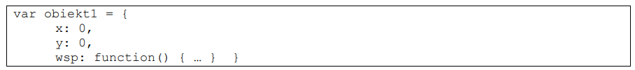
- **A.** wsp.x = …
- **B.** x = …
- **C.** obiekt1::x = …
- **D.** obiekt1.x = … ✅

### Q929. Odpowiednia kolejność procesów przetwarzania analogowo-cyfrowego dźwięku to:
- **A.** kwantyzacja, kodowanie, próbkowanie
- **B.** kwantyzacja, próbkowanie, kodowanie
- **C.** próbkowanie, kodowanie, kwantyzacja
- **D.** próbkowanie, kwantyzacja, kodowanie ✅

### Q930. Na obrazie przedstawiono wybór formatu pliku importującego bazę danych. Którego formatu należy użyć, jeżeli dane są wyeksportowane z programu Excel i zapisane tekstowo z zastosowaniem przecinka do rozdzielenia wartości pól?

- **A.** XML
- **B.** SQL
- **C.** ESRI
- **D.** CSV ✅

### Q931. Baza danych zawiera tabelę ksiazki o polach: tytul, id_autora, data_wypoz, id_czytelnika. Każdego dnia generowany jest raport książek wypożyczonych danego dnia. Wyświetlane są jedynie tytuły książek. Która z kwerend SQL posłuży do stworzenia tego raportu?
- **A.** SELECT tytul, data_wypoz FROM ksiazki WHERE data_wypoz = CURRDATENT_E();
- **B.** SELECT * FROM ksiazki;
- **C.** SELECT tytul FROM ksiazki WHERE data_wypoz = CURRENT_DATE(); ✅
- **D.** SELECT tytul FROM ksiazki;

### Q932. W języku CSS zdefiniowano formatowanie dla pola edycyjnego. Tak formatowane pole edycyjne będzie miało jasnozielone tło

- **A.** jeśli jest to pierwsze wystąpienie tego znacznika w dokumencie
- **B.** po kliknięciu myszą w celu zapisania w nim tekstu ✅
- **C.** gdy zostanie wskazane kursorem myszy bez kliknięcia
- **D.** w każdym przypadku

### Q933. W języku CSS zapisano wspólne formatowanie dla pewnej grupy znaczników. Formatowanie takich znaczników w kodzie HTML nastąpi przez atrybut

- **A.** style = "format1"
- **B.** id = "format1"
- **C.** div = "format1"
- **D.** class = "format1" ✅

### Q934. Formatem o najwyższej rozpiętości tonalnej wśród wymienionych jest
- **A.** JPEG
- **B.** PNG
- **C.** RAW ✅
- **D.** BMP

### Q935. Które z zadań programistycznych może być wykonane tylko po stronie klienta przeglądarki?
- **A.** Bezpieczne wyświetlenie personalizowanej zawartości strony ze względu na prawa użytkownika aplikacji
- **B.** Zapisanie danych pobranych z formularza w bazie danych powiązanej z aplikacją internetową
- **C.** Sprawdzanie danych wpisywanych do pola tekstowego w czasie rzeczywistym ✅
- **D.** Sprawdzenie hasła użytkownika w bazie danych powiązanej z aplikacją internetową

### Q936. Która instrukcja algorytmu odpowiada graficznej reprezentacji bloku przedstawionego na rysunku?

- **A.** n > 20 ✅
- **B.** Wypisz n
- **C.** n ← n + 5
- **D.** Wykonaj podprogram sortowania tablicy t

### Q937. Która z instrukcji języka JavaScript dokona zmiany koloru tekstu na niebieski w akapicie zdefiniowanym w dokumencie HTML?

- **A.** document.getElementById("jeden").style.color = "blue"; ✅
- **B.** document.getElementById("jeden").style.background-color = "blue";
- **C.** document.getElementById("jeden").color = "blue";
- **D.** document.getElementById("jeden").background-color = "blue";

### Q938. W języku SQL, po wykonaniu przedstawionych poleceń GRANT, prawo do zmiany struktury tabeli oraz jej usuwania zostanie przypisane
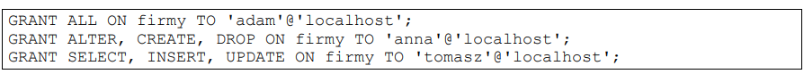
- **A.** Adamowi i Annie ✅
- **B.** Tomaszowi i Annie
- **C.** tylko Annie
- **D.** Tomaszowi i Adamowi

### Q939. Dla których imion zastosowana w zapytaniu klauzula LIKE jest prawdziwa?

- **A.** Arleta, Krzysztof, Krystyna, Tristan ✅
- **B.** Gerald, Jarosław, Marek, Tamara
- **C.** Rafał, Rebeka, Renata, Roksana
- **D.** Krzysztof, Krystyna, Romuald

### Q940. Grafik chce przekształcić bez utraty jakości obraz JPG w format PNG w ten sposób, żeby wszędzie tam, gdzie w pierwotnym obrazie jest kolor biały, w obrazie docelowym była przezroczystość. Aby to zrobić, powinien
- **A.** przekształcić obraz w odcienie szarości
- **B.** zmniejszyć rozdzielczość obrazu
- **C.** dodać kanał alfa ✅
- **D.** zaimportować obraz do edytora grafiki wektorowej

### Q941. Wskaż zapytanie SQL tworzące użytkownika sekretarka na localhost z hasłem zaq123
- **A.** CREATE USER 'sekretarka'@'localhost' IDENTIFIED `zaq123`;
- **B.** CREATE USER `sekretarka`@`localhost` IDENTIFY BY `zaq123`;
- **C.** CREATE USER `sekretarka`@`localhost` IDENTIFY "zaq123";
- **D.** CREATE USER `sekretarka`@`localhost` IDENTIFIED BY 'zaq123'; ✅

### Q942. Która z funkcji SQL NIE pobiera argumentów?
- **A.** upper
- **B.** now ✅
- **C.** len
- **D.** year

### Q943. W którym z przypadków walidacja fragmentu kodu CSS przebiegnie pomyślnie?
- **A.** 

- **B.** p { font-weight:bold; } ✅
- **C.** 

- **D.** p { text-size:bold; }

### Q944. W języku JavaScript zadeklarowana zmienna i, która ma przechowywać wynik dzielenia wynoszący 1, to
- **A.** var i = parseInt(3/2); ✅
- **B.** var i = 3/2;
- **C.** var i = Number(3/2);
- **D.** var i = parseFloat(3/2);

### Q945. W języku HTML zapisano definicję tabeli. Który rysunek obrazuje efekt jej działania?

- **A.** Rysunek 1 ✅
- **B.** Rysunek 2
- **C.** Rysunek 3
- **D.** Rysunek 4

### Q946. W programie MS Access we właściwościach pola klasa należy ustawić maskę wprowadzania danych. Którą maskę należy podać, aby wprowadzone dane były złożone z trzech znaków w formacie: obowiązkowa cyfra, po niej obowiązkowe dwie litery?

- **A.** 000
- **B.** 0CC
- **C.** CLL
- **D.** 0LL ✅

### Q947. Który zapis definiuje w języku PHP komentarz wieloliniowy
- **A.** #
- **B.** //
- **C.** <!-- -->
- **D.** /* */ ✅

### Q948. W programie do obróbki grafiki rastrowej zmodyfikowano krzywe kolorów tak, jak zaznaczono ramką na przedstawionym obrazie. Ma to na celu

- **A.** rozjaśnienie całości obrazu
- **B.** wygładzenie krawędzi na obrazie
- **C.** modyfikację najjaśniejszych i najciemniejszych kolorów obrazu ✅
- **D.** przyciemnienie całości obrazu

### Q949. Pole insert_id zdefiniowane w bibliotece MySQLi języka PHP może być wykorzystane do
- **A.** otrzymania id ostatnio wstawionego wiersza ✅
- **B.** otrzymania kodu błędu, gdy proces wstawiania wiersza się nie powiódł
- **C.** pobrania pierwszego wolnego indeksu bazy, tak, aby można było pod nim wstawić nowe dane
- **D.** pobrania najwyższego indeksu bazy, aby po jego inkrementacji wstawić pod niego dane

### Q950. W języku HTML, aby utworzyć pole edycyjne do wpisywania hasła, w którym wpisywany tekst jest maskowany (zastępowany kropkami), należy użyć znacznika
- **A.** <form="password" type="password" />
- **B.** <input type="password" /> ✅
- **C.** <input name="password" />
- **D.** <form input type="password" />

### Q951. Które metody odnoszą się do predefiniowanego obiektu Date w języku JavaScript?
- **A.** concat() oraz pop()
- **B.** row()
- **C.** getMonth() oraz getDay() ✅
- **D.** fromCodePoint()

### Q952. Którego typu danych w bazie MySQL należy użyć, aby przechować w jednym polu datę i czas?
- **A.** BOOLEAN
- **B.** TIMESTAMP ✅
- **C.** DATE
- **D.** YEAR

### Q953. Dana jest tabela oceny o polach id, nazwisko, imie, ocena. Przedstawione zapytanie jest przykładem

- **A.** łączenia
- **B.** selekcji ✅
- **C.** sumy
- **D.** rekurencji

### Q954. W przedstawionym fragmencie formularza HTML zdefiniowano pole input, o którym można powiedzieć, że
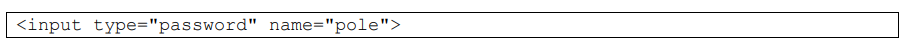
- **A.** wyświetla wprowadzone do niego znaki
- **B.** ma wpisany domyślny tekst „pole”
- **C.** umożliwia wpisywanie tylko wartości liczbowych
- **D.** ukrywa wprowadzone do niego znaki ✅

### Q955. Znacznik <pre> </pre> jest stosowany w celu wyświetlenia
- **A.** treści czcionką o stałej szerokości ✅
- **B.** znaku wielokropka
- **C.** znaku przekreślenia
- **D.** treści polską czcionką

### Q956. W języku PHP zastosowano funkcję is_float(). Które z podanych wywołań tej funkcji zwróci wartość true
- **A.** is_float(NULL)
- **B.** is_float(3.34) ✅
- **C.** is_float('3,34')
- **D.** is_float(334)

### Q957. Aby dołączyć kaskadowy arkusz stylów zapisany w zewnętrznym pliku, należy użyć następującego fragmentu kodu HTML
- **A.** <meta charset="styl.css" />
- **B.** 

- **C.** <link rel="stylesheet" type="text/css" href="styl.css" /> ✅
- **D.** <optionvalue="styl.css" type="text/css" />

### Q958. Tabela Pacjenci ma pola: imie, nazwisko, wiek, lekarz_id. Aby zestawić raport zawierający wyłącznie imiona i nazwiska pacjentów poniżej 18 roku życia, którzy zapisani są do lekarza o id równym 6, można posłużyć się kwerendą SQL
- **A.** SELECT imie, nazwisko FROM Pacjenci WHERE wiek<18 AND lekarz_id=6; ✅
- **B.** SELECT imie, nazwisko WHERE wiek<18 AND lekarz_id=6;
- **C.** SELECT imie, nazwisko WHERE wiek<18 OR lekarz_id=6;
- **D.** SELECT imie, nazwisko FROM Pacjenci WHERE wiek<18 OR lekarz_id=6;

### Q959. W języku SQL ustawienie klucza podstawowego na polu id w tabeli uczniowie możliwe jest za pomocą polecenia
- **A.** INSERT TABLE uczniowie PRIMARY KEY (id);
- **B.** INSERT TABLE uczniowie ADD PRIMARY KEY (id);
- **C.** ALTER TABLE uczniowie ADD PRIMARY KEY (id); ✅
- **D.** ADD TABLE uczniowie PRIMARY KEY (id);

### Q960. Które z tych rozszerzeń nie jest rozszerzeniem pliku video?
- **A.** GIF ✅
- **B.** MOV
- **C.** AVI
- **D.** MP4

### Q961. W języku PHP, aby prawidłowo obsłużyć połączenie z bazą danych MySQL, ostatnią operacją, powinno być zastosowanie polecenia
- **A.** exit
- **B.** mysqli_close ✅
- **C.** mysql_exit
- **D.** die

### Q962. Który z paragrafów został sformatowany przedstawionym stylem zakładając, że pozostałe własności paragrafu przyjmują wartości domyślne?

- **A.** A
- **B.** B
- **C.** C ✅
- **D.** D

### Q963. Dana jest tabela pracownicy, do której wpisano rekordy przedstawione obok. Po uruchomieniu podanej w ramce kwerendy SQL zostanie wyświetlona wartość

- **A.** 5400
- **B.** 1300
- **C.** 2200
- **D.** 2600 ✅

### Q964. W bazie danych MySQL polecenie CREATE USER umożliwia
- **A.** utworzenie użytkownika i nadanie mu praw do bazy
- **B.** wyświetlenie informacji o istniejącym użytkowniku
- **C.** utworzenie użytkownika ✅
- **D.** zmodyfikowanie hasła istniejącego użytkownika

### Q965. Poziom izolacji transakcji Repeatable Read (tryb powtarzalnego odczytu) stosowany przez MS SQL wiąże się z problemem
- **A.** utraty aktualizacji
- **B.** niepowtarzalnych odczytów
- **C.** brudnych odczytów
- **D.** odczytów widm ✅

### Q966. Relacja opisana w sposób: "Rekordowi z tabeli A odpowiada dowolna liczba rekordów z tabeli B. Jednemu rekordowi z tabeli B odpowiada dokładnie jeden rekord z tabeli A" jest relacją
- **A.** nieoznaczoną
- **B.** jeden do jednego
- **C.** jeden do wielu ✅
- **D.** wiele do wielu

### Q967. Dla przedstawionego fragmentu dokumentu HTML zdefiniowano formatowanie CSS selektora klasy "menu" tak, aby kolor tła bloku był zielony. Która definicja stylu CSS odpowiada temu formatowaniu?

- **A.** #menu { background-color: rgb(0,255,0); }
- **B.** div:menu { color: green; }
- **C.** div.menu { background-color: green; } ✅
- **D.** menu { background-color: rgb(0,255,0); }

### Q968. Jak nazywa się metoda sortowania polegająca na podziale na n przedziałów jednakowej długości, w których następuje sortowanie, po czym posortowane zawartości przedziałów są poddawane analizie i prezentacji?
- **A.** Sortowanie szybkie
- **B.** Sortowanie bąbelkowe
- **C.** Sortowanie kubełkowe ✅
- **D.** Sortowanie przez wybór

### Q969. Stronę internetową zapisano w języku XHTML. Który z kodów stanowi implementację przedstawionego fragmentu strony, jeżeli żadne style CSS nie zostały zdefiniowane?

- **A.** A
- **B.** B ✅
- **C.** C
- **D.** D

### Q970. W przedstawionej klasie zdefiniowano

- **A.** jedną właściwość
- **B.** dwie metody
- **C.** dwie właściwości ✅
- **D.** dwa obiekty

### Q971. Aby zamieścić na stronie internetowej film, należy użyć znacznika
- **A.** <video> ✅
- **B.** <media>
- **C.** <movie>
- **D.** <audio>

### Q972. Wskaż poprawną definicję stylu CSS dla przycisku typu submit o właściwościach: czarny kolor tła, brak obramowania, marginesy wewnętrzne 5px.

- **A.** A ✅
- **B.** B
- **C.** C
- **D.** D

### Q973. Przedstawiony fragment kodu napisano w języku JavaScript. Aby program przypisywał wartość równą 1 co trzeciemu elementowi w tablicy, to w miejscu kropek należy wpisać

- **A.** i = 3
- **B.** i += 3 ✅
- **C.** i ++ 3
- **D.** i =+ 3

### Q974. W zapytaniu SQL umieszczonym poniżej, znak gwiazdki oznacza, że w wyniku tego zapytania

- **A.** zostaną wyświetlone wszystkie rekordy tabeli mieszkancy
- **B.** zostanie zignorowany warunek sprawdzający imię
- **C.** zostaną wyświetlone wszystkie kolumny tabeli mieszkancy ✅
- **D.** zostanie wyświetlone pole o nazwie "*" (gwiazdka)

### Q975. Znacznik języka HTML, który służy do dynamicznego tworzenia grafiki na stronie internetowej bez osadzania dodatkowych plików, to
- **A.** <embed>
- **B.** 
- **C.** <canvas> ✅
- **D.** <object>

### Q976. Po wykonaniu kodu PHP zostanie wyświetlona aktualna data zawierająca jedynie

- **A.** dzień i miesiąc
- **B.** miesiąc i rok
- **C.** rok ✅
- **D.** dzień

### Q977. Proces organizowania danych w bazie obejmujący tworzenie tabel, ustanawianie relacji między nimi i polegający na wyeliminowaniu z bazy nadmiarowych danych oraz niespójnych zależności nazywa się
- **A.** weryfikacją spójności danych
- **B.** normalizacją ✅
- **C.** weryfikacją integralności referencyjnej
- **D.** redundancją

### Q978. W jaki sposób, stosując język PHP, zapisać w ciasteczku napis znajdujący się w zmiennej dane na czas jednego dnia?
- **A.** setcookie("dane", $dane, time() + (3600*24)); ✅
- **B.** setcookie("dane", $dane, 0);
- **C.** setcookie("dane", "dane", 0);
- **D.** setcookie("dane", $dane, time());

### Q979. Które stwierdzenie najlepiej opisuje klasę Owoc zdefiniowaną w języku PHP i przedstawioną na listingu?

- **A.** Ma jedno pole i dwie metody, z czego jedna metoda ma zakres prywatny.
- **B.** Ma dwa pola i jedną metodę, pole nazwa ma zakres widzialności ograniczony tylko do metod klasy.
- **C.** Ma dwa pola i jeden konstruktor, oba pola mają zakres widzialności ograniczony tylko do metod klasy.
- **D.** Ma dwa pola i jedną metodę, pole kolor ma zakres widzialności ograniczony tylko do metod klasy. ✅

### Q980. Aby stworzyć różnicową kopię bazy danych na serwerze MSSQL, należy zastosować klauzulę
- **A.** FULL
- **B.** RESTORE
- **C.** WITH FORMAT
- **D.** DIFFERENTIAL ✅

### Q981. W języku PHP wykonano operację przedstawioną w ramce. Aby wyświetlić wszystkie wyniki tego zapytania należy

- **A.** wyświetlić zmienną $db
- **B.** zaindeksować zmienną tab, tab[0] to pierwsze imię
- **C.** zastosować pętlę z poleceniem mysqli_fetch_row ✅
- **D.** zastosować polecenie mysql_fetch

### Q982. Kwerendę SELECT DISTINCT należy zastosować w przypadku, gdy potrzeba wybrać rekordy
- **A.** posortowane malejąco lub rosnąco
- **B.** pogrupowane
- **C.** występujące w bazie tylko raz
- **D.** tak, aby w podanej kolumnie nie powtarzały się wartości ✅

### Q983. Grafik wykonał logo strony internetowej. To czarny znaczek na przezroczystym tle. Aby zachować wszystkie atrybuty obrazu i umieścić go na stronie internetowej, grafik powinien zapisać obraz w formacie
- **A.** PNG ✅
- **B.** CDR
- **C.** JPG
- **D.** BMP

### Q984. W języku PHP funkcja, która może służyć do sprawdzenia, czy dany ciąg jest fragmentem innego ciągu, to
- **A.** trim();
- **B.** strtok();
- **C.** strlen();
- **D.** strstr(); ✅

### Q985. Wykonanie przedstawionego polecenia PHP umożliwi

- **A.** odczyt danych z bazy
- **B.** modyfikację struktury bazy
- **C.** modyfikację danych w bazie ✅
- **D.** zapis nowych danych do bazy

### Q986. Funkcja mysqli_num_rows() języka PHP może być wywołana po uprzednim zastosowaniu kwerendy
- **A.** INSERT
- **B.** UPDATE
- **C.** DELETE
- **D.** SELECT ✅

### Q987. Które wyrażenie logiczne należy zastosować w języku JavaScript, aby wykonać operacje tylko dla dowolnych liczb ujemnych z przedziału jednostronnie domkniętego <-200,-100)?
- **A.** (liczba <=-200) || (liczba>-100)
- **B.** (liczba <=-200) && (liczba<-100)
- **C.** (liczba >=-200) || (liczba>-100)
- **D.** (liczba >=-200) && (liczba<-100) ✅

### Q988. Wskaż instrukcję równoważną do instrukcji switch zapisanej językiem PHP

- **A.** A
- **B.** B ✅
- **C.** C
- **D.** D

### Q989. Podane polecenie SQL nadaje prawo SELECT

- **A.** dla użytkownika root na serwerze sprzedawca
- **B.** do wszystkich tabel w bazie hurtownia ✅
- **C.** dla użytkownika root na serwerze localhost
- **D.** do wszystkich pól w tabeli hurtownia

### Q990. Integralność encji w bazie danych zostanie zachowana, jeżeli między innymi
- **A.** każdej kolumnie zostanie przypisany typ danych
- **B.** klucz główny będzie zawsze liczbą całkowitą
- **C.** każdy klucz główny będzie miał odpowiadający mu klucz obcy w innej tabeli
- **D.** dla każdej tabeli zostanie utworzony klucz główny ✅

### Q991. W języku JavaScript stworzono funkcję o nazwie licz_pitagoras, która oblicza długość przeciwprostokątnej trójkąta prostokątnego, zgodnie z twierdzeniem Pitagorasa. Funkcja pobiera dwa parametry wejściowe i zwraca wartość. Prawidłowe wywołanie takiej funkcji, wraz z pobraniem zwróconego wyniku, będzie miało postać
- **A.** c = licz_pitagoras(a, b); ✅
- **B.** licz_pitagoras(a, b) = c;
- **C.** licz_pitagoras(a, b);
- **D.** licz_pitagoras(a, b, c);

### Q992. Który z typów wspieranych przez język PHP służy do obsługi zmiennych logicznych?
- **A.** Boolean ✅
- **B.** String
- **C.** Float
- **D.** Integer

### Q993. W edytorze grafiki rastrowej, aby pracować tylko na części obrazu, nie naruszając innych jego elementów, można wykorzystać
- **A.** warstwy ✅
- **B.** skalowanie
- **C.** kadrowanie
- **D.** inwersję

### Q994. Wielkość grafiki JPEG umieszczonej na stronie internetowej może mieć wpływ na
- **A.** błędy składniowe języka HTML
- **B.** długość czasu ładowania strony ✅
- **C.** kompatybilność z systemem Windows
- **D.** szybszą weryfikację odnośników

### Q995. Algorytm przedstawiony na rysunku można zapisać w języku JavaScript za pomocą instrukcji

- **A.** for(i = 0; i > 10; i++)
- **B.** var i = 0; do i++; while(i > 10);
- **C.** var i = 0; while(i <= 10) i += 2; ✅
- **D.** var i = 0; do i = i + 2; while(i < 10);

### Q996. W kodzie HTML zdefiniowano formularz, który wysyła dane do pliku formularz.php. Po wciśnięciu przycisku typu submit przeglądarka przechodzi do przedstawionego adresu. Na podstawie podanego adresu można powiedzieć, że dane do pliku formularz.php zostały przesłane metodą
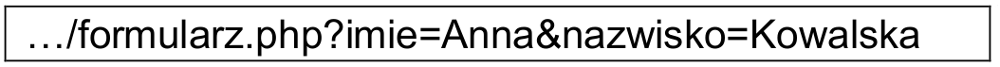
- **A.** COOKIE
- **B.** POST
- **C.** GET ✅
- **D.** SESSION

### Q997. Wskaż funkcję PHP, za pomocą której odczytana zawartość pliku jest zapisywana do zmiennej reprezentującej ciąg znaków
- **A.** get_file();
- **B.** file_get_contents(); ✅
- **C.** eof();
- **D.** fwrite();

### Q998. W której części dokumentu HTML należy umieścić wewnętrzny arkusz stylów?
- **A.** Wewnątrz znacznika, którego styl dotyczy
- **B.** W ciele strony
- **C.** W części nagłówkowej strony ✅
- **D.** W skrypcie dołączonym do strony

### Q999. W języku CSS zdefiniowano formatowanie paragrafu, które przypisze mu następujące cechy:

- **A.** tło czerwone, kolor tekstu niebieski, marginesy wewnętrzne ustawione na wartość 40px
- **B.** tło niebieskie, kolor tekstu czerwony, marginesy zewnętrzne ustawione na wartość 40px
- **C.** tło czerwone, kolor tekstu niebieski, marginesy zewnętrzne ustawione na wartość 40px ✅
- **D.** tło niebieskie, kolor tekstu czerwony, marginesy wewnętrzne ustawione na wartość 40px

### Q1000. W znaczniku meta w miejsce kropek należy wpisać

- **A.** informację o dostosowaniu do urządzeń mobilnych
- **B.** streszczenie treści strony ✅
- **C.** nazwę edytora
- **D.** język dokumentu

### Q1001. W języku PHP zmiennej a przypisano tekst, w którym kilkukrotnie występuje słowo Kowalski. Aby jednym pleceniem zmienić w zmiennej a wszystkie wystąpienia słowa Kowalski na słowo Nowak, należy zastosować polecenie
- **A.** $a = str_replace('Nowak', 'Kowalski');
- **B.** $a = str_replace('Kowalski', 'Nowak', $a); ✅
- **C.** $a = str_replace('Nowak', 'Kowalski', $a);
- **D.** $a = str_rep('Kowalski', 'Nowak', $a);

### Q1002. W bazie danych samochodów pole kolor z tabeli samochody przyjmuje wartości kolorów jedynie ze słownika lakier. Aby połączyć tabele samochody i lakier relacją należy, zastosować kwerendę
- **A.** ALTER TABLE samochody ADD FOREIGN KEY (kolor) REFERENCES lakier(lakierId); ✅
- **B.** ALTER TABLE samochody ADD FOREIGN KEY kolor REFERENCES lakier;
- **C.** ALTER TABLE samochody ADD FOREIGN KEY barwa REFERENCES samochody.lakier;
- **D.** ALTER TABLE lakier ADD FOREIGN KEY (barwa) REFERENCES samochody(kolor);

### Q1003. W języku C++ zdefiniowano zmienną: char zm1;. W jaki sposób można do niej przypisać wartość zgodnie ze składnią języka?
- **A.** zm1 == 0x35;
- **B.** zm1[2] = 32;
- **C.** zm1 = "wiadro";
- **D.** zm1 = 'w'; ✅

### Q1004. Znaczniki HTML <strong> oraz <em> służące do podkreślenia ważności tekstu, pod względem formatowania są odpowiednikami znaczników
- **A.** <b> oraz <u>
- **B.** <u> oraz 
- **C.** <i> oraz <mark>
- **D.** <b> oraz <i> ✅

### Q1005. Obraz przedstawia formatowanie CSS paragrafu. Aby otrzymać czerwony kolor poza obramowaniem, tak jak przedstawiono na obrazie, należy zdefiniować własność:

- **A.** border
- **B.** outline ✅
- **C.** padding
- **D.** background

### Q1006. Klauzuli DROP COLUMN można użyć podczas wydawania kwerendy
- **A.** ALTER TABLE ✅
- **B.** DROP TABLE
- **C.** CREATE TABLE
- **D.** ALTER COLUMN

### Q1007. Który zapis tworzący tablicę w JavaScript jest niepoprawny składniowo?
- **A.** var liczby = new Array(1, 2, 3);
- **B.** var liczby = [3];
- **C.** var liczby = [1, 2, 3];
- **D.** var liczby = new Array[1, 2, 3]; ✅

### Q1008. W języku HTML zapisano formularz. Który z efektów działania kodu będzie wyświetlony przez przeglądarkę zakładając, że w pierwsze pole użytkownik przeglądarki wpisał wartość "Przykładowy text"?
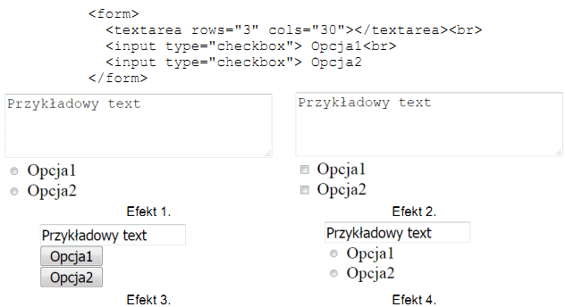
- **A.** Efekt 1
- **B.** Efekt 2 ✅
- **C.** Efekt 3
- **D.** Efekt 4

### Q1009. Który kod PHP sprawi, że zostanie wyświetlona sformatowana data oraz czas ostatnich odwiedzin użytkownika witryny, natomiast podczas pierwszej wizyty nic się nie wyświetli?

- **A.** Kod 1
- **B.** Kod 2 ✅
- **C.** Kod 3
- **D.** Kod 4

### Q1010. Zapis selektora input[type=number] { background-color: Brown; } oznacza, że tło będzie brązowe dla
- **A.** pól edycyjnych, które są typu numerycznego ✅
- **B.** wszystkich tekstów na stronie
- **C.** wszystkich pól edycyjnych
- **D.** pól edycyjnych, gdy użytkownik wpisze do nich dowolną cyfrę

### Q1011. W dokumencie HTML zdefiniowano listę oraz dodano do niej formatowanie CSS. Który z efektów odpowiada tej definicji

- **A.** Efekt 1
- **B.** Efekt 2
- **C.** Efekt 3
- **D.** Efekt 4 ✅

### Q1012. Co można powiedzieć o wyświetlonym przez witrynę tekście "test kolorów"?
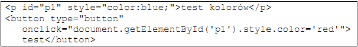
- **A.** Wciskanie przycisku test sprawia, że kolor tekstu jest na przemian niebieski i czerwony.
- **B.** Zaraz po załadowaniu witryny kolor tekstu jest czerwony.
- **C.** Po wciśnięciu przycisku test kolor tekstu jest czerwony. ✅
- **D.** Po wciśnięciu przycisku test kolor tekstu jest niebieski.

### Q1013. Efekt przedstawiony na obrazie, wykonany za pomocą edytora grafiki rastrowej, to:

- **A.** pikselizacja ✅
- **B.** szum RGB
- **C.** grawerowanie
- **D.** rozmycie Gaussa

### Q1014. W formularzu zdefiniowano kontrolki do wpisania imienia i nazwiska. Który atrybut reprezentuje podpowiedź umiejscowioną w polu kontrolki, znikającą w momencie, gdy użytkownik rozpocznie wpisywanie wartości?

- **A.** value
- **B.** placeholder ✅
- **C.** title
- **D.** name

### Q1015. Metoda zachłanna konstruowania algorytmów polega na
- **A.** podziale problemu na podproblemy w celu uzyskania problemów łatwych do rozwiązania
- **B.** wybieraniu rozwiązań, które w danym kroku wydają się najkorzystniejsze ✅
- **C.** odwołaniu się funkcji lub definicji do samej siebie
- **D.** przeszukiwaniu zbioru danych aż do momentu znalezienia rozwiązania

### Q1016. W bibliotece mysqli języka PHP, aby uzyskać ostatni komunikat o błędzie można zastosować funkcję:
- **A.** mysqli_error() ✅
- **B.** mysqli_use_result()
- **C.** mysqli_errno()
- **D.** mysqli_error_list()

### Q1017. Funkcja PHP var_dump() wyświetla informację na temat zmiennej: jej typ i wartość. Wynikiem dla przedstawionego fragmentu kodu jest

- **A.** array(2) {[0] => int(59) [1] => int(85)}
- **B.** int(59)
- **C.** string("59.85")
- **D.** float(59.85) ✅

### Q1018. Które polecenie jest poprawne pod względem walidacji HTML5?
- **A.** 
- **B.**  ✅
- **C.** 
- **D.** 

### Q1019. Lokalny System Zarządzania Bazą Danych (SZBD) udostępnia bazę danych
- **A.** jako serwer w sieci
- **B.** w chmurze komputerowej
- **C.** tylko na jednym, określonym komputerze ✅
- **D.** jako usługę sieciową serwera

### Q1020. Dla których imion klauzula LIKE jest prawdziwa?

- **A.** Oksana, Oktawia, Olga ✅
- **B.** Oksana, Ola, Olga
- **C.** Oktawia, Oktawian, Olga
- **D.** Oda, Oksana, Oktawia

### Q1021. Tabela samochody zawiera rekordy przedstawione na obrazie. Jakie dane zostaną zwrócone wykonując zapytanie SQL:

- **A.** opel zafira
- **B.** zafira ✅
- **C.** opel zafira; opel insignia
- **D.** zafira; insignia

### Q1022. Tabele Studenci, Zapisy, Zajecia są powiązane relacją. Aby wybrać jedynie nazwiska studentów oraz odpowiadające im idZajecia dla studentów z grupy 15, należy wydać kwerendę

- **A.** SELECT nazwisko, idZajecia FROM Studenci INNER JOIN Zapisy WHERE grupa = 15;
- **B.** SELECT nazwisko, idZajecia FROM Studenci JOIN Zapisy ON Studenci.id = Zapisy.idZajecia;
- **C.** SELECT nazwisko, idZajecia FROM Studenci INNER JOIN Zapisy ON Studenci.id = Zapisy.idStudenta;
- **D.** SELECT nazwisko, idZajecia FROM Studenci JOIN Zapisy ON Studenci.id = Zapisy.idZajecia WHERE grupa = 15; ✅

### Q1023. W grafice funkcja desaturacja ma na celu
- **A.** przekształcenie barw do odcieni szarości ✅
- **B.** zwiększenie jaskrawości barw
- **C.** rozjaśnienie obrazu
- **D.** zwiększenie liczby kolorów wykorzystywanych w obrazie

### Q1024. Walidator W3C wygenerował błąd walidacji: End tag p seen, but there were open elements. Którego fragmentu kodu on dotyczy?
- **A.** 
Ala ma <b>kota</b>

- **B.** 
Ala ma kota
- **C.** 
Ala ma kota

- **D.** 
Ala ma <b>kota
</b> ✅

### Q1025. Które typy danych w języku C++ reprezentują liczby rzeczywiste?
- **A.** float i long
- **B.** double i bool
- **C.** float i double ✅
- **D.** double i short

### Q1026. W języku SQL wydano kwerendę, niestety jej wykonanie nie powiodło się i wystąpił błąd: #1396 - Operation CREATE USER failed for 'anna'@'localhost'. Powodem takiego zachowania bazy danych może być:

- **A.** zbyt słabe hasło dla konta anna
- **B.** nieznane polecenie CREATE USER
- **C.** istnienie użytkownika anna w bazie ✅
- **D.** nieprawidłowa składnia polecenia CREATE USER

### Q1027. Na listingu kodu JavaScript w wykropkowanej części definicji obiektu osoba należy wpisać kod, który prawidłowo obsłuży instrukcję osoba.j = "PL"; Który to będzie kod?

- **A.** return this.j;
- **B.** this.jezyk = nazwa; ✅
- **C.** this.j = nazwa;
- **D.** return this.jezyk;

### Q1028. Funkcji session_start() języka PHP należy użyć przy implementacji
- **A.** obsługi formularza
- **B.** dowolnej witryny, która obsługuje ciasteczka
- **C.** wczytywania danych z plików zewnętrznych
- **D.** wielostronicowej witryny, która wymaga dostępu do danych przy przechodzeniu pomiędzy stronami ✅

### Q1029. Zapis CSS margin: auto; oznacza, że marginesy są
- **A.** wyliczane przez przeglądarkę tak, aby element został wyśrodkowany w poziomie ✅
- **B.** równe domyślnym wartościom marginesów elementu, do którego są przypisane
- **C.** stałe dla danej przeglądarki, niezależnie od rozmiaru jej okna
- **D.** odziedziczone po elemencie rodzica dla danego elementu

### Q1030. W systemie barw i oznaczeń znaków bezpieczeństwa kolor czerwony zastrzeżony jest dla
- **A.** znaków zakazu ✅
- **B.** znaków nakazu
- **C.** dróg ewakuacyjnych
- **D.** znaków informacyjnych

### Q1031. Kompetencje związane z osobowością dotyczą
- **A.** stanu zdrowia i predyspozycji do wykonywania określonych zadań
- **B.** wartości i wierzeń, które pozwalają na określenie motywów działania
- **C.** zadań w konkretnym zawodzie i wiedzy specjalistyczno-technicznej ✅
- **D.** indywidualnego radzenia sobie z otoczeniem

### Q1032. Organem społecznym, którego zadaniem jest sprawowanie nadzoru społeczno-ekonomicznego nad warunkami pracy, jest
- **A.** Straż Pożarna
- **B.** związek zawodowy ✅
- **C.** komisja BHP
- **D.** kierownik zakładu

### Q1033. Co można powiedzieć o błędach interpretacji kodu PHP?
- **A.** są ignorowane przez przeglądarkę oraz interpreter kodu PHP
- **B.** są zapisywane w podglądzie zdarzeń systemu Windows
- **C.** są zapisywane w logu pod warunkiem ustawienia odpowiedniego parametru w pliku php.ini ✅
- **D.** są wyświetlane w oknie edytora kodu PHP po wybraniu przycisku kompiluj

### Q1034. Przedstawione w tabeli cechy dotyczą

- **A.** umowy zlecenia
- **B.** umowy agencyjnej
- **C.** umowy o pracę
- **D.** umowy o dzieło ✅

### Q1035. Który format pliku jest formatem rastrowym?
- **A.** SWF
- **B.** TIFF ✅
- **C.** SVG
- **D.** CDR

### Q1036. Przedstawiony znak ochrony przeciwpożarowej jest stosowany w przypadku

- **A.** zakazu używania otwartego ognia
- **B.** niebezpieczeństwa pożaru spowodowanego materiałami utleniającymi ✅
- **C.** niebezpieczeństwa pożaru spowodowanego materiałami łatwo zapalnymi
- **D.** zakazu gaszenia wodą

### Q1037. W przedstawionym programie napisanym w języku PHP zmienna $i przechowuje

- **A.** wartość flagi
- **B.** zbiór liczb parzystych podzielonych bez reszty przez 59
- **C.** losową liczbę z zaokrągleniem do 100 miejsc po przecinku
- **D.** liczbę wykonanych losowań ✅

### Q1038. W języku PHP operator ++ przed zmienną (np. ++$i) oznacza
- **A.** predekrementację
- **B.** postinkrementację
- **C.** postdekrementację
- **D.** preinkrementację ✅

### Q1039. Która operacja, na dwóch obiektach, została zastosowana w programie do obróbki grafiki wektorowej?
- **A.** różnica ✅
- **B.** wykluczenie
- **C.** suma
- **D.** podział

### Q1040. Która własności języka CSS umożliwia zmianę domyślnego koloru czcionki?
- **A.** color ✅
- **B.** text-decoration
- **C.** transform
- **D.** font-style

### Q1041. Dana jest tabela oceny o polach id, nazwisko, imie, ocena. Przedstawione zapytanie jest przykładem

- **A.** sumy
- **B.** agregacji
- **C.** selekcji ✅
- **D.** złączenia

### Q1042. Użyty w kodzie HTML znacznik <pre> umozliwia umieszczenie na stronie WWW
- **A.** tekstu z zachowaniem jego oryginalnego formatowania ✅
- **B.** edytowalnego pola tekstowego
- **C.** tekstu zapisanego w indeksie dolnym
- **D.** odwołania do innego fragmentu tekstu

### Q1043. W tabeli uczniowie, aby zmienić wszystkie wartości znajdujące się w kolumnie wiek na wartość 10, należy użyć zapytania
- **A.** SET uczniowie UPDATE wiek=10;
- **B.** UPDATE uczniowie SET wiek 10 WHERE wiek ALL;
- **C.** UPDATE uczniowie SET wiek=10; ✅
- **D.** SET uczniowie UPDATE wiek 10 WHERE wiek ALL;

### Q1044. Wskaż prawidłową kolejność etapów planowania pracy zespołu

- **A.** Kolejność 2 ✅
- **B.** Kolejność 1
- **C.** Kolejność 3
- **D.** Kolejność 4

### Q1045. W języku PHP instrukcją, która jest przeznaczona do wykonania określonej liczby iteracji jest
- **A.** switch
- **B.** for ✅
- **C.** if
- **D.** continue

### Q1046. O przedstawionej definicji pola input można powiedzieć, że

- **A.** umożliwia wpisywanie tylko wartości liczbowych
- **B.** ukrywa wprowadzone do niego znaki ✅
- **C.** wyświetla wprowadzone do niego znaki
- **D.** ma wpisany domyślny tekst "pole"

### Q1047. Który typ danych w bazie MySQL jest przeznaczony do przechowywania liczb
- **A.** ENUM
- **B.** BIGINT
- **C.** VARCHAR
- **D.** DOUBLE ✅

### Q1048. Przykładem etycznego zachowania informatyka jest
- **A.** kopiowanie oprogramowania i przekazywanie kopii rodzinie
- **B.** podejmowanie prac jednocześnie u kliku zleceniodawców, których interesy są ze sobą sprzeczne
- **C.** przedstawianie swojemu klientowi prawdy o przewidywanych kosztach oraz przypuszczalnym czasie trwania analizowanych prac ✅
- **D.** naruszanie integralności systemów informatycznych podmiotów, które są konkurencyjne dla jego zleceniodawcy

### Q1049. Aby prawidłowo utworzyć relację typu m..n nienarażoną na redundancję danych, należy
- **A.** posortować przynajmniej jedną z tabel
- **B.** połączyć bezpośrednio klucze podstawowe obu tabel
- **C.** połączyć bezpośrednio klucze obce obu tabel
- **D.** utworzyć tabelę pomocniczą ✅

### Q1050. Językami działającymi jedynie po stronie serwera są:
- **A.** Java, C#, Python, Ruby, PHP ✅
- **B.** Java, C#, TypeScript, Ruby, PHP
- **C.** C#, Python, Ruby, PHP, JavaScript
- **D.** Java, C#, Python, ActionScript, PHP
